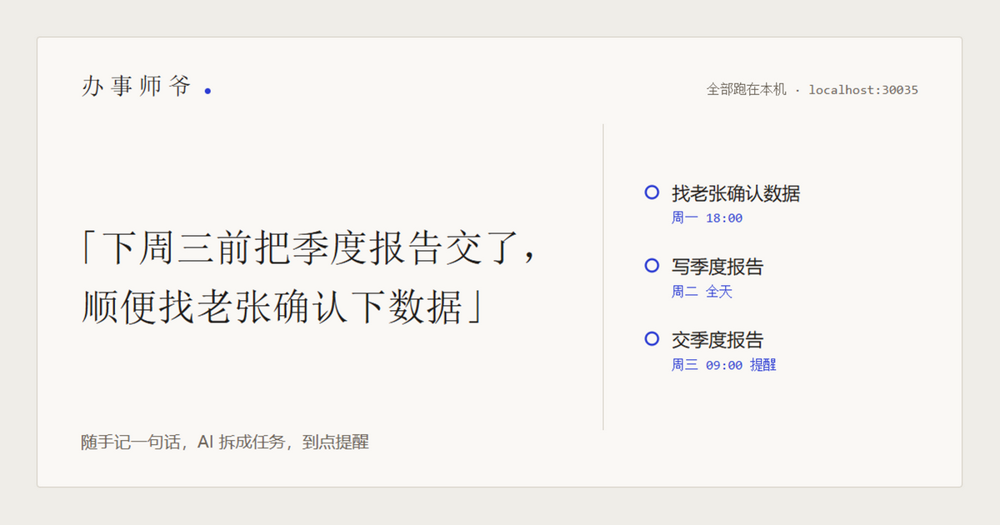
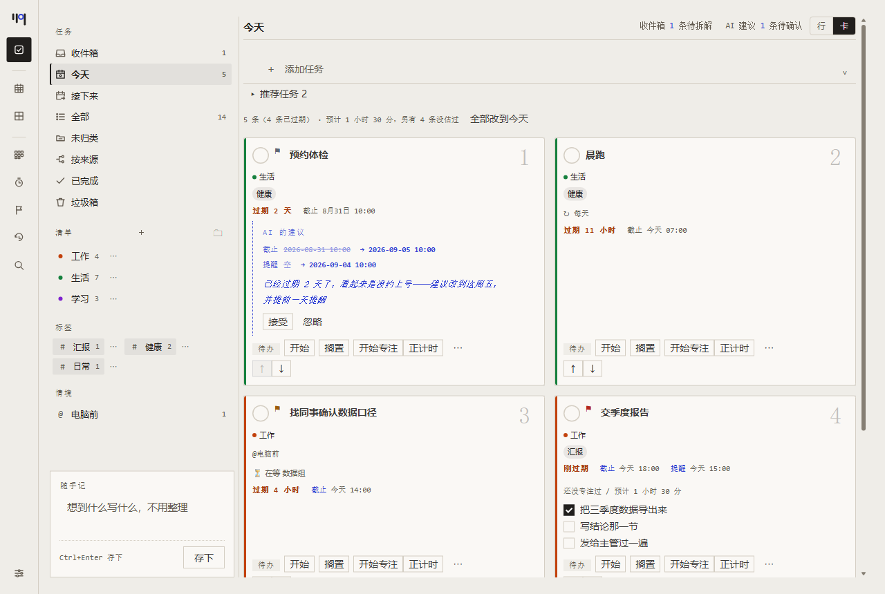
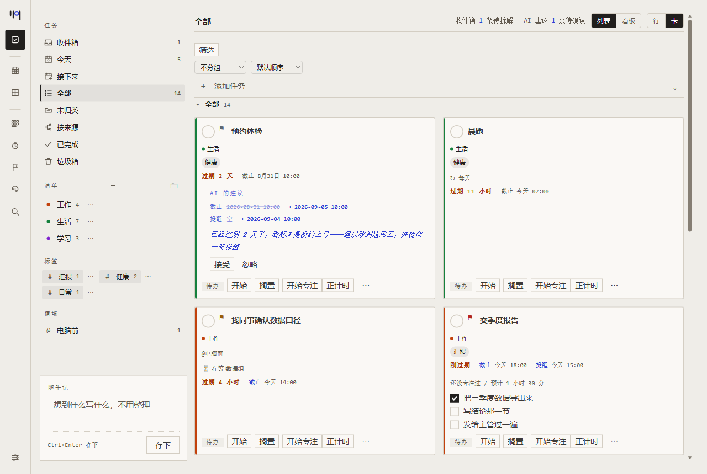
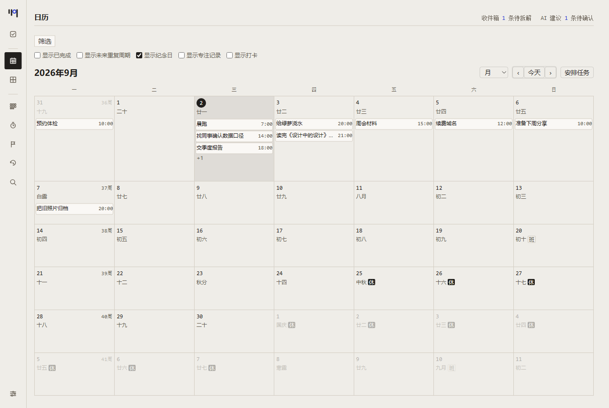
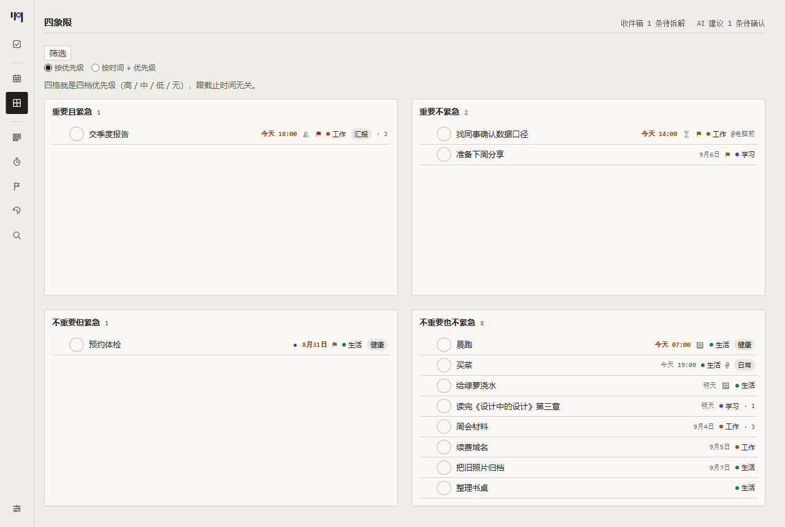

# 办事师爷

随手记的一句话，交给 AI 拆成任务，到点提醒你。全部跑在本机。

**跑起来**：双击 `启动.cmd`（Windows）/ `启动.command`（macOS）/ `启动.sh`（Linux），
或者终端里 `npm run go`。浏览器自己打开 `http://localhost:30035`，没有别的步骤。

- **数据是你的**：`data/` 下一个任务一个 JSON 文件，没有数据库、没有账号、不联网
- **AI 只提议，不动手**：拆出来的任务、提的修改建议，都要你点一下才算数
- **两条 AI 路子**：本机装了 Claude Code 就用它；没装就在设置里填任意 OpenAI 兼容接口
- **四个壳**：网页、桌面版（Electron）、安卓（含分享接入和本地通知）、命令行

（截图里的任务是编的演示数据。）

再看三屏：全部 · 日历 · 四象限

**全部**——一屏看完所有还挂着的，行档更密：

**日历**——农历、节气、法定节假日和调休都标出来：

**四象限**——重要/紧急两轴，可以切「按优先级」或「按时间 + 优先级」两套分法：

<b>目录</b>（这份 README 很长，先看下面三步就能跑起来）

- [**它是怎么转的**](#它是怎么转的)
- [**装上、跑起来**](#装上跑起来)
  - [上手](#上手)
  - [桌面版](#桌面版)
  - [手机（Android）](#手机android)
  - [换端口](#换端口)
- [**每天怎么用**](#每天怎么用)
  - [自己建一条任务](#自己建一条任务)
  - [两个视图：今天 / 按来源](#两个视图今天--按来源)
  - [点开一条任务：右边那一栏](#点开一条任务右边那一栏)
  - [任务本身还能怎么摆弄](#任务本身还能怎么摆弄)
  - [批量操作](#批量操作)
  - [时间那一半：提醒、改期、重复](#时间那一半提醒改期重复)
- [**找东西**](#找东西)
  - [分组和排序](#分组和排序)
  - [一份清单里再分段](#一份清单里再分段)
  - [清单、文件夹、标签](#清单文件夹标签)
  - [每个去处记住自己的样子](#每个去处记住自己的样子)
  - [推荐任务，和新建时预填什么](#推荐任务和新建时预填什么)
  - [日历上面那排显示开关](#日历上面那排显示开关)
  - [在等谁；各处的计数对得上](#在等谁各处的计数对得上)
  - [筛选：且 / 或、三档、两级标签](#筛选且--或三档两级标签)
  - [搜索](#搜索)
  - [快捷键](#快捷键)
  - [情境：我现在能干什么](#情境我现在能干什么)
  - [四栏](#四栏)
  - [四象限：两套分法，自己选](#四象限两套分法自己选)
- [**AI 那半**](#ai-那半)
  - [让 AI 帮你拆](#让-ai-帮你拆)
  - [让 AI 回头看一遍已有的任务](#让-ai-回头看一遍已有的任务)
  - [回顾：这一周该过一遍的](#回顾这一周该过一遍的)
- [**习惯、专注、纪念日**](#习惯专注纪念日)
  - [习惯](#习惯)
  - [番茄钟：专注完接着休息](#番茄钟专注完接着休息)
  - [专注统计](#专注统计)
  - [倒数纪念日](#倒数纪念日)
  - [每日概览](#每日概览)
- [**数据与同步**](#数据与同步)
  - [数据在哪](#数据在哪)
  - [数据目录搬到别处（`DATA_DIR` / `AGENT_CWD`）](#数据目录搬到别处data_dir--agent_cwd)
  - [同步到手机：WebDAV/同步盘 + `.ics` 订阅](#同步到手机webdav同步盘--ics-订阅)
- [**开发**](#开发)

## 它是怎么转的

1. 网页上随手丢一句话进**收件箱**（不用整理格式）
2. AI 读走这句话，拆成带截止时间、提醒时间、子任务的**任务**
3. 任务出现在看板上，到提醒时间尝试三路通知你：网页横幅（那一刻网页得开着，
   过后不补投）、Windows 系统通知（仅 Windows，默认开，能在设置里关掉）、
   webhook（要先在设置里填地址，默认不发）

## 装上、跑起来

### 上手

**双击 `启动.cmd`（Windows）/ `启动.command`（macOS）/ `启动.sh`（Linux）。**
第一次会装依赖和构建，几分钟；之后就很快。浏览器会自己打开 http://localhost:30035。

想在终端里跑：`npm run go`（装依赖 + 构建 + 启动，三个平台同一条）。

**停止**：关掉那个窗口就行。窗口找不着了就双击 `停止.cmd` / `停止.command` / `停止.sh`。

要 Node 24 以上（`package.json` 的 `engines` 写死了 `>=24.0.0`，CI 也跑 24）。

### 桌面版

`启动.cmd` 那条路要开着一个终端窗口才算「服务在跑」，窗口一关服务也没了，
到点也就没人提醒你——**一个只在你记得启动它的时候才提醒你的提醒工具，逻辑上是
个圈**。桌面版（Electron 包了一层）解决的就是这件事：关掉窗口不等于关掉服务，
它缩进系统托盘继续跑，到点了弹的是 Windows 原生通知，不用开着网页。

跑 `npm run dist:desktop` 在 `desktop/release/` 下打出当前系统的产物。**每个平台
的包只能在那个平台上打**（macOS 的 dmg 要 hdiutil、.icns 要 iconutil，Windows 上
没有替身），三份一起出要靠 `.github/workflows/release.yml` 那个矩阵。

Windows：

- **免安装版**（`办事师爷-<版本号>-win.zip`）——不用装，解压出来双击里面的
  `办事师爷.exe` 就跑，删掉整个文件夹就是卸载。**解压这一步只做一次**，之后每次
  启动都是一秒内出窗口。
- **安装版**（`办事师爷 Setup <版本号>.exe`）——普通 Windows 安装向导，装完开始菜单/
  桌面上有快捷方式。原生通知要走这一份（免安装版没有开始菜单快捷方式）。

macOS：`.dmg`（拖进「应用程序」）和 `.zip`，**Apple Silicon 和 Intel 各一份**，
文件名里带 `arm64` 的是前者。Linux：`.AppImage`（`chmod +x` 之后
双击就跑，删掉那个文件就是卸载）。

**都没有签名**——个人使用买证书不划算，但三个平台的后果不一样：

- **Windows**：SmartScreen 大概率拦一次。点「更多信息」→「仍要运行」就过去了。
- **macOS**：Gatekeeper 更狠，**报的是「已损坏，无法打开」而不是「未签名」**——
  看上去像文件坏了，其实只是没签名没公证。绕过：右键点应用图标选「打开」（比
  双击多一个「仍要打开」的按钮），或者 `xattr -d com.apple.quarantine
  /Applications/办事师爷.app`。
- **Linux**：AppImage 没有这一层，`chmod +x` 就行。

⚠️ **mac 和 Linux 那两份到现在一次都没在真机上跑过**（这台开发机是 Windows）。
代码和打包配置都按三平台写了，通知、托盘、协议激活那几条只在 Windows 上验过——
`desktop/冒烟清单.md` 那份清单在另外两个平台上还是空白。

用起来：双击开出窗口，看板照旧。**关掉窗口不是退出**，它缩到任务栏右下角的
托盘图标那里，服务和到点的提醒继续跑；托盘图标左键点一下窗口回来，右键有
「打开 / 退出」，退出才是真的把后台服务也停掉。

数据放在哪：桌面版不读这个仓库文件夹里的 `data/`，用的是系统的应用数据目录
（跟 `启动.cmd` 那条路是两份独立的数据，不会自动同步）：

| | 位置 |
|---|---|
| Windows | `%APPDATA%\shiye\agent\data\` |
| macOS | `~/Library/Application Support/shiye/agent/data/` |
| Linux | `~/.config/shiye/agent/data/` |

代码里取的是 `app.getPath('appData')`，不是写死的 `%APPDATA%`，所以三个平台
自动落到各自该去的地方。设置（`device.json`）就在同一个 `shiye/` 底下，
两条路共用一份——那个目录下只有这一个文件夹。**装过更早那版打包应用的话，旧数据要自己搬**：
它在 `%APPDATA%\待办\agent\`（那一版的 productName 是「待办」），把整个 `agent\`
拷到 `%APPDATA%\shiye\` 底下就行——没有自动迁移，理由写在 `desktop/src/main.ts`
里 `setPath` 下面那段。AI 拆解要读的 `AGENTS.md`/`workflows/` 每次启动都会重新铺一份
到同一个目录下，不用自己管。

`启动.cmd` 那条路完全不受影响，两条路可以在同一台机器上共存——桌面版起服务
之前会先探一下 30035 端口上是不是已经有一个健康的自己，有就直接复用，不会
抢着起第二个服务。

**备注里的链接在系统浏览器里开。** Markdown 里的外链带着 `target="_blank"`——
在浏览器里那是新开一个标签页，**在 Electron 里默认是新开一个 `BrowserWindow`**：
没有地址栏、没有前进后退，而且这个应用把菜单栏整个去掉了。点一下备注里的链接
就多出一个退不出去、看着还像是「办事师爷的一部分」的窗口。另一半是没有 `target`
的链接（附件那两个「打开」就是）：它们会**在当前窗口里跳走**，应用本身没了，
只能关掉重开。

现在两条都拦住了：应用自己那一页留在窗口里，附件和外链交给系统（附件用系统的
看图/PDF 程序打开正是想要的），**`javascript:`/`data:`/`file:` 一概不理**——备注是
自由文本、AI 也能往里写，把它原样递给系统是在替一段不受信任的文本执行动作。

### 手机（Android）

手机上有一个壳（Capacitor 把 `web/` 打包成的 APK）。第一批只做到「连桌面」：
手机连同一个局域网里桌面开着的服务，数据只有桌面那一份。第二批（「手机离线
第一批」）加了本地数据层：**apk 可以不连桌面**——手机上存一份最近一次在线时
看到的快照，连不上桌面的时候也能看、能改、能随手记。第三批（「推回桌面」）
补上了另一半：**回到局域网时，离线期间的改动会自动推回桌面**，撞车写冲突
副本，看得见、处理得掉。第四批是**本地通知**、第五批是**分享接入**，见下面。

**本地通知有了**：给任务设了提醒，到点手机会响，应用关着也响——手机自己排自己
的通知，不经过桌面服务，断网也照响。**手机和桌面各响各的，两边都响是对的**
（应用不知道你此刻人在哪，日历应用都这么做），不是重复通知的 bug。安卓 13 起
第一次打开会问通知权限；**拒了的话 App 顶上会挂一条常驻记号**提醒你去系统设置
里开，不会装作提醒功能还在。另外两条不是 bug 的已知行为：一次只排未来最近的
32 条（超出的下次重排时进窗口就补上，而「下次重排」是数据变化时发生的，不是
时间到了自动发生）；系统的「闹钟和提醒」开关没开时，提醒可能晚几分钟——这是
有意的降级，换掉的是「每改一条任务就被弹进一次系统设置页」。细节见
`android/冒烟清单.md` 第 9 步。

**分享接入有了**：在任何 App 里选中一段文字 → 分享 → 「办事师爷」，那段文字**直接
进收件箱**，不用切回来手打一遍。走的是跟 App 里随手记**同一条路**（离线也行：
落本地、回到局域网自动推回桌面，跟上面「离线」一节说的是同一套）。分享网页时
标题在前、网址在后，中间换行——收件箱这条是要给 AI 拆解读的，只留网址它读不出
东西。两条不是 bug 的已知行为：**只收纯文字**（图片和文件分享菜单里根本不会出现
「办事师爷」，不是收下了不处理，是结构上收不到）；**同一段文字分享两次会存两条，
不去重**（「我明明分享了、它没进去」比多一条的代价大一个量级）。成功会弹一句
「已存进收件箱：…」，那是唯一的即时反馈——落地那一刻看板还停在「今天」，新条目
不在眼前。细节见 `android/冒烟清单.md` 第 10 步。

**没有 WebDAV**——这一样还是后面几批的事。
**「推回桌面」不是完整的多端同步**：只有「回到跟桌面同一个局域网」这一条路
会触发推送，WebDAV（人在外面用流量也能同步）还没做。回到有网之后离线改动
具体会怎么处理、撞车怎么办，见下面「离线」一节，务必看完再决定要不要在
飞行模式下改重要的东西。

**要先做两件事**（只想要本地通知、不打算连桌面的话，第 1 件可以跳过）：

1. **桌面开局域网模式**：`.env` 里加一行 `LAN=1`，重启服务。默认不开——不设
   这个环境变量，服务照旧只有这台机器自己能连（绑 `127.0.0.1`）。**开了之后
   同一个 Wi-Fi 下的任何设备都能读写你的全部任务，没有任何认证**，服务启动时
   会在控制台印一句醒目的提示提醒你这件事，**只在家庭 Wi-Fi 上开，别在咖啡馆、
   机场这类公共 Wi-Fi 上开**，用完记得把这一行删掉或注释掉。

   有两格设置**改了就一直漏，关掉局域网模式也收不回来**：提醒的 webhook 地址
   （此后每条提醒都把任务原文发给对方），以及 AI 的接口地址（此后每次拆解都把
   你的收件箱原文和全部任务当提示词发过去）。密钥那一格反过来是安全的——
   `GET /api/settings` 只回打码后的形状，读不走。启动时那句提示把这几条都说了。
2. **手机装 APK、填桌面的局域网 IP**：还没有应用商店分发，是 sideload（手动
   装未知来源的 APK）。装完打开就是主看板，**不会先拦一面「填服务地址」的墙**
   ——没配过地址就走本地那条路，顶上挂一条离线记号。填地址的入口常驻在
   设置弹层的「服务地址」一节：填桌面在这个局域网里的 IP，比如
   `http://192.168.1.5:30035`，填错了随时回去重填。

详细步骤（怎么找局域网 IP、Windows 防火墙那道弹窗怎么点、装 APK 要先允许
「未知来源」……）见 `android/冒烟清单.md`。

#### 离线

手机连不上桌面的服务时（桌面没开、不在同一个 Wi-Fi、飞行模式），App 不再是
干瞪眼——顶上会多一条横幅「连不上服务端，现在看到的是本地数据」，看到的是
**上一次在线时读到的那份快照**（任务、收件箱、清单、AI 建议、跨任务观察，
在线读一次就会顺手存一份到手机本地），能看、能改任务状态和内容、能往收件箱
随手记。接受/忽略 AI 建议、改设置、新建清单、拆解收件箱（含带一句要求的「重新
拆解」）、彻底删除垃圾箱里的条目、附件的上传下载这几件事离线做不了，点了会看到
清楚的报错，不会装作成功。

**离线删掉的能还原。** 这以前是一扇单向门——离线删得掉、却永远还不了，而垃圾箱
存在的全部意义就是让删除不是单向的。离线时垃圾箱里看得见的又恰好只有「离线删
掉的那几条」，也就是说，能撤销的正是你刚刚那一下。还原之后不用为同步做任何额外
的事：推回桌面时「这条是改还是删」只看一件事——它在本地任务表里还在不在，还原
把它放了回去，判断自动从「删」翻成「改」。

**回到有网，离线期间的改动会自动推回桌面。** 横幅消失的同一拍就会推（不用
手动点什么），推完屏幕上有提示：推了几条、撞了几条。判定按三方比较来：

- **桌面这段时间没碰过的**：直接拿手机那份覆盖桌面。
- **两边都改过的**：**桌面赢**，手机那份写成冲突副本（`data/<tasks 或
  inbox>/<id> (冲突副本 …).json`），顶上出现「同步冲突」横幅提醒你去处理——
  手机那份没丢，在副本文件里。
- **离线删掉、桌面这期间又改过的**：**不删**，写冲突副本——防的正是「把桌面
  刚编辑过的东西按手机上的旧决定删掉」这种静默丢数据。
- **离线随手记的东西**：推回去之后是真的落进服务端的收件箱，会被正常拆解，
  不用等回到桌面重新手打一遍。

**读不出来的文件会单独出一条横幅**：`data/` 下某个实体文件的 JSON 坏了
（同步写到一半、手改时格式打错），服务端会跳过它、把另外那 999 条照常读出来
——但在这之前，界面上**一个字都没有**，于是那一条就这么无声消失，你不会知道
少了东西（服务端代码里那句「界面上由上层负责把坏文件列出来」一直没人做）。
现在顶上会说「有 N 个文件打不开」，并且说清**不是被删了**，是这一份读不出来：
修好格式它们就回来，确认不要了再删掉。

**只是缺个字段的（不是整个文件坏掉），界面这边会自己补上。** `data/` 下的任务
文件是手改得到的，而 `GET /api/tasks` 把它 JSON.parse 完就直接交出去、一次校验
都没有——漏写一个 `"tags": []`，类型上它还是一条合法任务，但卡片、紧凑行、
搜索、推荐、批量加标签五处都是直接 `t.tags.length`，**一条坏数据能白掉整页**
（这个应用没有全局错误边界兜整棵树）。现在这五个数组字段在**进界面的那一个
入口**统一补齐，不是在每个用到的地方各兜一次：用到的地方以后还会变多，入口
只有一个。写成裸字符串（`"tags": "紧急"`）也当空——`?? []` 只挡得住漏写，
挡不住写错类型。缺 `title` 这种不补：那是另一类问题，补一个空字符串等于把坏
数据伪装成好的。

**跟「同步冲突」分成两条横幅**，不合并：冲突副本是「有两份，挑一份留下」，
打不开是「这一条现在读不出来」——两种处置说不到一块去。这条判据不额外扫盘，
用的是服务端本来就要把每个文件读一遍的那一趟顺手记下的结果。

推失败（断网、服务端出错、或者一条畸形数据让整批被拒）不会假装成功：改动
还留在本地，下次连上会再试，错误提示也不会每分钟往屏幕上叠一条。装过上一版
就离线改过东西的手机升级上来，那批旧记号没有基准快照、判不出桌面动没动过：
改过的会写成冲突副本、删过的会重新出现在看板上，一次性的，再删一次就好。

**离线时通知也按手机本地那份数据排**：你在桌面上刚做完的那条任务，手机还没
同步到之前，到点照响——回到局域网同步一拍就消停了，跟上面说的离线数据陈旧
是同一类事，不是通知坏了。

完整的操作步骤（飞行模式怎么测、每一种情况该看到什么）见
`android/冒烟清单.md` 第 7、8 步。

### 换端口

在这个文件夹里建一个 `.env`（旁边的 `.env.example` 就是样板），写一行 `PORT=30045`。
不要在命令行里写 `PORT=30045 npm start`——那是 POSIX 语法，Windows 上跑不通。

## 每天怎么用

### 自己建一条任务

#### 列表顶上那一行

任务列表最上面常驻一行「+ 添加任务」（仿滴答清单）。打一句话、回车，就完了。

它跟下面说的「新任务」按钮不是一件事，**两个都在**：那颗按钮开的是整张表单
（备注、子任务、重复、附件……），偶尔来一条、要填全的时候走那条；这一行只收
一个标题，换来的是三件表单给不了的事：

- **它一直在那儿。** 一屏任务清单上最常做的动作是再加一条，原来那要先点一下
  才有地方打字。
- **建完不关、光标留在原地。** 表单是「偶尔来一条」的形状，建完就收；这一行是
  「连着记五条」的形状，回车、接着打下一条。
- **建完不弹话。** 新的一行当场出现在它下面，那就是回执。只有那条任务**不在
  你正看着的这一屏**（比如在「今天」里建了一条没填时间的）才会说一声它去哪了。

标题里的时间、标签照样认（下面那张表），预填也照样跟着当前这个去处走——站在
清单「工作」里加的就归工作，站在「今天」里加的就是今天。

它画的是**稿纸最上面那一栏空行**：只有一条下界线，没有底色、没有框（滴答清单
那边是一个浮在纸上的浅灰圆角盒子，在这一屏的立意里那是一块贴纸）。左边的「+」
跟下面每一个勾选圈落在同一条竖线上——「今天」的行左边常驻一段排序抓手的空位，
这一行跟着让一样多，实测两处都是 `left: 340`。聚焦时那条下界线加深成墨色，不
画一圈光晕：一圈 outline 又把它变回一个盒子。

**这一行画在哪分两处**，因为几个去处的头部长得不一样：「今天」「按来源」没有
筛选/分组那两条，直接画在视图标题下面；走筛选栏的那几个（全部、清单、标签）画
在筛选条和分组条**下面**、列表正上方——那两条是这一屏的取景器，输入框跟它添进
去的那个列表之间夹三行控件，看起来就不像是同一件事了。

**只在真正是一列任务、而且在这儿新建讲得通的去处出现**：今天、全部、按来源、
各个清单和标签。搜索结果和「已完成」里没有——在那两个地方建一条待办，它当场就
不在这一屏，那正是这个应用最不想制造的那种「写成功了界面没反应」。「接下来」
也没有：那个去处的成员资格是「有个将来的时间」，而这一行只收一句标题，要么建完
就消失，要么替你猜一个日期，两条都不好。

#### 完整的表单

已经知道要做什么、而且要填全（备注、子任务、重复、附件……）：点**加任务那一行
右端那个 `⌄`**。

**这是加任务唯一的入口**——标题栏上原来那颗「新任务」按钮删了。照的是滴答清单
文档里桌面版的写法：「在任务列表页顶部的『任务添加栏』输入内容，按回车键即创建
成功……点击**输入框右侧的下拉选项**，可以快速设置优先级、添加附件」。它那边没有
第二颗加任务的按钮，加任务只有「任务添加栏」这一个地方。

（`C` 键和命令面板里那条照旧通向这张表单，没有变。）

表单里填标题（必填）、备注、截止时间、提醒时间就完事，任务立刻出现在「按来源」
的「单独记的」那组里。

**这条路现在也有键了：`C`**（也在命令面板里）。建任务的两条路原来只有随手记
那条有键——而 `N` 通向的是「丢进收件箱、等 AI 拆」（默认 60 秒），「已经知道
自己要做什么」该走的这条一直只能用鼠标点那颗按钮：**键盘上快的那一个通向慢的
那条路**。`N` 被随手记占着，所以用 `C`（compose）；不用 `Shift+N`，那跟大写
锁定下的 `N` 分不干净。

跟 `N`／`/` 不一样，`C` **不拦默认动作**：那两个是把焦点换到一个已经存在的
输入框上（不拦的话按下的那个字会被原样打进去），而这个表单是下一帧才挂出来的，
它的标题框靠自己 `autoFocusTitle` 聚焦，那时候这次 keydown 早结束了。

**标题里直接写时间就行，不用去点那两个日期控件。** 打「明天下午两点交周报
#工作」，下面会出现一条小字：识别到「明天 下午两点」「#工作」，标题会变成
「交周报」——按「添加」就照这个建。认得出这几类：

| 写什么 | 认成什么 |
|---|---|
| 今天 / 明天 / 后天 / 大后天 / 下周 / 下下周 / 下个月 / 下下个月 | 截止日期。几个「下」就是几周 / 几个月 |
| 今晚 / 明早 / 明晚 / 今早 | 那一天 + 那个时段（「今晚八点」是二十点） |
| 周三 / 下周三 / 8月30号 / 2027-01-05 | 截止日期。今年那天已经过去了就算明年 |
| 三天后 / 两周后 / 两个月后 / 两年后 | 截止日期。「以后」「之后」跟「后」一样认 |
| 半小时后 / 三小时后 / 45分钟后 | 一个**具体时刻**，同时排一条提醒 |
| 提前半小时提醒 / 提前30分钟 / 提前一天 | 把提醒往前挪，**截止时间不动**（见下） |
| 下午两点 / 晚上9点 / 9点半 / 14:30 / 十点十五分 | 截止时间，**同时排一条提醒** |
| 周末 / 本周末 / 下周末 / 月底 / 下个月底 | 截止日期。后面跟「前」「之前」也认 |
| 每天 / 每周一 / 每周一三五 / 每周一到周五 / 每周三和周五 / 每周末 / 每三天 / 每个工作日 | 重复规则 |
| 每季度 / 每半年 / 每隔一天 | 重复规则（= 每 3 个月 / 每 6 个月 / 每 2 天） |
| 每晚十点 / 每早八点 | 每天重复**加上**那个时段（「每晚十点」是二十二点） |
| 每月15号 / 每月第一天 / 每月底 / 每月最后一天 | 重复规则**加上**下一次的日期（见下） |
| `#工作` | 标签，可以有好几个（后面留个空格） |
| `@电脑前` / `@外出` / `@在家` / `@联系人` / `@省力` | 情境。就这五个词，别的 `@` 不认 |

几条约定：

- **「三天后」和「半小时后」是两种东西**：前者只定哪一天（落 23:59、不排
  提醒），后者定的是一个瞬间——说「半小时后提醒我看火」的人要的就是到点响
  一声，所以日期、钟点、提醒一起定下来。跨天由日期自己进位：晚上十一点说
  「三小时后」落在明天凌晨两点。
- **相对时间的数字中文阿拉伯都行**：`3天后` 和 `三天后` 一样，`两天后` 认成
  2 天（中文里没人说「二天后」），十几二十几也认。认不出数字的那一段整个不认，
  原话留在标题里——「很多天后」不该被猜成某一天。
- **只说了哪天、没说几点**，截止落在那天的 **23:59**，不排提醒——凭空补一个
  上午九点等于替你定了个你没说过的闹钟。
- **只说了几点、没说哪天**，取最近有效的那一个：上午十点说「9点提醒我」指的
  是今晚九点，晚上十点说同一句指的是明早九点。
- **「提前 N 提醒」挪的是提醒，不动截止时间**：「明天下午三点开会提前半小时
  提醒」= 截止明天 15:00、提醒 14:30。分钟 / 小时 / 天三种单位，「提醒」两个
  字可省，中文数字也认。**没认出具体时刻时这一条整个作废**（那种任务本来就
  不排提醒，没有可挪的东西），而且那半句**原样留在标题里**——摘掉它等于把你
  写的字吃掉却什么也没做成。「提前半分钟」「提前半天」不认：「半」只在小时
  那一档说得通。
- **你已经在那两个日期控件里挑过的，识别不会盖掉**——落到控件上的那次是更
  明确的表达。
- **「下下周」按几个「下」算几周**（「下下下周」也认）。以前只认一个「下」：
  「下下周三开会」会建出一条叫「**下**开会」、排在下周三的任务——日期少算一周，
  标题还被改坏了。
**卡片上把「锚在几号」说出来**（「每月（15 号）」）。加 `monthDay` 之前，「每月
15 号交房租」和「每月交房租」在卡片上长得一模一样，而两者下一次落在哪天完全
不同——这一句是唯一能看出区别的地方。29/30/31 多说半句「短月落在月末」：那三档
在短的月份没有那一天，而「每月 31 号」这几个字在二月是句假话。

**月重复现在记得住「锚在几号」。** 「每月 31 号盘点」过一次二月，以前会**永久
漂成 28 号**：31 号在二月被收到 28（对的），但下一次是从 28 算起的，三月就成了
28 号，再也回不去。周重复不会漂——它把「每周几」记在规则里（`weekdays`）；月重复
在这之前什么都不记，只能看当前那条落在几号。现在 `Repeat` 多一个 `monthDay`，
跟 `weekdays` 是一对：二月照旧收到 28，三月回到 31。

没记过的老数据（这个字段之前建的、或者在表单里点出来的月重复）**不用迁移**：
服务端在第一次生成下一条时，用当时那条的截止日期把锚点补上——那一天正是你自己
定的。表单里也不为它多摆一个控件：截止日期本来就在上面，一件事不问两遍。

- **「每月15号」「每月底」连下一次的日期一起定下来**，别的重复规则不这么做。
  原因是 `Repeat` 里**没有「几号」这个字段**——月重复靠任务自己的截止日期定锚。
  只把「15号」从标题里抹掉、不落到日期上，等于把你刚说的那半句话弄丢了，比留在
  标题里更糟。「每周一」不一样：星期几进了重复规则本身，什么都没丢，所以它照旧
  只在你同时说了钟点时才安日期。取的是**下一个那天**（这个月的还没过就是这个
  月，当天也算）；没有 31 号的月份直接跳过去，落在下一个有 31 号的月份。
- **裸的「15号」不当日期**：「号」在中文里是个高频量词（3 号电池、1 号线、5 号
  文件），当日期认会把标题改坏。只有**紧跟在「每月」后面**的那个「15号」没有
  歧义，所以只在那个位置认。
- **「每隔两天」「每隔三天」不认，裸的「隔天」也不认。** 前者严格讲是每 3 天，
  口语里不少人指每 2 天——猜哪一个都是替你做决定，**而猜错了你看不出来**（卡片上
  写的是「每 3 天」，你写的是「每隔两天」，两句话对不上号）。裸的「隔天」在中文里
  还有「第二天」那个意思（「隔天再打一次电话」是一次性的）。分不出来的就不猬，
  原话留在标题里。
- **「第几个星期几」整句不认。** 「每月第一个周一开会」这种说法这个应用
  表达不了（重复规则里只有「每周的哪几天」，没有「这个月的第几个」）。**关键是不能
  只在重复那一步不认**：不管的话，剩下的「周一」会被日期那一步当成一个**具体
  日期**吃掉，于是建出一条叫「每月第一个开会」、排在这周一的任务——**认不出的说法
  被拆成了一个错的答案**，比一个字都不认糟得多。所以整次识别作废，原话原样还回去。
- **「每晚十点」是晚上十点。** 修之前这句话会错两样：认不出重复（「每」和「晚」
  原样留在标题里，任务叫「每晚睡觉」），而「十点」成了裸钟点走「最近有效」的
  推断——早上七点说这句话，候选是 10:00 和 22:00，10:00 还没过，于是落在**上午
  十点**。「每早」「每夜」同理。
- **「每早上八点」整词吃掉，「每早上班」一个字都不动。** 两句前四个字一模一样，
  判据只能看后面有没有钟点：有就「早上」是时段，没有就那个「上」属于「上班」。
  后一种认不出重复是可以的——**少认一次是漏，把标题改成「班」是错**。
- **一串星期几，连写、分隔、区间都认**：「每周一三五」「每周一、三、五」
  「每周三和周五」「每周一到周五」。区间按**中文一周的顺序**算，所以「每周一至
  周日」是整周——周日在 `getDay()` 里是 0、排在周一前面，直接按数字展开会得到
  空集。端点反过来（「每周五到周一」）不展开，只收两个端点：猜它是跨周还是写反
  了都是在替你决定。后面不是星期几就停下（「每周一和小李开会」只收周一）。
- **「周末」落在周六**，今天就是周六算今天；**今天是周日也算今天**——周日本来
  就在周末里，把它推到六天之后不合常理。「月底」落在那个月的最后一天，二月也对。
  两个词后面跟「前」「之前」照样认（「月底前交表」），日期是同一个——不吃掉那个
  「前」，标题会变成「前交表」。别的日期词不这么做：「明天前」「下周三前」没人
  这么说，为它们也加一遍是在为不存在的说法写代码。
- **「今晚」「明早」里那个字兼着说时段**：「今晚八点」是**晚上**八点。以前日期
  这一步把「晚」整个吃掉，后面那个「八点」就成了裸钟点，落在上午八点（还是个
  已经过去的时刻）。你要是自己又写了时段（「今晚下午三点」），以写出来的那个
  为准。没跟钟点的（「明早开会」）一个字都不多认，还是「开会」+ 明天。
- 不想要就点旁边的「取消识别」，那一整句原样建成标题，一个字不动。
- 认走的那几段**会从标题里消失**，所以提示条上把「标题会变成什么」也写出来了。

在「今天」视图里建的任务，如果没填今天的时间，它不会出现在「今天」——提示会
告诉你它去了哪，不用怀疑是不是没存上。

**新任务的默认清单和默认优先级可以预设**：设置弹层里「新任务默认清单」
「新任务默认优先级」两项，填了之后每次点开「新任务」就是填好的。只影响这个
表单的初值——AI 拆出来的任务归哪个清单是它读 `data/lists/` 之后自己判断的，
不受这里影响。没有「默认日期」「默认提醒」两档：这个应用里有没有时间决定一条
任务进不进「今天」、响不响，让每一条随手建的任务都凭空长出一个时间，代价太大。

### 两个视图：今天 / 按来源

顶部两个入口。**今天**是扁平的一份：已过期没做完的、今天要提醒的、今天要截止的、
提醒在更早一天就已经触发过但还没处理的，四选一，不含已完成和搁置；一条都没有就说
「今天没有要做的」。**按来源**是原来那个按「哪句话拆出来的」分组的看板，不变。

「今天」头上那行现在写全了：`12 条（9 条已过期） · 预计 4 小时 30 分，另有
3 条没估过`。

**中间那一截回答的是「今天这一堆是什么形状」。** 这一排是**平的**——过期的和
今天要做的混在一起，那是一次有意的取舍（顺序是他自己拖出来的，一分组处处打架，
理由见下面）。代价是「今天 12 条」读起来像「我今天安排了 12 件事」，而其中九条
其实是欠着的债。在这之前的补偿只有卡片上各自那句「过期 3 天」——一条一条看得
出来，**一眼看不出这一天的形状**。全都过期时换一句「都已经过期」：写「9 条
（9 条已过期）」是把同一个数字报两遍。口径复用 `countStale`，跟卡片上那个红标签
是同一条判据。

后面那一截是**预计多久**。七条任务每条看着都
不大、加起来六小时这件事，只有在有人把它加起来的时候才看得见——而 `estimateMinutes`
这个字段一直有（编辑表单里填、卡片上显示「已专注 50 分钟 / 预计 45 分钟」），
从来没有在任何地方求过和。

**没估过的那几条一定说出来。** 七条里只有两条估过、加起来 45 分钟，光写
「预计 45 分钟」会让人以为今天很轻松，那比不写更糟：这个数字是**下界**，不是
当天的总量。一条都没估过时整句不出，那一行还是原来只有条数的样子——一个
「预计 0 分钟」是句假话，而对一个从不填估计的人来说，「7 条都没估过」是每天
都在的一句废话。

#### 卡片、拖拽、删除、垃圾箱

**两边都是卡片，不是一条一条竖排下来。** 屏幕有多宽就铺多少列（每列不小于
340px：1280 两列、1920 四列、2560 六列，窄到手机上自动变一列）。竖排是七条任务
要滚一屏半、右边空着三分之二的宽度；铺开之后同样七条一眼看完。

两个视图铺的方式不一样，因为要的东西不一样：

- **今天**是等分网格，同一行的卡拉成一样高，操作那排按钮钉在卡片底部，
  每行下沿是一条直线。这边顺序是你自己拖出来的，就是内容本身，不能打乱
- **按来源**是瀑布流（antd 的 `Masonry`）。这边组内没有顺序可言，所以让矮卡
  直接叠到上一张下面，不留洞。这一组常有一张带子任务和边注的高卡配几张只有
  标题的矮卡，等分网格排出来洞会很大

反过来配就不行：瀑布流会把「今天」你排的顺序打乱；等分网格用在「按来源」上，
矮卡内部会撑出一百多像素的空，按钮飘得离内容很远。

「今天」的顺序是你自己排的，不是自动算出来的。两种改法：

- **拖**：卡片右上角那个大号序号就是抓手，按住它拖到想去的位置，松手前目标卡的
  左边或右边会亮起一条竖线，那就是落点。竖线不是横线是因为这是网格：横线画在
  一张卡下面，指的是它正下方那张卡的位置，而「排在它后面」其实是右边那张
- **按**：每张卡右下角有「↑」「↓」，点一下跟相邻一条换位置。键盘 Tab 过去按
  回车/空格也行——拖拽对键盘不友好，这两颗是它的等价物，不会被拿掉

**一挪就整份列表
落定**：挪动的那一刻，当前看得见的每一张卡都会记下一个具体的排位，从此这份列表
就是纯手动的，不会挪了一半又自动弹回去。新任务（不管是你自己建的还是 AI 拆出来的）
进来的时候没有排位，沉在最下面，直到你碰过它；从搁置恢复待办、或者把已完成的任务
重开，也是同一个待遇——不会带着几天前排过的旧位置跳回列表前面，一样从末尾开始。

**左右拖卡片改状态。** 往右推进一步、往左退回或搁置：

| 现在 | 往右拖 | 往左拖 |
|---|---|---|
| 待办 | 开始 | 搁置 |
| 进行中 | 完成 | 退回 |
| 已完成 | —— | 重开 |
| 搁置 | 恢复待办 | —— |

拖的过程里卡片跟着手走，露出松手会发生的那一步；字变实心就表示已经够了，
松手生效，不够就弹回原位。**这不是第二套规则**——每个方向落到的都是卡片上
那排按钮里已经有的一步，按钮一直在（键盘用户走那条路）。从按钮、输入框、
复选框上按下去不算手势，竖着划也不算（那是在滚页面）。

**「编辑」「删除」收在卡片上那颗 `⋯` 里。** 卡片铺成网格之后最窄只有 358px
（2560 六列），一张待办卡摆着状态角标 + 两步状态动作 + 编辑 + 删除 + 上下移动
共六个控件，屏幕最宽的时候按钮反而要折成两行。收起这两颗就装得下了。

**删除要先确认一句。** 点了会先搬进**垃圾箱**（顶部导航新增的入口），不是直接
抹掉——垃圾箱里每条能「还原」放回来，也能「彻底删除」才是真的没了；列表上面
还有一颗**「清空垃圾箱（N）」**（仿滴答清单），带着条数。

**垃圾箱不会自己清。** 这个应用不做「30 天后自动清理」：那是在一个定时器上
悄悄删你的数据，而一个本地跑的工具没有存储压力去换那个风险。代价是删得越多
它越长，所以得有一颗一次清完的按钮——不然清两百条要点四百下。清空会**连附件
一起删**（软删除不清附件目录，它们活到这一步才真的没了），确认框里说了这两件
事和一共几条：这是这个应用里最不可逆的一步，连垃圾箱都没有垃圾箱了。
**离线时不给清**：那会儿垃圾箱里只看得见离线删掉的那几条，在一份不完整的
列表上按「清空」，人以为清掉的是全部。弹出的
确认会提醒这一点，顺带指一下「搁置」这条更轻的路：多数想删的时刻其实是
「暂时不想看见它」，不用惊动垃圾箱。收进 `⋯` 之后它也不再紧挨着「编辑」了。
**编辑到一半切走视图，回来接着改。** 一张卡的编辑态整个活在它自己的组件状态
里，而八个视图里只有「今天」「按来源」「收件箱」是常挂着不卸载的——在「全部」
里改一条任务的备注、中途点一下「今天」看一眼，回来时刚打的字**一个不剩，而且
一声不吭**。这个形状栽过一次（收件箱那条草稿），当时的修法是给那个视图加上
「切走不卸载」；任务卡这边修不了同一处：八个视图全挂着不卸载，等于把整棵树
（日历、看板各带一套拖拽传感器）留在内存里，而它们本来就是为了「切走就干净」
才不常挂的。

现在卸载那一刻把草稿存住，挂回来接着改。**只活在这一次页面会话里**——刷新就
空，不写进浏览器存储：一份三天前的草稿在下一次打开时自动跳出来，比丢了更吓人
（跟番茄钟「关掉页面 = 放弃」同一条，不进那扇门）。保存成功、主动取消都会清掉
那份暂存，**保存失败不清**——那时候草稿必须留着。

顺带一条只有接上这个之后才存在的坑：`E` 键（以及各处「指出这一条」）走的是
「挂载后紧接着进入编辑态」那条 effect，而它原来是**无条件**把编辑框填成任务的
当前值——刚接回来的那份草稿会在同一帧被冲掉，等于白存。现在那一步是「没有草稿
才填」。换密度（卡片↔行）也会把卡片卸载重挂，所以这条顺带也保住了。

**还原是半程撤销**：只找回任务本身，它跟收件箱的关联、挂着的 AI 建议、手动
排的位置都不会一起回来。**子任务是例外——它们跟着回来，层级原样接上**（见下一段）。

**删一条有子任务的父任务时，父子一起走。** 子任务**跟着一起进垃圾箱**（跟滴答
清单一致），从垃圾箱还原父任务时它们**一起回来、还挂在原来那条下面**（判据是
`deletedAt` 相同）。所以这一下是完全可还原的，跟「删除先进垃圾箱」一脉相承。

一次点击带走的不止一条，那就得在按下去之前说清楚带走几条——确认框那句是
「它的 3 条子任务会跟着一起进垃圾箱，还原时一起回来」，**排在「先进垃圾箱」
前面**：跟删清单那个确认框同一个顺序，先说这一下会牵动什么，再说有没有退路。
批量删除同样有这句，但**只数「父亲被删、自己没被选中」的那些**——那句话报的是
「还会**额外**带走几条」，父子都在选中集合里时那个孩子已经算在「选中的 N 条」
里了，再数一遍就是把同一条报两次。

这句话能一次补齐三处，是因为顺手把那段文案收进了 `lib/deleteConfirm.ts`。在这
之前它是**三份一字不差的字符串**（卡片、紧凑行、批量确认各一份，靠一条注释
「跟卡片上那句一字不差」盯着别飘）——补一处、瞒两处正是这种复制迟早要收的账。
确认框的标题也顺带带上了是哪一条（`删掉「交房租」？`）：菜单是从某张卡上点开
的，问「删除这条？」答不出「哪条」。

**放弃**（仿滴答清单）：有些事就是不做了，但删掉太狠——以后回顾时还想看见
自己当初决定不做它。搁置的卡上多一颗「放弃」按钮（往左划也行），放弃之后它
从「今天」「接下来」「全部」里退出去，不再提醒、不再标红，但**在「已完成」
视图里单独占一组「已放弃」**，也在看板的「已放弃」列里。想捡回来点「重新
开始」，回到待办。

「放弃」跟「搁置」是两件事：搁置是「暂时不想看见它」，人心里还留着它，所以它
**仍然出现在「全部」里**；放弃是「决定不做了」，它跟已完成一样退出了未完成
那一侧。放弃只从搁置那一步走得到——卡片最窄只有 358px，给待办/进行中各摆一颗
放不下，而「不做了」几乎总是先经过「暂时不做」。

**搁置**：任务不想删又不想让它一直占着「今天」，卡片上有个「搁置」按钮。搁置的
任务不出现在「今天」，也不会再弹提醒（网页横幅、Windows 通知、webhook 三路都不发
了）、不再标红——搁置就是「暂时不想看见它」，这几件事都该跟着安静下来。但「按来源」
里照样看得到——按来源是档案，不会替你把东西藏起来——筛选条上也多了一档「搁置」，
方便单独翻看。想捡回来就点「恢复待办」。

#### 开始时间与时间段

**开始时间**（仿 OmniFocus 的 Defer Date）：编辑表单里截止时间旁边多了一个
「开始时间」。一个说「什么时候之前要做完」，一个说「在这之前别烦我」。

> 这里以前写的是「仿滴答清单的『时间段』」，**那是标错了出处**。
> 「未到开始时间就从清单里消失、到那天自己回来」这套行为，出处是 OmniFocus 的
> Defer Date（"Start No Earlier Than"）——滴答的「时间段」**不隐藏任何东西**。
> 那句话当时还掩着一个真缺口（这个应用没有结束时刻），**那个缺口现在补上了**，
> 见下面「时间段」那一段。

**填了开始时间之后，旁边会多出一个「结束时间」**——两个一起就是滴答清单的
「时间段」，也是这个应用里**唯一一个能在日历上占一段高度的东西**。在它之前
日历只画点：一场九点到十二点的会和一条九点整的提醒长得一模一样。

它跟上面那个「别烦我」的身份不冲突：对同一条任务，「九点之前别烦我」和
「这场会九点开」**说的是同一个时刻**。所以没有另加一个「日程开始」字段——
那会让同一条任务有两个开始时刻，而人分不清该填哪个。

**有时间段的任务按时间段的起点落格**，其余照旧看截止时间。这是这个应用
「日历落格只看截止时间」那条规矩唯一的例外，所以它收在一个函数里
（`calendarAnchor`），不散在几处判断中——月视图、周视图那几行小时、
日历事件本身问的是同一个问题，各写一遍就会出现「月视图画在这天、周视图
画在那天」。有时间段的也**一律不算全天**，哪怕截止时间恰好是零点。

**`.ics` 里会多一行 `DTEND`**，订阅方那边它才是一段而不是一个点。
`DTSTART` 仍然是截止时间、没换成开始时间——重复规则整个锚在 `DTSTART` 上
（BYDAY 按它算、FREQ=MONTHLY 按它的日号），换起点会让每条重复任务的周期
跟着变。结束时刻不晚于起点时那行不写：RFC 5545 规定 `DTEND` 必须严格晚于
`DTSTART`，写了就是一份非法的 `.ics`。

上面那句的推论：**一场只填了时间段、没填截止时间的会导不出去**，虽然它在这个
应用自己的日历上画得好好的——`.ics` 只导有截止时间的任务，而这一族没有。要把
它同步到手机，先给它一个截止时间。这不是另一个决定，是同一个：把 RRULE 的锚点
跟事件的起止拆开之前，这一族只能整体留在门外。

**不校验「结束早于开始」**，跟「开始晚于截止」同一条既有约定：那是一句自相
矛盾的话，但它是你的话，两个控件改哪个都可能短暂地不自洽。日历那边按
「没有时间段」处理，不画一个负高度的块。

重复任务的下一条，**时间段两端平移同样的量**：一场每周九点到十二点的会，
下一条也是九点到十二点，时长不变。

**换时间的时候挪的是那场会，不是给它补一个截止时间。** 「改期到今天/明天」、
批量「推迟一小时」、在日历上拖到另一天或另一个时刻——四条路走同一份平移：
开始和结束一起挪、时长不变，本来有截止时间的也跟着挪同样的量，本来没有的
**不会凭空多出来一个**。

拖到日历的**全天带**是唯一的例外：那儿唯一说得通的写法是把两个时刻清掉
（「这件事不再是几点到几点」），而那是在一次没有确认、事后也看不出来的拖拽里
丢掉信息。所以那个方向不接，跟四象限横轴「拖了不改期」是同一条约定。要把一场
会变成全天的，清空表单里那两个时刻。

> 这一族原来是散的：四条路各自只认截止时间，于是一场「九点到十二点开会」
> （没填截止时间——三个日期选择器互相独立，这是最自然的输入）在这四条路上
> 分别是**被编出一个 23:59 的截止时间**而会本身没动、**被静默跳过**、
> **拖不动**、以及最坏的一种——在周/日视图上拖到别的时刻，看着弹回原处、
> 其实悄悄多了一个你没说过的截止时间。同一批还修了它在周/日视图上**整条
> 画不出来**（那一段小时带子按截止时间算宽度）、月格里有但**点开当天列表是
> 空的**、日程视图上写成**「全天」**。

**它跟搁置不是一回事。** 搁置是「暂时不想做」，是你的意愿；开始时间是
「现在根本做不了」，是事实——报税要等系统开放，续签要等到期前一个月。加这个
字段之前只有前者，于是两种完全不同的意图挤在同一个状态里。

还没到开始时间的任务：

- 卡片上写「9 月 1 日 开始」，行档上是一枚「9 月 1 日 起」的 chip；
- 「接下来」里单独一组「还没开始」，**默认折着**、排在最后——上面那组「没有时间」
  是能现在做的，这组做不了；一份从上往下读的清单，做不了的该在底下。
  （**只分「没有截止日期」那一支**：一条「9/1 开始、9/5 截止」的任务，你得处理它的
  时间依然是那个截止日。）
- 右上角那个推荐面板不会推它们——推一件现在做不了的事没有意义。
- **四象限里也不出现**。那一屏是这个应用里唯一一处「就这么多事，挑一件」，
  混进两条下个月才能动的任务，「重要且紧急」那格的数字就是虚的。
  （OmniFocus 给这种状态起了个名字叫 Unavailable，它的标准视图默认也不显示。）

**到了开始时间那天，它会自己出现在「今天」。**

这是这个字段的另一半，也是它存在的理由——你当初设这个日期，要的就是
「到那天再提醒我」。在补上这一条之前，系统只做了「在那之前藏起来」：9 月 1 日
到了，那条任务悄悄离开「还没开始」那一组，落进「没有时间」里，跟一条随手记下的
杂事长得一模一样。

判据是**就那一天**，不是「已经开始了的都算」——否则「今天」会变成只进不出的
池子，三个月前设了开始时间、又没截止日期的任务会永远赖在里面。过了那天，它
回到「随时可做」的那一堆里。

今天 18:00 才开始的任务，上午就已经在「今天」里了，同时卡片上还写着
「18:00 开始」。两个都对：「哪天开始做」在人心里是一天，不是一个时刻。

（这两条的出处：Things 的
[《An In-Depth Look at Today, Upcoming, Anytime, and Someday》](https://culturedcode.com/things/support/articles/4001304/)
——「Come Saturday, it hops into Today, a gentle nudge of commitment」；
OmniFocus 的[《Glossary》](https://support.omnigroup.com/documentation/omnifocus/universal/4.8.11/en/glossary/)——defer date 是
「the date an item becomes **Available** for work…it will **return when it's
ready for work**」。）

重复任务的下一条会把开始时间**整体平移同样的量**（跟提醒一样）：一条「每月 10 号
开始」的任务，下个月那条不会还写着上个月 10 号。

### 点开一条任务：右边那一栏

行档里点一条任务的标题，**右边多出一栏详情**（仿滴答清单第三栏），列表一个像素
都不动。⋯ 菜单里的「编辑」、`E` 键、桌面通知点开那一条，四个入口全走这里。

**「看看这条」和「我要改它」分开**：点标题打开的是查看态（能一眼看清，「完成」
「搁置」「开始专注」这些按钮都在）；⋯ 菜单里的「编辑」和 `E` 键**直接把面板里那
张卡开成表单**——他按的是「编辑」，不该开了面板还要再翻一次 ⋯ 菜单。

**在这之前是「那一行当场膨胀成一张卡」**：它下面所有任务往下跳一大截——你正要点
的下一条跑了。连着看三条就是连着跳三次，每次还得重新找位置。详情挪到固定的一栏
里之后，点第二条、第三条时它在同一个地方换内容，眼睛不用重新找。

- **面板里渲染的就是那张 `TaskCard`**，不是另搭一份详情：查看态、编辑表单、附件、
  AI 建议、状态按钮、番茄钟，一件都没重做。这一点是有意的——这个仓库最贵的一类
  缺陷是「同一件事有两份实现，其中一份没跟上」，一个从零搭的详情面板注定会漏掉
  刚加的那个字段。
- **列表里那一行标出来了**：左边一道墨线。详情在右、列表在左，对不上号的话连着
  点三条之后谁也说不出现在看的是哪一行。跟勾选态（一整块浅底 + 一圈边，那是「这
  几条要一起动」）刻意长得不一样，同一行可以既被勾选、又是打开的那一条。
- **`Esc` 关得掉**，但**焦点在输入框里时不关**——那一下 Esc 是面板里那张卡的
  「取消编辑」，一起把面板关掉等于改错一个字、整条任务连看都看不见了。
- 那条任务被删了（面板里删的，或者别处删的）**面板自己收起来**：它按 id 现查，
  查不到就不渲染，不用另写一个"清掉"的步骤。
- 打开时焦点收进这一栏。不收的话用键盘打开一条任务之后，Esc 该关的那个东西根本
  没被「进入」过。
- **手机上是整屏浮层**，不是接在列表下面。窄屏上换行掉到列表底下的话，点一条任务
  屏幕上什么都不动，得往下滚过整份列表才看得见——那正是这个应用最不想制造的那种
  「写成功了界面没反应」。
- 卡片档不变：那一档每张卡本来就摊着全部信息，再开一栏是同一份内容说两遍。
- **这一栏的宽度可以拖**：把鼠标移到它和列表之间那条缝上，指针变成左右箭头就能拖
  （300～640 像素）。清单侧栏和列表之间那条缝也一样（200～460）。拖出来的宽度**存
  在这台设备上**，下次打开还是这个宽度——跟行/卡密度一样，是「定一次就不再想」的
  那类偏好，所以不进会同步的设置。
  用键盘也能调：`Tab` 走到那条界线上（读屏会念「分隔条，当前 360，范围 300 到
  640」），左右方向键一次 16 像素，`Home`/`End` 直接到最窄/最宽。手机上没有这回事
  ——那一屏详情是铺满整屏的浮层。

  **三栏各有自己的下限，谁也挤不掉谁**：侧栏 200、任务列表 380、详情 300。两栏都
  拖到最宽（460 + 640）在 1280 上放不下，这时候是这两栏各让一点，任务列表守着它的
  下限不动（它是主角）——存着的宽度不变，窗口一变大就自己回去。

  **窗口窄到放不下三栏（不到 1000 像素）时，详情退成整屏浮层**，跟它在手机上本来
  就是的样子一样。这个数是三个下限加起来倒推的（200 + 380 + 300 再加外壳约 972）：
  低于它就没有「挤一挤都放得下」这回事了。不这么做实测很难看——768 上三栏是
  157 / 320 / 199，两侧栏都低于自己写着的下限，字被压得读不出来；而更早一版是任务
  列表只剩 36 像素、详情还整个换到第二行。

  任务列表那个 380 不是「内容放得下」那个数（实测 211 就够），是**四象限**倒推的：
  2×2 那个网格每格要 170 像素左右才画得出标题，380 减掉内边距和间隙对半分正好 173。

### 任务本身还能怎么摆弄

**置顶**：卡片 `⋯` 里「置顶」，那条排到最前面，卡片上挂一个 📌。所有排序
（今天、全部、清单、按来源组内、以及你自己选的任何排序方式）都以它为第一
比较键——按了「置顶」就是「不管别的，先看这条」，选一个排序方式不该把这条
决定推翻。「今天」里手动拖出来的顺序在置顶组内部照样生效。

#### 副本

**创建副本**：同一颗 `⋯` 里。**照抄内容，不照抄经历**——标题（加「（副本）」）、
备注、时间、检查事项、标签、清单、重复、优先级、**预计时长**带过去；完成时间、
改期次数、专注记录、附件、AI 的拆解理由不带，检查事项的勾也清掉。（滴答清单
的「保存为模板」没做：那要一套单独的模板库，而「创建副本」覆盖了它八成的用法
——拿一条现成的改改。）

「预计时长」原来是漏的。它是后加的字段，加的时候只更新了服务端生成下一次
重复实例那条路（`nextInstance`，那儿写着「那是这件事要花多久，不是这一次花了
多久」），没更新这里——于是「预计 45 分钟」的任务复制一份出来就没有估计了，
而**拿副本当模板正是这个功能最常见的用法**。同一类「手挑字段漏掉新字段」的事
在新建任务那条路上也发生过（标签和优先级），那边后来加了 `Object.keys` 的结构
性守卫。现在这边也有了：带什么、不带什么两张名单挪进 `lib/duplicate.ts`，一条
测试盯着它们加起来**恰好**是 `Task` 的全部字段，不重不漏——下次再加字段，不
做决定就红。

#### 层级：子任务

**多级任务**：编辑表单里「上级任务」一项，把这条挂到另一条下面。子任务卡上
会写「↳ 属于「装修」」，父任务卡上写「子任务 1/3」；在「全部」「已完成」
「清单」「标签」这几个平铺列表里，子任务会紧跟在父任务后面。

**最多五层**，跟滴答清单一样（它那边的原话是「现阶段，我们只允许5级任务嵌套，
超过该上限则不能继续添加」）。超了会被服务端退回，并且说清是因为深度——
**不是悄悄把超出的层压平**：压平会静默改掉你已经建好的结构，而那不可逆。

判的是「父亲那一层 + 你整棵子树的高度」，不是「父亲那一层加一」——把一棵三层
的子树挂到一棵三层的下面同样超限。**也不能挂到自己的子任务下面**：那会绕成
一个圈，而一个圈会让列表展开时无限递归。

（这里以前只做一层，理由是「十二个视图各自要处理无限层级的缩进和排序」。
放开之后那个成本是真付掉了。行上那对层级记号不用改——它们是**关系式**的
（「↳ 装修」+「1/3」），不是按缩进画的，天然支持任意层数。）

**父任务的「开始时间」向下传：父亲还没到那天，底下的活儿现在也做不了。**
给「装修」写上「9 月 1 日才开始」，它自己和它整棵子树都从四象限、「现在做
什么」里退出去——那几屏问的是「就这么多事，挑一件」，而这些现在一件都动不了。
被挡住的那条卡片上会写出是**谁**挡着（「「装修」9 月 1 日 才开始」，行档上是
「等「装修」」）：不写的话，一条自己一个日期都没设的子任务凭空消失，是无解的；
而你要么去改父任务那个日期、要么把这条摘出来，两条路都得先知道找谁。

这一条照的是 OmniFocus，`startAt` 这个字段本来就是从它的 Defer Date 来的，
而「容器的 defer 罩住里面所有东西」是那个概念定义的一部分：「Assigning a Defer
Date to an action group or project tells OmniFocus that **neither the item nor
any contained items** are Available for work until the Defer Date has passed」
（[《The Outline》](https://support.omnigroup.com/documentation/omnifocus/universal/4.8.11/en/outline/)）。

**只传递，不钳制。** OmniFocus 还有一条：子项的开始时间不能早于父的、截止时间
不能晚于父的，填了会被拉回去。这一条**有意不做**——它跟这个应用另一条既有约定
正面冲突：表单收下你自相矛盾的输入（「开始晚于截止」「结束早于开始」都收），
理由是那是**你的话**，当场拒掉会让那一次编辑整个失败。所以这里只改「怎么看」，
不改写你填的日期：子任务上那个比父亲更早的开始时间原样留着，只是它现在仍然
做不了。

（**状态那两个方向本来就是通的**——勾掉父任务，没做完的子任务跟着完成；最后
一个子任务做完，父任务跟着收。日期一直一个方向都不传，这次补的是这个不对称。）

**删掉父任务时，整棵子树跟着一起进垃圾箱**（向滴答清单靠齐），还原时一起回来。

这里原来选的是保守那一侧（把子任务摘成顶层留下），换过来的理由有两条：
摘成顶层是**不可还原**的（那条层级关系无声消失，从垃圾箱捞回父任务也接不
回去），而一起删有垃圾箱兜底；以及确认框现在会把「会带走几条」说出来。

确认框数的是**整棵子树**，不是直接子任务——删一个三层的项目可能一次带走
十几条。超过一层时它还会把层数说出来（「3 条子任务（最深 3 层）」）：
「3 条」和「3 条、一整棵结构」在屏幕上一样长，而后者你多半想先看一眼。

#### 分组能折起来

**每一组都能折起来**（仿滴答清单：它那边每个组头前面都有一个小三角）。点一下
组头，这一组的卡就收起来，只剩标题和条数。在「按来源」里把「AI 拆的」折掉只看
自己记的、在「今天」里折掉已经做完的那一组，都是这一下。

**「已完成」「已放弃」两组一开始就是折着的**（点进一份清单或一个标签时）。一份
用了一年的清单底下挂着两百条做完的卡，每次点进去都要从它们上面滚过去。这里折起来
加一个数字——「这份清单我做完过多少」本身是句有用的话，而且点一下组头就展开。

- 整个标题就是那颗按钮（键盘也点得到，读屏能读出展开/折起），不是旁边另摆一个
  小三角：标题本身就是最大、最好点的目标。
- 折起来时那一段**整个不渲染**，不是 `display: none`——后者只省了滚动，两百张卡
  连同各自的状态还留在树里。
- 展开之后重渲染不会自己折回去：记的是「他点过什么」，不是「现在是折是展」。
- 能拖着排序的那几个视图（看板、四象限）不给折：一个折起来的格子等于一个看不见
  的放置目标，那是另一件事。

#### 编辑表单的键盘收尾

**编辑表单能用键盘收尾了**（仿滴答清单：标题框里回车就是「写好了」）。在这
之前打完字必须把手挪回鼠标去点「保存」/「添加」，而「新任务」表单本来就一
展开就把光标放在标题框里——键盘那条路只差这最后一下。

- **标题框（单行）：回车 = 保存 / 添加，Esc = 取消。**
- **备注框（多行）：回车永远是换行**，要保存按 `Ctrl`/`Cmd` + 回车。Esc 同样
  是取消，但打了 `/` 菜单开着的时候 Esc 先关菜单——那一下人想撤的是刚打出来
  的斜杠，不是整次编辑。
- **按 `?` 弹出的快捷键表里有它们了**，单独一段「编辑表单里」。不能混进上面
  那张表：那一整段紧接着写的是「在输入框里打字时这些键不生效」，而这三个恰恰
  **只在输入框里生效**。那个文件顶上自己写着「加了新快捷键忘了写进来就少
  一行」——这三个键落地那一轮确实忘了，而当时那条同步测试只盯整页那一族，
  什么都没红。现在两族各有一条。
- **只挂在这两个纯文本框上，不挂在整个表单外壳上。** 截止时间、清单、重复截止
  是 antd 的弹层控件，Esc 在它们身上的意思是「关掉这个弹层」；事件冒到外壳上
  再被当成「取消编辑」，就成了「按一下 Esc 关个日期框，顺手把没保存的草稿全
  扔了」。标签输入框的回车是「加上这个标签」，同理不抢。
- **输入法组字中一个键都不认**：中文输入法按回车是上屏候选词，不是「我写完了」
  ——漏了这道守卫，打「明天交周报」在选词那一下就把表单存了。判据跟整页快捷键
  共用同一套三道守卫（`lib/keymap.ts`）。
- 走的是跟按钮完全同一对函数：空标题照样挡得住，保存失败照样把编辑框和草稿
  留着，不另开一条路。

#### 间距是量出来的，不是调出来的

改版时最容易冒出来的一类问题不是「某个数太大」，而是**几个互不相干的数加在一起
太大**——没有人选过那个总和，所以谁都不觉得自己写错了。

实测过一次：「今天」最后一条任务到底下那句「有 N 条已经过期了」之间有 74 像素空白，
由三处凑成——任务列表的下内边距 32、那句路标的上外边距 28、它自己的上内边距 14。
单看每一个都不离谱。现在三处收成 12 + 20 + 10，并且有一条测试盯着**那个和**
（超过 48 就红），谁往上加都会被引到另外两个跟前。

同一屏上**两条横线宽度必须一样**。回顾那一屏上下两块各带一条线、只隔二十来像素，
而上面那块收在 38em 的行宽里、下面那块原来不收——屏幕上是一条 604 像素的线紧挨着
一条 1414 像素的线，读起来像两套排版规则打架。

#### 过期和到期的记号

**「已放弃」补进两处漏掉它的判据。** 这个状态是后加的，有两行只写了
「不是 done」就放行：

- 点进一份清单（或一个标签），**放弃掉的任务落在「未完成」那一组里**——那一组
  的名字在这时候是句假话：它不是没做完，是明确决定不做了。现在分三组：未完成 /
  已完成 / 已放弃，跟「已完成」那个去处的分法一致。空组整个不渲染，所以绝大多数
  清单看起来还是两组。
- 手机上，**一条放弃掉的任务照样会在提醒时刻弹出来**，而搁置的反倒不会。服务端
  那条同源判断（`reminder.ts` 的 `isDue`）用的一直是 `isSettled`，两边一个漏
  一个不漏。现在两边都走 `isSettled`。

**过期记号写清欠了多久**（「过期 3 天」「过期 5 小时」「刚过期」），不再是
光一句「已过期」。欠一小时和欠三个星期长得一模一样的话，这个记号就只剩
「有问题」三个字，而「多久」正是决定先干哪个的那半句。滴答清单那边的做法是
日期本身写成「昨天」这种相对说法，同一个意思。

一小时内是「刚过期」（写「过期 0 小时」是句废话），一天内报小时，再往上报天。
天数按经过的时间整除，不按日历天——日历天要处理「昨天 23:00 到今天 01:00 算
一天还是两小时」这种歧义。只设了提醒、没设截止时间的那种，参照的是那条更早
响过的提醒（跟「这条算不算过期」是同一条判据，不另写一份）。

**有截止时间的，由截止时间说了算——一个已经响过的提醒不会让它变成「过期」。**
提醒本来就是提前叫你去做那件事的，它响过正是它该做的事。这一条是补账补出来的：
一条任务截止今晚 21:00（还没到），提醒设了两个，昨天那个响过、今天那个还没到；
卡片上显示的是「下一个还没到的」，一切正常，而底下那句「有 1 条已经过期了」却
一直挂着——**改日期怎么改都消不掉**，因为改的是截止时间，动不到提醒。桌面通知
里的「其中 N 件已经过期」是服务端另算一份，当时同样报错，现在两边说同一句话。

（**没设截止时间**的那种不受影响：提醒昨天响过、今天还有一个要响时，它照旧
算过期——那时候提醒就是这条任务唯一的信号，上一个响过没被处理，就是欠着。）

行档那颗到期 chip 顺带补上了「**昨天**」：今天、明天都有相对说法，往前一天却
直接掉回「8月21日」，而过期一天正是最常见的那一种。再往前不说「前天」——那是
卡片上那个记号在回答的问题，两个混在一起会在同一张卡上把同一件事说两遍。

**到期现在有三档，不是两档**（仿 OmniFocus 的 `Due Soon`，它那边是介于灰和红
之间的一个黄圈）：没到期 / **快到期**（三天内、还没过期）/ 已过期。

在这一档之前，「今天 18:00 截止」和「三个月后截止」在行上除了那几个字之外
**长得一模一样**——文字确实说了「今天」，可一整屏扫过去时，眼睛真正在读的是
颜色。快到期那一档用的是过期那抹红兑淡的颜色，说的是「同一个警报，声音小
一点」：它本来就是过期的前一状态，给它一抹独立的黄等于在这套双色墨水里凭空
多一个词（群青是配给给 AI 产出的，见「双色墨水」那节）。

只换字色、不加边框——过期那一档有边框，两档都上的话一整屏扫过去分不出轻重，
而这两句话的轻重正是重点。**做完的、搁置的不画**（跟过期红同一条口径），
**AI 写的到期时间照旧走群青**（「这是谁写的」比「快了」更要紧）。

那个「三天」跟四象限「按时间 + 优先级」那套规则的横轴**是同一个数**
（`URGENT_WITHIN_DAYS`）。它原来只住在四象限那个文件里；这一档要用同一条边界，
所以搬到了 `agenda.ts`——「N 天内算急」跟四象限没有特殊关系，而这个仓库为
「同一个界面上两种『N 天内』」栽过一次。

#### 「全部推到今天」和撤销提示

**「接下来」里「已过期」那一组的组头上有一颗「全部推到今天」**（仿滴答清单
右键分组的「全部延期到今天」）。这个应用没有「全选」：想把八条过期任务一起
顺延，得先点八下把它们一条条选中，才轮得到批量改期——而那八下点的是同一个
意思。

推的是**屏幕上那几条**，不是「所有过期的」：筛选栏挡掉的不算在内，组头那个
计数是多少就改多少条。每条保留自己原来的钟点（**今天已经过了的那个钟点落当天
23:59**，不然推完还是过期的、这颗按钮等于什么都没做）、提醒跟着平移，跟批量
改期走的是同一条判据（`lib/reschedule.ts`）。只有「已过期」这一组有——「明天」
「7 天内」整组顺延不是一个说得通的动作。

**「今天」头上那一行也挂着同一颗按钮**（有过期的才出现）。上面那行刚报完
「12 条（9 条已过期）」——**看见了债，却没有就地还债的地方**：这个动作原来只在
命令面板和「接下来」的组头上有，而「今天」才是最常看见这个数字的地方。推的还是
「屏幕上那几条」：那个数字数的是哪几条，这颗按钮就推哪几条，同一份 `isTaskOverdue`，
不让数字和动作各算各的。跟命令面板那条一样先问一句——改期把原来那些日期覆盖掉
了，没地方找回来。

**勾完之后弹一条带「撤销」的提示**（仿滴答清单）。点完成，那张卡当场从眼前
消失——每个视图都会（看板和清单按状态摆卡，日历只画没了结的），点错了想改
回来得先想起来去「已完成」里翻。「今天」底下那节「今天完成的」只补了一个
视图，别处一直是空的。

提示里带标题（`已完成「交房租」`）：连着勾三条就是三条各带一个撤销的提示，
光写「已完成」分不出哪条是哪条。撤销**改回它原来那个状态**，不是一律 `todo`
——从「进行中」勾完的，撤销回「进行中」。停六秒，默认的三秒对一个要人反应
过来、伸手去点的按钮太短。

只认**完成**这一下，不认「搁置」「放弃」：那两个走卡片菜单，是想过才点的；
勾选框是一个手滑就中的目标。而这一下如果还连带改了别的，提示里会多一句
「撤销只把这一条改回来」——一个写着「撤销」的按钮，人默认它把刚才那一下
整个抹掉。

**连带改了什么就说什么。** 那句话原来是「还连带改了别的」——**只交代了「有事
发生」、不交代「发生了什么」**，人读完还得自己去猜是哪一条被动了。现在三种
连带各说各的：重复的报「下次 9月1日」（见下一段），子任务的报「连带做完了
3 条子任务」，最后一个孩子做完的报「「装修」也跟着完成了」。放开到五层之后
后两种**不再互斥**——中间那一层既是父也是子，勾掉它会同时往下（孙辈跟着
完成）和往上（兄弟都做完了，父亲跟着收）。两个方向是互补的。

顺带修掉一处多报：原来只要这条任务有重复规则就算「有连带」，而**按次数结束
重复的最后一次**（`count` 用完）服务端不会再生成任何东西，撤销确实能把这一下
整个抹掉——那时候再说一句「撤销只把这一条改回来」是在吓唬人。现在这个判断
交给跟服务端同一个 `advance`。有了这条，「有连带」和「说得出是什么连带」成了
同一件事（测试里有一条恒等式盯着），所以括号里不再需要那句什么都没说的兜底。

**重复任务的提示里多一句「下次 X」。** 点完成，那张卡当场从眼前消失，而一条
「每周一交周报」这时候最想知道的恰恰是**下一条生成了没有、生在哪天**——上面
那句「还连带改了别的」说的正是这件事，但它没说是哪一天。日期怎么算跟服务端
真正生成下一条走的是**同一个函数**（`advance`），不在前端另算一遍；写法用行上
那颗到期 chip 同一套说法（「明天」「9月1日」），不另发明第二种日期格式。

不重复的、次数已经用完的（这是最后一次）、以及重复但压根没有截止时间的
（下一条同样不会有日期），都不说这句话。它说的是**规则算出来的下一次**，不是
「我刚刚造了一条」——服务端遇到「已经有一条同样的了」时不会再生成，但那种
情形下「下一次是 9 月 1 日」照样成立，那张卡已经在了。

**批量标完成也一样给一次撤销。** 上面那一下是勾选框，这一下是 `D` 键——选中
二十条按一下，二十张卡同时从眼前消失，而**风险大的那一边原本反而没有兵器**。
提示写清楚改了几条（`2 条标成了已完成`），撤销**逐条改回各自原来那个状态**，
不是一律 `todo`：选中的那几条本来状态就可能各不相同。判据跟单条那条是同一份
（`lib/undoDone.ts`），包括「只认完成」和那句「还连带改了别的」——批量搁置/
放弃是从「改状态」下拉里挑出来的，是想过才点的。

#### 检查事项那一格

**检查事项现在手填得了。** 进编辑态之后，那一块下面多一个「加一条检查事项…」
的空框（回车加上去），已有的每一项文字变成输入框、旁边一个 `×`。

在这之前**只有 AI 拆得出来**：编辑表单里刻意不含这个字段（代码注释写着「真要
手填再说」），于是手工建的任务永远没有检查事项——而「全勾完自动完成」「⤴ 转成
子任务」「卡片上的子任务 n/m」三样都建在它上面。打错一个字也只能整条删了重加。

**增删改走的是跟「勾掉一项」同一条路（直接写，不进编辑草稿）**：那个勾选框在
编辑态里一直点得动，草稿里再存一份的话，编辑期间勾的那一下会在保存时被盖回去。
「加一条」只在编辑态出现——一个常驻在每张卡下面的空输入框，对绝大多数没有
检查事项的任务纯属噪音。

**检查事项旁边有颗「⤴」，把它转成真正的子任务**（仿滴答清单「转为子任务」）。
补的是一条走不通的路：一个检查事项写着写着发现它需要自己的截止时间、备注、
优先级——而检查事项只有「文字 + 勾没勾」两个字段，除了删掉重写成一条任务、
再手动挂回父亲下面，之前没有别的办法。清单跟着父亲走（同一件事的一步，不该
掉进收件箱），标签、优先级、截止时间都不继承——那几样正是你转过来要单独设的。
**勾掉的那一项转过去还是已完成**：这是挪个地方，不是重新做一遍。已经在第五层
的那张卡上不出现这颗按钮——转出来的任务要挂在它下面，那就是第六层。

**检查事项全部勾完，任务自动完成**（跟滴答清单一致）。只在「这次真的动了
检查事项」「从没勾满跨到勾满」「你自己没同时指定状态」三条同时成立时才触发：
把一条勾满的任务手动退回待办之后，下次编辑不会再把它推回已完成。**搁置和
已放弃的不适用**——在一条已经放弃的任务上勾掉最后一项，不该拿一个顺手的动作
推翻一个明确的决定。

#### 父子任务的联动

**把父任务挪到别的清单，原来跟它在一起的子任务跟着走。** 补的是一个说不通的
分裂：用「⤴」把检查事项转成的子任务，一开始就是从父亲那儿继承的清单（同一件
事的一步，不该掉进收件箱），而父亲后来换清单时那几步却原地留在旧清单里——
清单 A 里剩一条写着「子任务 0/2」的父任务、两个孩子看不见，清单 B 里是两条挂着
「属于「装修」」而那条装修不在这个清单里的孤儿。**只带走本来就跟着的**：特意
放到别的清单里的那一步（「这步归采购」）是一个明确的安排，不该被父亲的一次
移动顺手收编回去。

**最后一个子任务做完，父任务也自动完成，而且一路往上收。** 这是上面那条规矩
缺的那一半：一层是检查事项，一层是子任务，而子任务这半一直没有——四步全做完
了，头上那条
「装修」还开着，得再点一下才算完。**放弃了的子任务不算数**（跟卡片上「子任务
1/2」那个记号用的是同一套），否则会出现记号显示 2/2 了、父亲却还开着；**搁置
的子任务挡着**，那件事还在。父亲自己是搁置/已放弃时不碰它。自动完成的父亲
**不会生成重复的下一条**——那不是「他做完了那条重复任务」，是一次连带。

**完成父任务，底下没了结的子任务一起完成**（跟滴答清单一致）。这是上面那条的
另一半：一层是检查事项，一层是子任务。补的是一个真的会让人看不懂的状态——
父任务「装修」已经在已完成里，卡片上却还写着「子任务 1/2」，而「刷墙」照旧躺
在今天。**搁置和放弃的子任务不碰**：那两个状态是你明确做过的判断，「父任务完成
了」不是推翻它的理由，尤其搁置被改写成已完成会变成一条假的完成记录。连带完成
的重复子任务**不会生成下一条**——那等于凭空造一件挂在已完成父亲下面、没人要求
做的事。反方向不做：父任务重开不会把子任务一起翻回来。完成是「这件事结束了」，
一句话覆盖得住底下每一步；重开只是「还有点收尾」，哪一步要重做只有你知道。

#### 附件

**一次能拖一批附件进来了**（仿滴答清单）。在这之前拖三个文件进去只传第一个，
外加一句「已忽略其余 2 个」——说是说清楚了，但另外两个还是得再拖两次。

**排队逐个传，绝不并发**：服务端那条路由是「读全部任务 → 改这一条的附件列表 →
整份写回」，同一条任务没有写锁，两个 POST 同时在飞会互相覆盖、先回来的那个
附件直接消失。顺带还有个好处——队列顺序就是拖进来的顺序，列表里也是那个顺序。

**中间一个失败不挡后面的**：拖五个进去、第二个超了大小限制，中断的话后面三个
好文件也一起没了，而看到的只是一句错误，分不清是全没传还是传了几个。逐个收着，
最后一次说清哪几个没成（带文件名）。

**截图可以直接 Ctrl+V 贴到任务上，图片附件会画出缩略图**（仿滴答清单）。

截图是待办应用里最常见的附件（「这个报错的样子」「白板拍一张」），而在这之前
唯一的路是**先存成文件、再拖进来或者点选**，想看一眼还得点开链接。现在贴一下
就传上去，列表里直接看得见。

- **只接剪贴板里的图片，不接文件**：在输入框里 Ctrl+V 的正常语义是粘贴文字，
  把「剪贴板里恰好有个文件」也变成上传，会让复制一段带附件的内容之后每次粘贴
  都莫名多出一个附件。图片没有这个歧义。粘文字那条路一个字都不挡。
- 贴上去的文件**自己带时间戳命名**（`粘贴-20260820-140509.png`）：剪贴板里的
  截图通常没有名字，或者十张都叫 `image.png`，那样会互相覆盖、列表上也分不出
  哪张是哪张。一次贴一批的话后面几张带序号（`…-140509-2.png`）——时间戳只精确
  到秒，同一次粘贴的几张不加序号照样会撞在一起。
- **缩略图旁边文件名照旧留着**：图加载不出来（文件被别的东西删了、格式坏了）
  时那一行还认得出是什么，不是只剩一个碎图标。`svg` 不预览——它能带脚本，
  这条边界不值得为了一个很少见的附件类型去赌。离线时不画：那会儿附件地址是个
  死链接，右边那句「要连上服务才能看」已经说明了。

#### 「今天完成的 N 条」

**「今天」底下有一节「今天完成的 N 条」**（仿滴答清单），默认折叠。

补的是这个应用里最高频那一步之后的空白：点完成，卡片当场从「今天」消失——
**看不到自己今天做了什么**（一整天的成果不留痕迹），而且**点错了没有退路**
（那张卡当场不见，想撤销得先想起来去「已完成」里翻）。这一节里每条右边一颗
「重开」，走的是跟卡片上状态按钮完全一样的那条路。

- **默认折叠**：一天做完十几件事之后，展开着会把真正要做的那几条挤到屏幕
  外面——这一节回答的是「我今天干了什么」，那是回头看的问题，不是此刻要做
  决定的问题。
- **最近做完的排最前**：刚点错的那一条该在手边，跟垃圾箱里「最近删的排最前」
  同一条。
- 只算**今天**完成的（昨天做完的属于历史，那是「已完成」那个去处的事），
  也只算「完成」——放弃的不进来，这一节叫「今天完成的」，把放弃的算进去是在
  抬高那个数字。
- **不进上面那个拖拽列表**：手动排序排的是「接下来先做哪个」，已经做完的
  没有先后可言。

**顺带改了两个名字，都是「同一个东西在两处叫两个名字」。**

- 「接下来」和按时间分组的第四组，原来叫**「本周内」**，现在叫**「7 天内」**。
  它的边界一直是「从此刻往后数七天」，跟「这个日历周还剩几天」没关系：周六看
  这一组，它装的是一路到下周六的任务，而「本周内」在人心里是到明天为止——那个
  名字说的是一件不成立的事。改完还顺带对上了筛选栏里那一档，**同一个 7 天窗口
  原来在两处叫两个名字**（筛选栏一直写「7 天内」）。「按完成时间」那一档同理
  （今天 / 昨天 / 7 天内 / 更早）。
- 筛选栏里那一项原来叫「没有日期」，现在跟「接下来」的第六组、看板按时间分列时
  那一列统一叫**「没有时间」**——而 `due` 在编辑表单里的名字本来就是「截止时间」。
  这个不一致是上一批加那一档时自己引进来的。

### 批量操作

在「今天」「全部」「已完成」「清单」「标签」「搜索结果」这几个视图里 Ctrl/Shift
点卡片多选，底下会出来一条批量操作条：改状态 / 改期 / 推迟 1 小时 / 改清单 /
加标签 / 改优先级 / 删除。

**「今天」原来是唯一不能多选的——而它恰恰是最常用的那个。** 「把今天这五条一起
推到明天」是最典型的批量需求，偏偏在最常用的视图里做不到；`D`/`T`/`M`/`W`/
`Delete` 那一整套快捷键也跟着够不着，它们全都作用在选中集合上。当初的范围是
「只做 TaskGrid」，而「今天」和「按来源」这两个手写 props 的视图就这么落在了
外面。判据跟别处共用同一个 `clickToSelection`，**Shift 连选按的是这个视图排好
之后的顺序**（手动排序把它们重排过），不是传进去那份数组的顺序。

**「按来源」这一轮仍然没有**：那个视图是 Masonry 瀑布流，卡片按列高填进不同的
列，**看到的顺序跟数组顺序对不上**——而 Shift 连选要的正是「屏幕上看到的那个
顺序」。在那儿接上选中态，连选会圈出一批看起来毫无关系的卡。「今天」是普通
网格/单列，DOM 顺序就是视觉顺序，没有这个问题。

- **改期**（今天 / 明天 / 下周）跟卡片 `⋯` 里那组同一套语义：**每条原来几点
  还是几点**，提醒跟着挪。没有「去掉截止时间」——批量清空所有选中任务的截止
  时间，误点一下的代价比单条大一个量级，而它不像删除那样有垃圾箱兜底。
- **推迟 1 小时**（仿滴答清单应付临时会议/堵车那颗按钮）：从**每条自己的时间**
  往后挪一小时，不是「重新排到一小时后」。选中的全都没有时间时会说一句，不是
  静默什么都不做。
- **加标签是加，不是换**：每条各自合并自己已有的标签，已经有的那条整条跳过。

这几个都是「批量、但每条各改各的」，走的是一次请求（`PATCH /api/tasks` 的
`patches: [{id, patch}]` 形态），不是对每张卡各发一条——那样 N 次独立写各自
触发一轮文件监听 → SSE 广播 → 所有开着的页面刷新，选 20 张就是 20 轮。

### 时间那一半：提醒、改期、重复

AI 猜的标题、备注、截止时间、提醒时间不对？看板上每张卡片那颗 `⋯` 里有「编辑」，
四个字段都能改，两个时间字段都能清空（不提醒了）。改了提醒时间之后会重新计算
提醒，不会因为改期就永远不提醒了。

#### 服务没开着的时候，到点的那些怎么办

**服务停着的时候到点的那些，开机后不补响。** 到期判定没有下界——不管一下的话，
停一晚上再开机，第一轮扫描会把这段时间里所有到点的提醒一起发出去：十几条系统
通知同时炸，每条还各起一个 PowerShell 进程、各发一条 webhook。**那时候「现在
响」已经不是提醒，是打扰**，而它们并没有丢：「今天」收它们、卡片上红着「过期
N 天」、头上那行报「其中 N 条已过期」、每日概览也会把它们和今天到期的一起推
一条。补响窗口是**一小时**：服务重启、笔记本合盖一会儿这类「刚错过」的还响得到，
隔夜隔周的不响。

**章照样盖**（只是不响）：不盖的话每 30 秒重新判一次，手机那边「错过了几条」
那个数也会一直挂着它们。同一条任务上有一条旧的、一条刚到的，那条任务照常响
——「刚才有一条到点了」是任务级的判断。

#### 提醒那一格

**一条任务可以设多个提醒。** 提醒那一格是一串选择器：已经设的每个各占一个，
末尾永远多留一个空的——那个空选择器本身就是「加一个」，不用先按一颗按钮才看得
到输入框。清空某一个就是删掉它。

这个字段（`Task.reminders`）**一直是数组**：服务端逐条判、逐条发，`.ics` 也逐条
导出，只有这个表单一直卡在一个。第二条及以后编辑不到，保存时靠「把它们原样接
回去」才没被抹掉——也就是说 AI 拆出来的、或者别处写进去的第二个提醒，在界面上
既看不见也删不掉。**「提前一天」加「提前半小时」是最常见的一对**，以前设不出来。

**设了好几个提醒时，「今天」和卡片说的都是对的那一个。** 两处以前都只看
**排在最前**的那个提醒（数组按时刻排过序，最前的就是最早的）：

- **「今天」的成员资格**：8/20 设过一个、8/25 又设一个，到了 8/25 那天只看第一个
  会答「不是今天」——那条任务不因为「今天要提醒」进「今天」，只能靠「提醒过期
  了」那一支勉强留下来，而今天真正要响的那一个一个字都没提。现在是「**任意
  一个**提醒是今天就算」。
- **卡片和行档上显示的时刻**：现在显示**下一次要响的那个**（还没到的里面最早
  那个；全都过去了就显示最近响过的那次）。以前它一直写着那个早就响过的时刻。

**多个提醒在别处也说得清。** AI 的建议卡片上，提醒那一行原来只显示第一个
——那是表单只编辑得了一个时候写的，现在会让人**批准一份自己看不全的改动**
（那块的规矩本来就是「新值一律完整显示」，点「接受」应用的是完整内容）。
现在全列出来。任务卡上那一行是摘要，摊开三四个时刻会把它撑爆，所以显示第一个
加一个 `+2`——只显示第一个、一个字不提还有别的，会让人以为就设了那一个。

**设了时间之后，提醒下面多一排「提前多久」**（仿滴答清单）：准时 / 提前
5 分钟 / 30 分钟 / 1 小时 / 1 天 / 2 天，点一下就好。在这之前提醒只有一个绝对
时间的选择器——想要「截止前半小时提醒我」得先看一眼截止是几点、心算减三十分钟、
再去日历上点出那个时刻，而这恰好是设提醒最常见的一种。绝对时间的选择器留着，
给「周五下午三点提醒我」这种跟截止没有固定偏移关系的情形。**一个时间都没设时
整排不出现**：「提前」没有参照物。

**「提前」是相对哪一刻算的，跟日历落格问的是同一个问题**：有时间段的按**起点**
算，其余按截止时间——判据就是日历那份 `calendarAnchor`，不另写一遍。加时间段
那一批（第六批）留了个半截：那一批让任务能占一段时间了，提醒这边却还整排锚死在
截止时间上，**于是一场只有时间段、没有截止时间的会，一档预设都点不出来**，只能
自己去日历上挑一个绝对时刻。现在点得出了。

**有时间段时还多一颗「结束时」**（仿滴答清单的「结束时间提醒」）：一场会开到
几点就提醒你收尾。它只在真有时间段时出现——没有时间段就没有「结束」这一刻，
摆一颗点了算不出时刻的按钮比没有更糟。「准时」和「结束时」各亮各的：两者
偏移量都是 0，但锚点是两头。点亮哪一颗是拿两个时间现算出来的，所以改了
截止时间之后那一排会全部熄灭——它在当场告诉你「这条提醒已经不是提前半小时了」，
再点一下就好，而不是留着一个不再成立的标签。**几档可以同时点亮**——点一档是
往现有的那几个里加一个，不是换掉；再点一次点亮的那颗，删掉的也只是那一个。

#### 「没处理就一直提醒」

编辑表单里设了提醒之后，下面会多出一个**「没处理就一直提醒」**的勾选框
（仿滴答清单那句「会一直提醒你，直到你进行处理」）。勾上之后这条提醒响过一次
还不算完，**每十分钟再喊一声**，直到你真的处理它。

这个应用的第一性目的是「别漏事」，而一条**没看见的提醒和没设过提醒结果完全
一样**——横幅关掉那一下就结束了，人不在屏幕前的那几分钟正好把它错过。

「处理」是指这几件里的一件：

- 把任务**完成 / 搁置 / 放弃**——三种都是「我对这条做过判断了」；
- 按**「稍后 10 分钟」**（那会把提醒时刻往后挪、章一起清掉，回到普通那条路）；
- 或者干脆**把提醒删掉**。

**只把横幅关掉不算。** 那正是这个开关要挡的动作。

**默认关，而且是一条一条开的。** 它跟上面那条「搁置的任务不发提醒」方向正好
相反（那条的理由是「刚图个清净就被烦到，比不搁置还糟」）——两条规矩都对，
只是适用的任务不同：交房租、吃药那种漏了有后果的开，别的不开。全局开等于把
「烦人」变成默认值。

十分钟这个间隔跟「稍后 10 分钟」那颗按钮同值，但**是两个概念**：那个是「往后
推多久」，这个是「还没处理就隔多久再喊一声」。改其中一个别顺手改另一个。

**这个节奏跟滴答不一样，是故意的。** 滴答的持续提醒是几分钟内的一次爆发，不是
无限期低频重复——安卓那边「响 30 秒、停 30 秒，持续 5 分钟」，iOS 旧版「1 分钟
内 2 次」。那个节奏是给手机的：人揣着手机，五分钟内轮番震动几乎一定被感知到。
这边响的是桌面，五分钟内爆发几次跟响一次的结果差不多（人不在电脑前就是不在），
而十分钟一次、直到处理为止，才真的接得住「离开工位二十分钟回来」这一类。
跟滴答一致的是那句「直到你进行处理」，不是它的节奏参数。

**另外两条也跟参照不完全一样，都是有意的：**

- **滴答有全局开关**（设置里「打开全局持续提醒」）外加单条覆盖，这儿**只做单条**。
  那边响的是手机上一条本地通知；这边一条提醒同时走网页横幅、Windows 通知和
  webhook 三路，全局开等于把每条任务都变成三路轮番轰炸。
- **Things 在这件事上跟滴答意见相反**——它明说「Reminders are not alarms.
  They won't keep "ringing"」，建议「省着点用提醒」。这个开关选了滴答那条，
  但落点在「默认关」上：**默认行为其实跟 Things 一致**（响一次就完），
  想要滴答那条的人一条一条开。不是在两份参照里挑一份跟着走，是把它们的
  分歧变成一个开关。

`firedAt` 在这一档下的含义因此从「响过了」变成「**上次**响的时刻」。手改文件
时把它写成「上周三」这种解析不出来的东西，这条提醒**不响**——不知道上次什么
时候响的，猜一个只有两种猜法，都比不响糟。

**重复响的是服务这一路**（网页横幅、Windows 通知、webhook）。手机那条是**系统
自己排的本地通知**，只排「将来最近的那几条」，排不出「没处理就每十分钟再来一次」
——那得让 App 一直醒着。手机上还是响一次；连着家里的服务时，重复的那几声跟
网页一起到。

网页横幅上有「完成」「去做」「稍后 10 分钟」三颗按钮（最后一颗旁边还有个小箭头
能换时长），右上角的 `×` 是「忽略」
——这条提醒弹出来的那一刻，想做的事无非这几件，不用先关掉横幅再去看板上找那张卡。

「去做」把那条任务打开（跟桌面通知点本体是同一条路），番茄钟就在那张卡上。
它对应滴答清单提醒弹窗里那颗「开始专注」；这个应用的番茄钟长在任务卡里，
所以这一颗做的是把卡打开，专注按钮一步之遥。**它不改任何东西**——打开一条
任务不是处理它。
「稍后 10 分钟」**把刚响过的那一条挪到十分钟后**（认的是 `firedAt` 最新的那条，
那就是刚把横幅推出来的那一条），别的提醒一个字节不动。

**旁边那个小箭头能换一个时长**：10 分钟 / 30 分钟 / 1 小时（仿 Things，它那边
就是这三档）。主按钮仍然是十分钟——一个正在被打断的人不该为「推多久」多做一次
选择，而十分钟是绝大多数情况要的那一下；另外两档收在箭头里，要的时候一步就到。
**主按钮那一档不在菜单里重复摆一遍**：同一件事两个入口、点哪个都一样，是纯噪音。

**Windows 的系统通知上只有一档**（就是那十分钟）。toast 是一条转瞬即逝的横条，
四颗按钮挤上去比没有更糟，而且每多一档就要在协议里多一个 action。两边**点下去
的默认结果一模一样**，这是超集不是分叉——有一条测试钉着「第一档 === 桌面那颗」。

这里原来是「追加一条新的」，理由写着「原来那条盖过『发过了』的章，挪它不会再
响」——**那个前提是错的**：服务端按**时刻**逐条比对来沿用旧章，`at` 一变就配不上
任何一条旧的、从「还没提醒过」重新算起，挪它照样响得起来。而追加的代价是实打
实的：连着按五次「稍后」就攒下六条提醒、五条是死的，编辑表单里并排六个日期
选择器。一条盖过章的都没有时（手改文件能造出来）退回追加——什么都不做的话，
那颗按钮点了没反应。

桌面版的原生通知上本来就有同名的两颗按钮，**现在两边做的是同一件事**了。那颗
按钮原来是「整个替换掉这条任务的提醒数组」（那条路上手里只有一个任务 id，保留
别的提醒要多一次往返，代码里写着「等真的有人反馈『推迟之后别的提醒也被吃了』
再补」）——网页这半边一改成「挪刚响的那条」，同一个名字下面就成了两种行为，
而且其中一种在删数据。现在它先把任务取回来再挪（取不到就退回老路：宁可少留
几条提醒，也不能让那颗按钮点了没反应）。

关键在于中间那一层不是接口调用，而是 `data/` 下的 JSON 文件。AI 只写一类文件
（`outbox-<unique>.json`，拆解结果，文件名各写各的不会撞），服务发现它出现就同步
合并进任务列表、再删掉它；网页监听文件变化实时跟上。AI 写文件本身不需要服务开着，
但只有服务在跑（或者重新起过一次）才会真的把它合并进看板。

拆解怎么触发：默认**收件箱一有还没处理的条目，服务等一段时间没有新动静就自动拆
一次**（见下一节）；也可以手动催一下——网页上的「立即拆解」按钮，或者终端里的
`/expand`。

#### 改期，和 ⋯ 菜单里的那几组

**只是想往后挪一天，不用开编辑表单。** 同一颗 `⋯` 里有一组「改期」：今天 /
明天 / 下周 / 去掉截止时间，点一下就改完。**原来几点还是几点**（周五 18:00
的任务推到明天是明天 18:00），**提醒跟着挪同样的量**——只改截止不动提醒的话，
那条提醒下一次扫描就会当成迟到通知立刻炸出来。原来没设过截止时间的，落在那天
的 23:59。「去掉截止时间」只清截止、不清提醒，两者在这个应用里各管各的。

**「今天」那一档多一条：算出来的时刻要是今天已经过去了，落 23:59。** 一条
「前天 09:00」的任务下午三点点「改到今天」，按上面那条会落在今天 09:00——
**一个已经过去的时刻，任务当场又是过期的，屏幕上一点变化都没有**。而「已过期」
那一组的组头上正挂着一颗「全部推到今天」、命令面板里也有一条「把 N 条过期的
改到今天」：按完了那一组还是原样，这是这个仓库最怕的那类「写成功了、界面看上去
什么也没发生」。

落 23:59 不算编一个他没说过的时刻：那个钟点已经被违反了，而「改到今天」这句话
本身说的就是「今天之内做」——带日期不带钟点的任务本来就落在 23:59，这一支只是
让它们走到同一个地方。**「明天」「下周」不受影响**（落点永远在未来，这一支根本
走不到），今天还没到的钟点也照旧保留。提醒跟着这个新时刻平移，顺带也不会在下
一个 tick 就炸出来。

**同一颗 `⋯` 里还有一组「移动到」**（仿滴答清单右键菜单里的「移动到」）：
所有能归的清单，加一项「不属于任何清单」，点一下就换。补的是一个说不通的不
对称——批量操作条早就有「改清单」，选中一条任务再走批量，比在它自己的卡上改
还少几步。**当前所在的那个也列出来，只是点不动**：藏起来的话看不出「少的那项
正是它现在待的地方」。归档的清单和智能清单不当候选（智能清单是一份存下来的
查询、不是容器，把 `listId` 指过去那条任务哪儿都找不到），但任务本来就在某个
已归档清单里时，那个清单会留在列表里。

**候选按侧栏里的顺序排**，不是按服务端读盘的顺序。这一处曾经只筛不排：
两三份清单时看不出来，十几份时每次「移动到」都得重新扫一遍，因为它不是你
自己用上移/下移排出来的那个顺序——而 `order` 这个字段存在的全部意义就是让你排。
同一份判据供着四处清单选择器（这颗 ⋯ 的「移动到」、批量操作条的「改清单」、
筛选栏的按清单、任务详情里的清单下拉），排一处四处一起对。

**同一颗 `⋯` 里还有一组「打标签」**（仿滴答清单右键菜单里的标签那一项）：
列出现有的所有标签，点一下加上、再点一下摘掉。补的是这一组不对称里最后剩下
的一样——在这之前，给一条任务补一个标签只能**进编辑态 → 展开「重复/优先级/
清单/标签」那个折叠块 → 打字 → 保存**，四步；而批量操作条上早就有「加标签」，
选一张卡反而比选五张麻烦。

**跟「移动到」的处理正好相反：已经打上的那几个不禁用，而是前面加一个 `✓`。**
两者形状不同——`listId` 是单值，点当前那一项等于没点，所以禁用；标签是多值，
点当前那一项是「摘掉它」，那是这一组一半的用法。一个只加不减的入口是单向门
（跟「专注补记必须配一张删得掉的列表」同一条）。**只列已有的，不新建**：打一个
从没用过的标签得进编辑表单，那儿有输入框，菜单项里问不出一段自由文字。
一个标签都还没有时整组不出现。

**同一颗 `⋯` 里还有「优先级」和「推迟 1 小时」**，补的是同一个不对称的最后
两样：批量操作条上早就有「改优先级」和「推迟」，而在单张卡上改这两样之前
只能开编辑表单——选中一条任务走批量，比在它自己的卡上改还少几步。优先级
四档（高 / 中 / 低 / 无），当前那一档点不动，理由同「移动到」。「推迟 1 小时」
**只在这条真有时间可挪时出现**：既没有截止也没有提醒的任务推迟一小时什么都
不会发生。推的是**这条任务自己的时间**，不是「重新排到一小时后」——原计划整个
往后挪一段，截止和提醒挪同样的量。

**删掉了 `stuckNote` 这个字段。** 它是一个**谁都写不了的字段**：界面上从来没有
过入口，AI 被 `stripForced` 挡着，而 AGENTS.md 里却写着「那是他自己写的现场笔记，
你改它等于篡改笔记」——在替一个不存在的东西立规矩。它多半是 `waitingFor`（在等谁，
有完整的表单字段、卡片记号、行档字形和筛选维度）的前身。

**但 `stripForced` 里仍然接住它。** 按老约定写 outbox 的 AI（提示词可能缓存在别处）
还会带一把 `"stuckNote": null`；不摘掉的话它会变成一个白名单外的键，把**整个
outbox 文件**退回去。`data/tasks/` 里已有的那把键下次写盘时被迵移丢掉，不需要
做任何事——它从来只有 `null` 一个值。

#### 空状态和排序

**一条任务都还没有时，空状态说的是「从哪儿开始」。** 空状态在这个应用里有个
统一标准——**说清楚怎么让它有内容**（纪念日那句「上面填一个日期就行」、回顾那句
「让 AI 跑一遍分析」都是这么写的）。唯独「一条都还没有」这种全新状态没被单独
对待：「今天」说「今天没有要做的」，「按来源」说两个字「空的」。

那两句在有任务的时候是对的，**在一台刚装好的机器上是误导**：它们把「你今天很闲」
和「这个应用还是空的、而你不知道从哪儿开始」说成了同一句话。现在那两处共用一句
带出口的话（两个入口各提一次：左边随手记、右上角新任务），写成常量不各写一句。

**搜索结果也按紧急度排了**（置顶 → 过期 → 按时间）。它是在全部任务上
filter 出来的，不排的话保留的就是传进去那份的先后——也就是服务端读目录的
顺序。搜出八条，最急的那条可能排在第五。至此**每一个列表面都有一个说得出来的
顺序**：平铺列表和搜索按紧急度，看板/四象限格内同一份排法，「今天」是你拖的顺序，
收件箱按写下的先后，已完成按完成时间，垃圾箱和回顾按刚刚发生的在前。

**收件箱按写下的先后排，先写的在上面。** 在这之前两份列表（待拆解、已拆解）
都不排序，拿到的是服务端读目录的顺序——文件名是 uuid，也就是随机：连着记三条，
它们出现的先后跟你写的先后没有关系。

用升序不用降序：这是一条**要从头处理的队列**（「拆收件箱」就是把还没处理的
从头过一遍），等得最久的该排最前，而且跟「按来源」那个视图的组顺序一致。
垃圾箱和回顾那两处是倒序的，但它们回答的是「刚刚发生了什么」，不是同一类。

**父任务做完之后，子任务的「上级任务」下拉框还看得见它。** 已完成的任务不在
候选里（把一条活着的任务挂到一件做完的事下面多半是选错了），但那导致两件事：

- **显示撞谎**：`<select>` 的值找不到对应选项时浏览器显示第一项，于是打开一条子任务，
  下拉框写着「不是谁的子任务」，卡片上却画着「↳ 属于「装修」」。（那个控件上方的
  注释一直写着这种情况「也要能显示出来」，而代码里从来没有这一步。）
- **摘不下来**：下拉框只在有候选时才渲染。别的任务恰好都做完了的话，整个框不出现，
  这条子任务就再也离不开它父亲了。

现在当下挂着的那个父亲总会被补进下拉框，**排在最后**——它不是一个「可以选」的
新去处，是「你现在在这儿」。

**把重复从「每天」「每周」改成别的档时，「当成习惯」跟着取消。** 那个勾选框只在
这两档时才出现（习惯那个去处、连续天数、打卡表、日历上那个记号全按「习惯 +
每天或每周重复」认）——但标记本身不会自己消失。于是改成「每月」之后，这条任务就成了
一个**哪儿都不显示、又在界面上取消不掉的习惯**：唯一的出路是先改回「每天」、
取消勾选、再改成想要的那一档——没人猜得到。静静清掉不会丢任何东西：离开
「每天」那一刻，这个标记已经不产生任何可观察的效果了。改间隔、改截止不算，
还是「每天」就不动它。

#### 各处的计数和预览

**「回顾」也有数字了**（还没点过「知道了」的那几条）。这个视图原来故意不给数字，
代码里写的理由是「计数函数拿不到 insights，加进那个类型会让所有现有签名跟着动，
下一批一起改」——真改起来**一个签名都不用动**：那个函数收的是整个对象，多一个
键，既有那三个解构一个字都不用碰。那条顾虑当时高估了成本。判据跟回顾视图自己
共用同一个 `openInsights`，不另写一遍。

**侧栏里每份清单、每个标签后面都有个数了**（仿滴答清单）。十份清单摆在那儿，
哪一份真堆着活、哪一份早就空了，在这之前只能一个个点进去看。

**口径只有一个：还没了结的有几条**（不是已完成、不是已放弃，搁置的算）。三个
理由抴在一起：跟导航上「全部」那个数同一条判据（两个数字摆在同一根侧栏上，
不能各算各的）；跟点进去之后「未完成」那一组看到的是同一批；而已完成的数量只会
越来越大，挂一个一直在涨的数字没有意义——这正是导航上「已完成」故意不给计数
的理由。**0 不画**，跟旁边那几个一样。

- **文件夹标题上也有一个**，就是它底下那几行加起来——一条不多一条不少。
  归档的清单不在那个标题下面，也就不算进去。
- **智能清单先按查询筛、再数其中没了结的**：一份明确只筛「已完成」的
  智能清单显示 0，那不是算错——点进去「未完成」那组也确实是空的。
- **父标签连子标签一起算**：点进「工作」看得到 `#工作/项目A` 的任务，那个数
  就得跟看到的对得上。`#工作台` 不算在内。

**筛选条件也有一句人话预览了**（「待办 · #工作 · 3 天内」），而且它同时解决
另一件事：**侧栏里的智能清单在这之前只有一个名字**。一份存下来的查询叫「紧急」，
那到底是「高优先级」还是「三天内到期」还是两者都要？不打开编辑器就不知道，
而打开编辑器要点两下、还得记住原样退出。现在那颗 ✦ 上一悬停就写着（读屏也听得到）。

两处共用同一个写法：一组之内用「·」连（它们是「且」），组与组之间说「或者」
（跟那颗「+ 或者…」按钮同一个词）。清单名字查不到时说「某个清单」，**不印一个
裸 uuid**。「都要有」只在真的选了不止一个标签时才说——一个标签时「任一」和「全部」
是同一件事。

**重复规则那一排控件下面，现在有一句人话预览。** 那一排最多七个控件
（频率 / 间隔 / 星期几 / 从哪天算 / 还重复几次 / 重复截止），拼起来到底是一句
什么话，在这之前要保存之后看卡片才知道。这句话**跟卡片上写的是同一句**（同一个
`describeRepeat`），不另拼一套说法。

还有一件只有这儿能说的事：**「每月 15 号」里那个「15 号」没有自己的控件**——
它是从你写的话里识别出来的、或者服务端第一次生成下一条时用当时的截止日期
补上的。不显示的话，表单里它既看不见、改完别的字段又会默默地跟着走。

**命令面板里多了一条「把 N 条过期的改到今天」。** 跟旁边那几条批量命令不同：
它**不需要先选中**，范围是全表，数字写在标题里。为什么要有它：「接下来」里
那颗「全部推到今天」长在「已过期」的组头上，而「今天」里过期的和今天要做的
混在一排、分不出组来（下一段说这件事）——而那正是最想整批顺建的时候。

**它要确认一句**，而批量操作条上的改期不问。不是两套标准：批量那条路已经要你
**先选中、再从下拉里挑**两步，而命令面板是模糊搜索命中、回车就跑的一步。
同一条理由让「去掉截止时间」根本没进面板（它同样不可逆，但没有一个确认框能
把话说清楚）。

**「今天」不把过期的单独分组，这是有意的。** 滴答清单那边分，这里做不了：
这个视图的顺序是**你自己拖出来的**（一条全局序列），而「过期 / 今天」是从
截止时间现算的——跨组拖到底是改期还是排序？上下移到了组边界怎么办？
“移到第 N 位”是组内还是全表？补偿在别处：卡片上写的是「过期 3 天」而不只是
「已过期」，一眼看得出哪几条欠得久；整批顺建走上面那条命令。

#### 行档上的记号

**看板的每一列、四象限的每一格，现在按紧急度排**（置顶的最前，然后过期的，
再按时间）。在这之前它们是**服务端读目录的顺序**——文件名是 uuid，也就是随机。
别的每一个列表面都排过序（「全部」「接下来」「清单」都是同一份排法，「今天」是
你自己拖的顺序），唯独这两个没有——而代码里那句「置顶是**所有排序的第一个
比较键**」在这两个视图里一直不成立：置顶的卡压根不浮上来。

排序不会覆盖掉谁排的顺序：看板**没有列内拖拽排序**（同一列里拖动不产生任何
改动），没有一份手动顺序可以被抹掉。

**行上还补了 📌（置顶）和两个层级记号。** 图钉那个不是锦上添花，是在解释这一行
**为什么在这儿**：置顶是所有排序的第一个比较键，一条被顶到最前的任务在行档上
没有任何说明，整份列表的顺序看起来就是乱的。层级两个记号写成「↳ 父亲的标题」
和「1/2」——平铺列表里子任务只是**挨着**父亲（`nestChildren`），中间隔一条分组线、
或者父亲被筛掉了，这一行就是孤零零的一条。父亲的标题收在 12em 里，超出省略号，
完整的在 `title` 里。看板那一列（217px）下层级两个不画：它们是成串的东西，不是
单字形，跟标签、子项数同一档让路。

**行上多了两个记号：⏳（在等谁）和 🔁（会重复）。** 卡片上这两样一直画得出来，
行档一个都没有——**同一条任务换个密度就少两条信息**。「在等」那一条尤其站不住：
筛选栏一直有「只看等待中的」，筛出一屏行，看不出各自在等什么，也想不起该去催谁
（这句话本来就写在卡片上那一块的注释里，在行档同样成立）。

写法跟旁边那颗 🔔 一字不差：**一个字形，内容放 `aria-label`**，不写正文——这一行
的宽度全靠标题吃，卡片上那种「⏳ 在等 张老师回邮件」的整句在这儿会把标题挤没。
重复那一条的 `aria-label` 直接用卡片上同一个 `describeRepeat`，不另拼一套说法。
看板那一列（217px）也照常显示：这两个都是单字形，让路的一直是标签和子项数那种
成串的东西。

**行上还多了「属于哪个清单」。** 卡片档一直有——左边一条 3px 的清单色竖条，
外加一颗圆点和清单名；行档一个字都没有。而**行档正是「全部」「搜索」「今天」
这类跨清单视图里最常用的密度**，恰恰是这条信息最要紧的地方：同一屏里躺着工作、
家里、购物三份清单的任务，行档看不出任何区别。

复用卡片那三个样式（圆点 / emoji 图标 / 名字），不新造一套：同一个东西在两处
不该长两个样。名字开头那个 emoji 当图标、替掉圆点，跟卡片和侧栏同一条判据。
清单被删了（`listId` 还指着一个不存在的 id）就什么都不画——一个裸 uuid 对人
没有意义。看板那一列（217px）下不画：跟标签、子项数同一档让路，而且按清单
分列的看板上，每一行再报一遍列头已经说过的话是纯噪音。

**紧凑行上那颗 `⋯` 现在是同一份菜单。** 在这之前它**只有「今天」视图里的
上移/下移**——其余五个视图里它照样渲染出来、点下去什么都不发生（组件自己的
注释写着「点了什么都不发生」），而把密度从「卡片」换成「行」，还会静默失去
上面这一整颗菜单里的每一样。菜单定义收进了一处（`lib/taskMenu.ts`），两种密度
共用，包括删除前那句确认文案——同一个动作在两种密度下说两种话，等于让人以为
它们是两回事。

**「今天」的行档是个例外，那里的 `⋯` 仍然只有上移/下移**：那两颗按钮挂着
键盘拖拽用来「重排之后把焦点放回刚移动的那一行」的引用，塞进下拉菜单里、
菜单一收起按钮就卸载，那条已经成立的可达性当场断掉。为了让一个视图多几项而
弄坏另一个视图，不划算——「今天」想用那几项就切回卡片档。

（**「加标签」没有放进这颗菜单**：加标签要打字，一个菜单项塞不下一个输入框，
而编辑表单里的标签编辑器就在旁边。批量操作条上那个是因为「给选中的十条都打上
同一个标签」没有别的入口。）

#### 重复规则

**重复任务有两种算法。** 编辑表单里选了「每天/每周/每月/每年」之后，旁边多一个
「按截止日算 / 按做完那天算」：

- **按截止日算**（默认）：下一次从这一条的截止时间往后推，周期不会漂。
  「每周一写周报」拖到周三才写完，下一次还是下周一。
- **按做完那天算**：下一次从**完成的那一刻**往后推。「每三天健身一次」周五
  耽搁了、周六才补上，下一次就该是周二，不是周一。

选了后一种，卡片上那句人话会写成「每 3 天（做完那天再算）」——同一句「每 3 天」，
两种算法结果差好几天，卡片上得看得出来是哪一种。

**每周重复有「工作日」「周末」两颗预设**，点一下等于点五下周一到周五。

**「法定工作日」「法定节假日」是另外两档**（仿滴答清单），跟上面那两颗预设不是
一回事：预设是「周一到周五」，这两档跟着**当年的放假通知**走——避开春节国庆
这些假期，而**调休补班的那几天算上班**（比如 2026-10-10 那个周六）。

> 这里以前写着「那两档没做：这个应用离线跑、没有那个数据源」。**那句话当时就
> 不成立**：`chinese-days` 早就在仓库里了，日历格子上那半行「休 / 班」就是它
> 画的，表随包一起更新、离线可用。

**农历也能重复**：「农历每年」（春节、中秋、家人的农历生日）、「农历每月」
（初一、十五）。这两个用公历表达不了——一个农历年在 353 到 385 天之间跳，
按公历「每年」重复的话每年会漂十几天。农历月也有大小月：定在「农历三十」的
任务，碰上只有廿九天的那个月会**收到廿九**，但记着你原本定的是三十，下一年
月大时自己回到三十（跟公历「每月 31 号」碰上二月是同一条规矩）。

**那两档法定日子有个别的档没有的性质：它们会用完。** 农历和公历都是算出来的，
往后几十年都成立；而放假通知是**发布出来的**——国务院办公厅每年下半年才发下
一年的，在那之前世界上不存在这个数据。所以选中它们时表单上会写一句「本地这张
表到 20XX 年为止，之后这条重复会自己结束」。到了那一天它就是**停下来**，
而不是把假期当成上班日继续排——那是「看起来像答案的错答案」，比停下来糟得多。

这几档在 `.ics` 导出里**不写 RRULE**，一次一条独立事件：RFC 5545 里没有「农历」
也没有「中国法定节假日」这两个概念，硬写出去就是假的。

**还有「艾宾浩斯记忆法」这一档**（背单词那种）：间隔不固定，按遗忘曲线
第 1、2、4、7、15、30…… 天各复习一次，每完成一次自动跳到下一格。卡片上会
写「艾宾浩斯记忆法（第 3 次）」——同一句「艾宾浩斯」，第一次和第六次下一回
隔的天数差一个量级，不写出来看不出来。

**重复也能按次数结束。** 同一排还有个「还重复 __ 次」，留空就一直重复。
**填的是剩余次数不是总次数**：想「再复习四次」就填 4，每完成一条自动减一，
减到 0 就不再生成下一条。卡片上会写「每天（还剩 3 次）」，最后一条写「最后
一次」。跟旁边的「重复截止」可以同时设，谁先到算谁的——**卡片上两个都写**
（「每天（还剩 2 次，到 2026-12-01 为止）」）。截止那个以前一个字都不显示，
而它跟「还剩几次」是一对：一个显示一个不显示说不通，而不说的后果是那条任务
某天就是不再回来了，卡片上从头到尾没提过它会停。

**重复任务的 ⋯ 里多一项「跳过本次」**（仿滴答清单）。今天不想做那次跑步，
但也不愿意为了不断掉打卡记录去按一下「完成」——跳过就是给这个时刻用的：
截止时间挪到下一次，提醒跟着挪，勾掉的检查项重置，**但不盖完成章**。它跟
完成的根本区别在这里：完成会把做完的那条留在原地、另造一条新的，历史留得住；
跳过是这条记录本身往前挪，什么都没发生过，「已完成」里不会多一条，习惯的连续
天数一天都不加。这条任务上花过的专注时间和拖延次数原样留着——那是任务的历史，
不随某一次作废。次数会减一（一门上五次的课，翘掉一次也还是在那五个日子里结束），
艾宾浩斯按下一档间隔排。

**跳过不算一次拖延。** 这一条得单说，因为它差点就是反的：推迟次数是按字段
判的——「本来有截止日期、被往后挪了」就加一——而跳过恰好也把截止时间往后挪。
照那条判，每跳过一次就记一次拖延，攒几次之后这条任务开始出现在「一拖再拖」的
推荐里，AI 回顾也会把它当成长期拖延的典型。可这两件事根本不是一回事：**拖延是
「同一次要做的事往后挪」，跳过是「这一次不做了，日程往前走一格」**。所以跳过
走的是一条自己的路（不是发一个改日期的普通请求），那条路上明说这一次不算。
离线也跳得动。只有真跳得动的才摆出这一项：不重复的、没有截止时间的、
次数已经用完的都不出现，点了屏幕上不会有任何东西变的入口比没有更糟。

**重复不做「模板 + 副本」那套。** Things 的重复背后是一张模板：每次到点从模板
复制一条出来，改副本不生效、必须去改模板，模板还能暂停/恢复/停止。这儿的重复
是「当前那一条 + 到点生成下一条」——同一时刻只有一条活的，改它就等于改未来的，
不用先找到模板再改。代价是「把这条规则暂停两周」表达不了（只能先删掉重复、
以后再设回来）；换来的是不用回答「模板和副本谁说了算」这个问题，而那个问题
Things 自己的帮助里专门有一条 FAQ 在解释（「My changes to a repeating to-do
don't stick」）。

**标签不从清单继承。** Things 可以给项目/区域打标签，里面的条目自动继承（继承
来的标签不显示在条目上，但筛选和搜索算数）。这儿的标签只在任务上——要做继承，
得给清单也加一个标签字段，然后在**每一处读标签的地方**做展开，而那正是「同一个
概念两份定义」的形状。清单本身已经是一种分类；想要「工作 + 电脑前」这种交叉，
用清单加情境或者清单加标签就够了。

#### 拆解理由的折叠

**AI 的拆解理由超过两行会收起来**，末尾一个「展开」。这段话的用途是扫一眼
「它为什么这么拆」，两行够；AI 偶尔会写得很长，不收的话一张卡六成是它。

收件箱里**还没拆的**条目也能改——点「编辑」补两个字或者改掉写错的地方。改完文字
等于「按新的再试一次」：会把这条从「已自动尝试」的记录里摘掉，之前自动拆解失败过
也不影响这次重试。**已经拆解过的条目改不了文字**：任务已经生成了，改原文不会重新
拆。想要一个不一样的拆法**走「重新拆解」那颗按钮**（见上面「拆得不对？再来一轮」）
——在那儿写一句「哪儿不对」，比回头改原话直接，而且提的每一轮要求都留在这条记录
里看得见。

收件箱输入框：回车换行，`Ctrl+Enter` 存下（或者点「存下」按钮）。

设置弹层里有个「导出数据」，把收件箱、任务、建议、这台机器的设置四份现状
打进一个 JSON 文件下载，文件名带时间戳，连着导出几次不会互相覆盖——是再买
一份备份，不是替代 `data/`（前三者存在 `data/` 里，设置存在设备配置目录，
导出只是把它们的现状一起打包成一份快照，不代表这几样本来就放在同一处）。

## 找东西

### 分组和排序

**平铺的那几个去处能换分组和排序。** 「全部」「已完成」「搜索结果」以及点进
某个清单/标签之后，筛选栏下面多一条：分组（不分组 / 按清单 / 按优先级 /
按时间 / 按标签 / 按创建时间 / 按完成时间）+ 排序（默认顺序 / 截止时间 /
优先级 / 创建时间 / 修改时间 / 预计时长）+ 正序倒序。选了之后记在这台机器上，换一台不会跟着走。

**「行 / 卡」这个开关在手机上默认是「行」，电脑上默认是「卡」。** 390×844 上
实测，一条任务卡片档占 134px、行档 33px——首屏能看见的从 4 条变成 17 条，而
「今天」这一屏的全部意义就是一眼看完今天要做什么。**是默认不是强制**：在手机上
手动切回卡片档会记住，这份偏好本来就存在本机、不跟着同步走。

**分组多了一档「按完成时间」**（今天 / 昨天 / 7 天内 / 更早），**而且「已完成」
那个去处默认就用它**（仿滴答清单的已完成列表按日期分）。「按时间」那一档分的
是截止时间，对一份做完的清单几乎没有意义——一件上周就该做、昨天才做完的事会
落进「已过期」，而你想知道的是「昨天做完的」。已完成以前是一整条按时间倒序的
流水，攒到几百条就是一堵墙，没有任何可以落脚的地方；而它每一条都有完成时间，
那几乎是这份列表唯一有用的轴。默认用它、不是等你自己去下拉框里找出来：一个
要先发现才有用的默认，对「墙」这个问题没有帮助。在那儿手动改成别的照样记得住。

**还没完成的任务单独一组**（在别的去处也能选这一档）：不拿「最后动过的时间」
顶上去充数——那会让「按完成时间」这个标题说一件不成立的事。已放弃的按「最后
一次动它」算，那就是什么时候放弃的。

**还有一档「按创建时间」**（同样是今天 / 昨天 / 7 天内 / 更早），仿滴答清单。
它回答的是收件箱拆完之后的下一个问题：**哪几条是刚进来、还没安排的**。按别的
轴都答不上——按时间分的是截止时间，新任务多半还没有；按状态则全挤在「待办」
那一格里。这一档跟「按完成时间」不同的是**没有「还没完成」那一组**：每条任务
都有创建时间，这个轴对所有任务都成立。

### 一份清单里再分段

**一份清单里可以再分段**（仿滴答清单的「分组」/ Things 的 Headings，两家独立
地都有这一层）。编辑表单里清单下拉旁边多一个「分段」框，打个名字就是一段；
分组那一栏选「按分段」，这份清单就按段摆开。看板也能按分段分列——那正好是一个
项目板，而往某一列里拖 = 把它归进那一段。

**段的顺序按第一次出现**，不按字典序：段名多半带着次序（「准备」「收尾」），
而中文字典序按拼音走，跟人心里的次序没有关系。也就是说，段在哪儿由它下面第一条
任务在这一屏的位置决定——Things 里 heading 的位置也是这么定的。

**它存的是段名，不是一张分段表。** 这跟标签是同一个决定，理由也一样（见下面
「层级用命名约定表达」那段）：分段一旦成为实体，就要跟着来文件存储、四条 CRUD、
同步与冲突、删清单时的孤儿清理、AI 契约、离线层。代价照直说：**改段名要动那一段
里的每条任务**，而且**空的分段不存在**（最后一条任务挪走，那一段就没了）。
滴答和 Things 那边分段能空着、能拖着排序，这里不行。

那个「分段」框是**带候选的自由输入**（`<datalist>`），不是下拉——「选一个已有的」
和「起一个新的」在这里是同一个动作，下拉表达不了后者。候选是全表现算的，
跨清单的段名也给：它是候选不是约束，而**打错一个字就是凭空多一段**，那是
「存名字不建表」唯一真正的风险，这份候选就是挡它的那道防线。

**AI 写不了分段**：怎么给自己的清单分段是你的组织习惯。

### 清单、文件夹、标签

**清单能收进文件夹**（仿滴答清单）。「清单」标题旁边的 `🗀` 建一个文件夹，
每份清单的 `⋯` 里「移到文件夹」把它收进去，文件夹自己的 `⋯` 里能改名和删除。
这一整块以前是**只存在于服务端的**：`Folder` 那张表、`List.folderId` 这个字段、
四条 CRUD 路由都在，前端一处都没有接，于是清单只能平铺——攒到十几份之后侧栏
就没法看了，而那正是文件夹要解决的事。

- **不属于任何文件夹的清单排在最前面**：多数人只会把一部分清单收进文件夹，
  剩下那些是天天点的，不该被推到底下。
- 文件夹里的清单缩进一档、前面一条竖线，跟二级标签一模一样——两处说的是同一
  件事「这一支属于上面那个」，不为文件夹另发明一套外观。
- **空文件夹照样显示**：不显示的话，「移到文件夹」菜单里会冒出一个侧栏上根本
  没有的名字。
- **文件夹能收起来**：标题最前面一颗三角，点一下把里面的清单整组收起，再点
  展开。这里原来是**不做**折叠的，理由是「文件夹本身已经把长列表切成了几段」
  ——那条理由建立在「清单分散在几个文件夹里」上。实际形状是**一个文件夹装
  十来份清单**（一个项目一份，全归在一个文件夹下）：这时候它没把列表切成几段，
  只是在十来行前面加了一行标题，侧栏反而更长。归档也不解决，归档的清单照样
  一行一行渲染在「已归档」那一节里。实测 1440×1000 上，收起来让侧栏从要滚
  91px 变成不用滚。
  - 折叠状态**存在本机**（`localStorage`），不进设置——「我这台机器上侧栏收成
    什么样」同步到手机没有意义，手机上侧栏本来就是划出来的抽屉。
  - 存的是**收起来的那几个**，不是展开的那几个：默认全展开，这样新建的文件夹、
    换一台机器、清掉浏览器数据，都还看得见里面的东西。反过来存的话这三种情况
    都会表现成「这个文件夹是空的」，而它并不空。
  - **不属于任何文件夹的那一组永远展开**：它没有标题行，也就没有任何地方能把
    它放回来。
- 删文件夹**不删里面的清单**，它们回到顶层，任务一条都不会少；确认框里写着
  会影响几份清单。

**清单和文件夹能上移下移**（仿滴答清单侧栏能拖着重排），在各自的 `⋯` 里。
`order` 这个字段以前**建出来就冻住**——顺序等于建的先后，永远，没有任何入口
能改。**只在同一层内换位置**：文件夹里的清单在这个文件夹里上下动，上移到顶
不会跳进上一个文件夹，那是「移到文件夹」干的事，一次点击只做一件事。到头的
那一项是**禁用**而不是消失——藏起来的话菜单会忽长忽短，同一个动作每次落在
不同的高度上。**不做拖拽**：侧栏拖放要接一整套传感器，还要分「拖进文件夹」
和「在文件夹里排序」两种落点；上移/下移是这个应用已经有的那条路（「今天」
视图卡片上的上下移），键盘和鼠标共用，触摸屏也不用另写。

**侧栏的清单能重命名、归档、删除**（仿滴答清单），每份清单后面一颗 `⋯`。
在这之前清单只能建、不能改也不能删——服务端那两条路由早就通了，前端一直只
接了「新建」，`archived` 这个字段更是没有任何入口能置成 true。

- **改颜色**：候选是六个定色（砖红/松绿/紫/赭石/青/玫红），也就是新建清单时
  轮着取的那一份调色盘。分类色以前是建那一刻按清单数轮出来的、之后再也改不了
  ——攒到第七份就开始重复，而那颗圆点正是侧栏里认清单用的记号。**不给自由取色
  器**：那个挑得出群青，而服务端会拒收它（群青是配给制、只标 AI 产出），等于
  把一次报错摆在挑颜色的人面前，而他挑的时候完全看不出哪个不行。每一项左边一颗
  那个颜色的圆点、右边写名字——只有色块的菜单读屏念不出来，键盘用户也没法凭
  「第三个」记住自己要哪个。
- **归档**是「这份不用了、别再往里放东西」：它从「清单」那份列表里挪到下面
  的「已归档」一节，字轻一档。**不是藏干净**——藏干净就没有任何入口能取消
  归档，那样归档就成了一扇单向门。归档的清单不再出现在「归到哪个清单」的候选
  里，但一条任务本来就在里头的话，它自己的下拉框里还留着（见上面那条）。
- **归档完会说一声里面还剩多少活**：「已归档「旧项目」。里面 12 条没了结的
  任务照旧留在「全部」「今天」里——归档只是把这份清单收起来、不再往里放
  东西。」补的是一处很扎眼的不对称：删清单的确认框写得清清楚楚（下一条），
  而它顺手推荐的「归档」这条更轻的路一直一声不吭——于是两条路里唯一不交代
  「里面那些任务会怎样」的，恰恰是被推荐的那条。归完一个做了一半的项目，
  那十几条没做完的任务会一直待在你每天看的那几屏上，不说一声就是一个纯粹
  的意外。数的是**还没了结的**（搁置算，做完和放弃的不算），跟侧栏里那份
  清单后面挂着的数字是同一条判据——他刚刚看着那个数字点的归档。空清单和
  智能清单不说话（后者是一份查询、不是容器，归档它一条任务都不牵动）。
- **删除会先问一句，而且明说「里面的任务不会被删」**——它们只是不再属于任何
  清单。多数人看到「删除清单」的第一反应就是怕连着那一批任务一起没了。确认框
  里还会指一下「归档」：想删清单的时刻多半只是「不想再看见它」，那条更轻，
  而且回得来。
- 删掉或归档你正站着的那份清单时，页面退回「全部」。

**侧栏的标签能改名和删除**（仿滴答清单的标签管理），每个标签后面一颗 `⋯`，
里面「重命名」和「删除」。**两样都收在这颗 ⋯ 里，不是两颗常驻的小按钮**：
标签是 12px 的胶囊、横着排，每个后面挂两个字形等于把这一片的宽度和按钮数
都翻倍；而一个一等位置的「×」，误点一下就是从 N 条任务上摘掉这个标签，
且没有垃圾箱能捞——任务卡把「删除」从一等位置挪走是同一条理由。补的是一个只能一条条改的坑——标签不是一张表，它就是
任务上的字符串，打错一个字之前只能把带着它的每条任务都打开改一遍，十二条任务
就是十二次编辑。**子标签跟着一起改**：`工作` 改名，`工作/紧急` 也变成
`新名/紧急`，不然层级当场断成两棵树；而 `#工作台` 不受牵连（前缀比较带上
分隔符，跟点父标签能看到子标签下全部任务是同一条规则）。改成一个更深的名字
就是把这个标签挪到别人下面（`紧急` → `工作/紧急`）。改完之后如果你正站在这个
标签的去处上，页面会跟着走到新名字——不跟的话会停在一个已经不存在的去处上，
看起来像是改名把标签弄丢了。

**删标签只删叫法，不删任务。** 确认框里写着会影响几条任务；**这一步没有垃圾箱
兜底**（垃圾箱装的是任务），删完想要回来得一条条重新打上。删的是你正站着的
那个标签时，页面退回「全部」。

### 每个去处记住自己的样子

**这份记忆是一个去处一份的**（仿滴答清单：排序方式是每份清单自己记住的）。
在「工作」里改成按优先级，翻到「购物」不会跟着变——这两份清单想要的顺序本来
就不一样，一份要「最要紧的在最上面」，另一份要「我自己拖出来的那个顺序」。
全局一份的时候，改一处等于改了所有地方，每换一个去处都得再改回来，这个下拉框
反而成了负担。**没设过的去处一律是默认档，不继承别处**：继承的话「每个去处
自己记住」这句话就只有一半是真的。改回默认档时那一条会从记忆里删掉，不然这张
表会随着「点进过的清单」无限长大。

- **「不分组」时保留这个视图原来的分组**，只在组内排——清单页那两组「未完成 /
  已完成」是这个视图的结构，不该因为选了个排序就被拍平成一坨。
- **「默认顺序」就是「别动」**：过期的在前、再按截止时间，那是各视图自己排好的。
- **「按预计时长」回答的是「我现在只有二十分钟，能做点什么」。** 升序，短的
  在前；没估过的沉底、倒序也不会翻上来——那一问的答案不该是一堆没人估过的
  任务。想找「今天最大那块石头」就勾上倒序。（`estimateMinutes` 这个字段
  一直有，编辑表单里填、卡片上显示、「今天」头上求和，只差一个能按它排的档。）
- 倒序**只翻转有值的那些**，没设截止时间的仍然沉底——不然一按倒序就是一屏
  没有日期的任务。
- 按标签分组时，一条任务只进它第一个标签的组，不复制到每个标签下。
- 「今天」「接下来」「日历」「四象限」没有这一条：前两个的顺序本身就是内容
  （一个是你拖出来的，一个已经按时间分好组了），后两个的格子本身就是坐标系。

**看板是清单的显示方式，不是一个去处。** 视图标题右边有个「列表 / 看板」开关，
**每一个任务去处都能就地切**：全部、已完成、搜索结果、某个清单、某个标签。切成
看板之后摆的是**这一屏自己那批任务**——「工作这个清单按状态分列看看」是最自然的
用法，而这在改之前根本没有：那时候「看板」是一条独立的去处，摆的固定是全部任务。

这一条是照滴答清单改的：它那边「看板」也不在最左那条功能模块栏上，而在每份清单
标题右边的「视图」一栏里，跟「列表」「时间轴」并排。（时间轴这里没做。）

「今天」「接下来」没有这个开关：前者的顺序是你自己拖出来的，分成几列之后那个顺序
没有地方落；后者本来就按时间分好组了。看板模式下也不出「行 / 卡」——那几列固定是
行档，一列 217px 摆不下卡片。

**看板可以换分组轴。** 几列上面一个下拉：按状态（默认）/ 按时间 / 按优先级 /
按清单 / 按标签。**拖拽的含义跟着轴走**：按优先级分列时拖过去就是改优先级，
按清单分列时就是移动到那个清单，按标签就是加上那个标签（**加，不是换掉**）。
三个格子不接受落点，拖过去什么也不会发生：「已过期」（没有「把它设成过期」
这个动作）、「7 天内」「以后」（一个范围对不出一个具体日期）、「没有标签」
（落进去要清掉全部标签，那是删数据，不该由一次拖拽触发）。看板的轴跟上面
列表视图的分组**分开记**：在「全部」里选了按标签，不会顺手把看板也换掉。

### 推荐任务，和新建时预填什么

**「今天」上面有一条「推荐任务」。** 「今天」是一份会空掉的列表，而看板上多半
还躺着二十条没排时间的任务——它们在这一屏一个字都不出现。点开这条能看到四组：
最近添加（刚记下、还没排时间的）、一拖再拖（改过 2 次以上期的）、躺很久了
（建了 7 天以上还没做完的）、即将到来（明天、后天到期的）。每条右边一个
「加到今天」，点了就是把截止时间挪到今天（原来几点还是几点，提醒跟着挪）。
重复任务和已经在「今天」里的不进这个池子。默认收起，一条推荐都没有时连按钮
都不出现。

**任务名点得开**，跳回那条任务并把它的编辑表单指出来。看见「这条躺了 30 天」
之后想做的**未必**是「加到今天」——也可能是打开它改小、或者干脆放弃；只有那
一个动作的话，另外两条路要自己去别的视图里把它找出来。这是「点任务名跳回去」
的第五处（另外四处：回顾里的关联任务、习惯页的习惯名、专注统计的排行榜和记录
列表、桌面通知点开那一条），五处共用同一个判据。

**站在「今天」里按「新任务」，截止时间预填今天**（仿滴答清单）。那个去处的
成员资格就是「今天要做」——在那儿建一条不带时间的任务，卡片会落进「按来源」，
你盯着的这一屏一点变化都没有。落在那天的 23:59，不是零点（零点会被当成一个
真实时刻，00:01 就标成过期、红一整天）。想「想到什么先记下来、不定时间」，
那条路是随手记（`N` 键），不是这个表单。

**站在某个清单或标签里按「新任务」，建出来的就落在那儿**（仿滴答清单）。
在这之前它按设置里的默认清单走——多半是「不属于任何清单」，于是在清单「工作」
里建完一条，这一屏一点变化都没有，跟建失败长得一模一样（表单下面那句「这条在
『按来源』里」正是为了这种时候存在的）。现在清单预填清单、标签预填标签，
建完当场就在眼前，那句话也不再说——它当场看得见，再说「在按来源里」就是在说
一件不成立的事。

**预填的日期让位给标题里写出来的。** 站在「今天」里打开表单、又在标题里写
「明天下午两点交周报」，听标题的——预填只是一个上下文猜测，而那几个字是你
主动打出来的。你自己在日期控件里挑过的仍然最强（那是最明确的一次表达），
顺序是：控件 > 标题 > 预填。把预填的那个清空、标题里也没写，就是没有截止
时间，不会被悄悄塞回去。

**智能清单和已归档的清单不预填**：智能清单是一份存下来的查询、不是容器，把
任务指过去它不会因此出现在里面，反而在导航里哪儿都找不到；归档的意思就是别
再往里放东西。这两条跟「移动到」的候选是同一份判据。优先级一律来自设置——
你在哪个去处说明不了这件事有多重要。

**点开某一天之后，当天列表下面有一颗「在这天新建」**（仿滴答清单：在日历上
点一天就能往那天加一条）。在这之前，日历上看出「周四空着」、想往那天加一件事，
得离开日历、去顶上开「新任务」、再自己把日期挑成周四——而那个日期你刚刚就是
在日历上点出来的。

**它只是把日期带过去，不另开一个表单**：建任务全应用只有一个入口（顶上那个
「新任务」），在日历里再摆一份输入框等于第二份表单，两份迟早在字段上长歪。
带过去的是那天的 23:59，跟「只说了哪天」的自然语言识别同一条——零点会被当成
一个真实时刻，那天 00:01 就标成过期、红一整天。关掉表单时那个预填就清掉，
下次从顶上进来不会还带着上回点的那天。

### 日历上面那排显示开关

**日历上面有一排显示开关**（仿滴答清单的「显示设置」）：

- **显示已完成**——**默认关，这是一次有意的行为变化**。在这之前日历无条件显示
  全部有截止时间的任务，包括做完的；一个月做完三十件事之后，那一页上真正要做
  的那两件会被埋掉。想看回来一键就开。**已放弃的跟已完成同一档**（一件决定不
  做的事不该继续占着那一天），**搁置的照常显示**——搁置是「暂时不想做」，它
  仍然占着那一天。这跟「全部」那个去处的规矩一致：排除已完成和已放弃，保留搁置。
- **显示纪念日**——**默认开**。跟另外两个不一样：那两个默认关是因为会让一页
  凭空多出很多东西（所有做完的、所有未来的重复），而纪念日通常只有几条，
  它们本来就是「哪天有什么事」——那正是日历回答的问题，藏起来才需要理由。
  勾了「每年」的会按年铺开：一个 3 月的生日，翻到明年三月那一页也看得见。
  跟影子一样拖不动（它不是任务），但**不画成半透明虚线**——影子是「还没发生
  的一次推演」，纪念日是一件确定会到的事，两者不该长得一样。
- **显示未来重复周期**——默认关。这个应用的重复是「完成一条才生成下一条」，
  所以一条「每周一开例会」在日历上只有一个格子有它，翻到下个月是空的。开了
  之后后面那些周一会出现**推演出来的影子**：半透明、虚线边框、拖不动也勾不掉
  ——它们还没发生，数据库里没有对应的记录。推演只算屏幕上看得见的那几天，
  翻页时重算；`重复截止`和「还重复几次」都会限制它，不会画出一次永远不会发生
  的会。
- **显示专注记录**——默认关。番茄钟跑完记下的那几段，画在它发生的那天。
  **这是日历上唯一有时长的东西**：在周/日视图的小时格里是一个有高度的块，
  也就是「我那天下午到底干了什么」最直接的答案。默认关是因为一天四五段番茄
  加上本来的任务，一列就满了——它是已经发生的事，不该跟真正的日程抢地方，
  所以也画得比任务淡。拖不动。
- **显示打卡**——默认关。习惯做到的那天有个记号。**恒全天**，哪怕是 23:47
  点的完成：打卡的粒度是「这一天做了」，`completedAt` 里那个几点几分是
  「点完成的时刻」，画成时刻块是在暗示一个并不存在的时间安排。拖不动。

### 在等谁；各处的计数对得上

**「在等」这个字段终于填得了、看得见、清得掉。** 编辑表单里多一格「在等…」
（比如「张老师回邮件」），卡片上画成一条小字注记。

在这之前它是单向的：**AI 写得进**（AGENTS.md 明写「等张老师回邮件」是原文里的
事实，拆解时就能填），筛选栏也一直有「只看等待中的」这一档——只有你自己没有
任何地方能填它、更没有任何地方能清掉它。于是 AI 标上「在等回邮件」之后，邮件
回了，那条任务永远留在那个筛选里；而卡片上一个字都不显示，筛出来一屏任务也
看不出各自在等什么、该去催谁。**清空那一格就是「等到了」**（只打空格也算），
存的是 `null` 不是空字符串——那个筛选把空白和 null 一起当成「没在等」。

**填了「在等谁」之后，「现在做什么」就不再捞它出来问你。** 那一屏四组问的都是
「这条你是不是忘了」，而在等别人的任务你不但记得，而且**现在根本推不动**——
下一步在别人手里。Things 把这件事说得最直白：「schedule the to-do for a future
date……**这一步很关键，它把这些任务弄出 Today**——反正你现在也做不了」
（[《How to Deal with Waiting To-Dos》](https://culturedcode.com/things/support/articles/2237050/)）。

**但「今天」和四象限不跟着藏。** 那两屏答的是「我盘子里有什么」，一条今天到期、
在等人的任务确实在盘子里；把它藏掉是替你做决定。只有「现在做什么」不一样——
它是主动捞东西出来问你，捞错了是纯粹的噪音。这个不对称是有意的，两边各有一条
测试盯着，免得以后有人顺手「统一」掉。

（**跟 Things 还有一处差别**：它自己并不自动排除，而是让你给这条任务设一个跟进
日期，靠日期把它挤出 Today。那条路这儿也走得通——设了开始时间的任务本来就不进
四象限和「现在做什么」。上面那一下是额外加的，理由就是上一段那个不对称。）

**导航上「全部」那个数字，跟点进去看到的条数对得上了。** 徽标以前数的是
「没做完的」，而那个去处排除的是「做完的**和放弃的**」（放弃是后加的状态，
徽标没跟上）——于是徽标写着 12、点进去只有 10。两处现在读同一份判据，另外
加了一条测试直接拿徽标的数跟视图真的列出来的条数比：以后再加状态，哪一边
漏了都会红。

**筛完一条不剩时，那句空状态说的是实话。** 以前不管有没有开筛选，列表空了都
说「一条任务都没有」——而你其实有两百条，只是这个筛选一条都没匹配上。这句话
在那种时候是假的，还刚好长得像「数据没了」（这个应用最怕的就是界面说的跟实际
不符）。现在会说「这 200 条都被筛选挡住了——清掉筛选就看得到」。

**正在编辑的那张卡还在时，两句都不说**：被筛掉的卡如果正开着编辑框，它会被
特意留下来（不留的话编辑框会在手底下蒸发），那时候该显示的是那张卡，不是任何
一句空状态。这个判断落在列表组件自己身上——只有它知道最后到底渲没渲成空的。

**筛选和批量改状态都认得「已放弃」了。** 这两处各自手抄过一份写死四个状态的
列表，而「已放弃」是后加的第五个——于是筛选栏里选不到已放弃的任务（尽管
「已完成」那个去处一直给它留着一整组），批量操作条也没法把选中的几条一起标成
放弃（单张卡上的状态按钮一直可以）。两处都改成从同一份出处取，另外加了一条
测试盯着这件事：以后再加状态，漏了哪一处就红。

**……漏的其实是三处，第三处这一轮才补上。** 「按来源」那条筛选条也手抄了一份
写死的五档表，同样没跟上——`已放弃` 在那儿一直选不到，尽管它的计数一直在算
（`countByStatus` 五档全有，只是没有按钮显示第六档）。顺带还有个隐患：那段
代码用 `FILTERS.find(...)!` 反查当前档位的名字，一张不全的表配一个断言不为空
的查找，档位真变成「已放弃」就当场炸。

根子是**文案抄了四份**：五个状态的中文名原来分别写在卡片、看板列头、「按来源」
筛选条、新建任务那句提示里，其中一份的注释还写着「文案在这个仓库里本来就没有
单一出处，跟着抄一份是既有做法」。现在 `STATUS_LABEL` 跟 `STATUSES` 挨着住在
`lib/taskView.ts`，另加一份 `STATUS_FILTERS`（「全部」+ 五个状态，顺序从
`STATUSES` 来）——四处全从这儿取，测试盯着「档位齐不齐、每一档有没有文案」。

**其实是五份，按状态分组那份（`grouping.ts`）也在抄。** 所以真正的问题从来不是
「哪一处漏了」，是**没有任何东西拦着下一次再抄一份**——两次修补都只修了当时
看得见的那几处。现在有了：一条测试**读源码**，`web/src` 下除了出处那一个文件，
谁再写出 `todo: '待办'` 这样的映射字面量，它当场红（写法照 `keymap.test.ts` 那
两条同步测试——运行时反射看不见「有人手抄了一份常量」这件事，那正是这类缺陷
从来没被任何测试拦住过的原因）。另有一条盯着出处自己还在，免得出处被删掉也
算绿。

优先级那边顺手做了同一件事：「无」这个字原来在四处各写了一遍（优先级菜单、
筛选栏下拉、侧栏的智能清单说明、AI 建议里那句「优先级改成 X」）。一个字看着
不值得收拢——直到你想把它改成「不设」为止：那时候要改四处，而漏掉的那一处
不会有任何东西报错。

**清单和标签两维都能筛「没有」了**（仿滴答清单筛选里的「收集箱」「无标签」）。
清单下拉最后一项是「不属于任何清单」，标签下拉最后一项是「没有标签」。

「还没归进任何清单的」是最常要找的那一批——那就是还没分拣的那一堆——而在这
之前筛选表达不出来：空数组的含义已经被「这一维不参与」占了。看板按清单/标签
分列时一直有「不属于任何清单」「没有标签」两列，筛选这边一直没有，于是这个
概念只能看、不能筛，也存不成一份智能清单。

- **跟同维度选中的清单/标签是「或」，不是「且」**：勾了「没有清单」又选了
  「工作」，要的是「还没归类的，加上工作里的」；判成「既没清单又在工作里」
  就是空集，那这一维一勾上就什么都筛不出来。
- 「标签要全中」管不着「没有标签」：「每个都得有」加上「一个都没有」本身
  就是矛盾。
- 下拉里那两项**只活在下拉框里**，一个字节都不进存下来的 `listIds`/`tags`
  ——选中那一刻就拆成 `noList`/`noTag` 两个布尔字段。加它们之前存下来的智能
  清单缺这两个键，服务端按 `false` 收下，不会突然打不开。

**日期那一维也能筛「没有」了**（仿滴答清单的「无日期」）。「到期天数」那个
下拉最后多一项**「没有时间」**，跟几档「N 天内」并列。

它捞的是**最容易被整批遗忘的那一堆**：这个应用处处按日期组织——「今天」要有
日期才进得去、日历只画有日期的、默认排序按日期——没有日期的任务在哪儿都不
显眼，而在这之前没有任何地方能把它们一次性捞出来。理由跟上面两维一字不差：
`dueWithinDays` 的 `null` 已经被「这一维不参与」占了，表达不出「压根没有截止
时间」。

- **日期这一维只能选一档**，所以它不像上面两个那样要跟同维度的选择取「或」：
  选了「没有时间」就是没选「7 天内」，改选「7 天内」会把它放下。
- **日期读不出来的也算没有**（手改文件写了「下周三」）：它在「N 天内」那一档
  同样筛不到，日历不画它、「今天」不收它、排序把它沉底——功能上它就是没日期，
  而那正是这一档要捞的那一堆。
- 下拉里那一项的值是一句中文，**不是 `-1` 之类的哨兵数字**：`dueWithinDays`
  服务端只校验「是数字或 null」，`-1` 是一个合法值（「昨天之前」），拿它当
  哨兵迟早跟一份手改出来的真 `-1` 撞上。跟上面那两项一样，一个字节都不进
  存下来的筛选，选中那一刻就拆成 `noDue` 一个布尔字段；缺这个键的旧智能清单
  服务端按 `false` 收下。

### 筛选：且 / 或、三档、两级标签

**筛选有「且」和「或」两半**（仿滴答清单的普通筛选 / 高级筛选）。默认：各个
维度之间是**且**，一个维度内部（多选那几个）是**或**。另外两个开关：

- **「标签要全中」**——把标签这一维内部从「或」改成「且」（「同时打了 #工作
  和 #紧急」）。只有标签有这个开关，跟滴答清单一样：「状态既是待办又是已完成」
  不是个真需求。选了不止一个标签才出现——一个标签时「任一」和「全部」是同
  一件事。筛「工作」也会筛出 `#工作/项目A`，跟点侧栏那个标签看到的是同一批。
- **「+ 或者…」**——加一组新条件，组与组之间取**并集**（滴答清单的「多语句
  查询」）。只嵌一层，服务端校验也拦着：一份存下来的查询要是能长成任意深的
  树，筛选栏画不出来、人也读不懂。
- **「+ 但不要…」**——加一组**排除**条件（仿 OmniFocus 的
  `None of the Following`）。跟「或者」是一对：那个往结果里加，这个从结果里减。
  「高优先级的，但不要 #工作」。

  **减在最后、对整份结果减一次**，不是每个「或」组各减各的——后者会把
  「A 或 B，排除 C」变成「(A 排除 C) 或 B」，那是另一句话，而且是你从界面上
  读不出来的那一句。

  **这颗在筛选全空时也给**（「或者」那颗不给）：「全部，但不要 #工作」是一句
  完整、有用的话，而「什么都不筛 或者 什么都不筛」不是。

**筛选栏上还有三档**，对应的字段本来都在任务上，只是以前筛不到（仿 OmniFocus
自定义视角里那几条规则）：

- **只看重复的**——重复任务在别的维度上跟一次性任务长得一模一样，攒到几十条
  之后没有任何地方数得清「我到底给自己排了多少条常规」。
- **还没开始的**——判据跟卡片上那个「9 月 1 日 开始」的记号是同一个函数，
  筛出来的每一条上都看得到那个记号。
- **预计 ≤ 15 / 30 分钟 / 1 / 2 小时**——「我现在只有二十分钟，能做点什么」。
  这是「预计时长」这个字段最本命的问题，而在这一档之前它只能排序、不能筛。
  **没估过的筛不到**：「没估过」既不是二十分钟以内也不是以外，混进来这份清单
  就不能直接照着做（跟「情境」那一维对「没分情境」的态度一字不差）。

顶上那句人话把这几档都说得出来，包括排除那半——**不说的后果是屏幕上少了一批
任务、而那句话一个字都没提为什么**。

**空组不参与，不是「匹配全部」**——这一条跟单组时正好相反，而且必须相反：
单组为空是「什么都不筛」（放行全部），多组时如果空组也算「匹配全部」，那第一
行控件被清空的那一刻整份查询就退化成「全部」，下面那组还在筛的东西被它吃掉。
所有组都空了才回到「什么都不筛」。

**标签可以分两级**（仿滴答清单的「二级标签」）：打 `#工作/项目A`，侧栏里
「项目A」就缩进挂在「工作」下面，只显示斜杠后面那段、不重复父标签的名字。
**点父标签连子标签的任务一起看**，点子标签只看它自己那些。没人打过 `#工作`
本身也没关系——那个分组照样建出来、照样点得进去，只是字轻一档。
`#工作台` 不会被算成 `#工作` 的子标签（前缀比较带分隔符）。

层级用**命名约定**表达，不加一张标签表：这个应用里标签根本没有实体，是从
任务上现算出来的，为了一层嵌套引进一张表就是把「标签表和任务对不上」那一整类
bug 请回来。代价是创建方式跟滴答清单不一样（打字 vs 在侧栏拖拽），效果一致。
跟清单的文件夹一样**只做两级**，`a/b/c` 里第一个斜杠之后整段都算子标签的名字。

**清单名最前面打个 emoji，它就是这份清单的图标**（仿滴答清单）：侧栏、卡片上
的清单名、搜索的「跳转到」三处都会用它**替掉**那颗分类色圆点，名字里不再重复
显示它。没打 emoji 的照旧画圆点。不用另开一个图标选择器、也不加字段——清单名
本来就存得下 emoji，打上去就看见了。

国旗（🇨🇳）、带肤色的（👍🏽）、ZWJ 组合的（👨‍💻）都算一个整的图标。开头是数字
不算（一个叫「1月计划」的清单不会被切成图标「1」+ 名字「月计划」）；整个名字
就是一个 emoji 时也不拆——拆完导航上会出现一条没有文字的项。

### 搜索

**搜索是最左那条竖栏上的一颗，点开是一个浮在整屏之上的框**（`/` 也开得出来）。
上面一条输入，下面就是结果，点一条直接跳过去并摊在右边的详情面板里；结果多于
八条时底下有一行「看全部结果」，进「搜索」那个去处看完整的一列（那儿有筛选和
分组）。

**它不是一个「去处」**：日历、习惯那几个切过去之后你就待在那儿了，而搜索是
「找一下，然后回到本来在做的事」。所以它不进视图注册表、不占数字键。

原来这个框长在清单侧栏顶上，有个绕不过去的毛病：侧栏只有任务模块才渲染，站在
习惯/日历上按 `/` 是一个完全没反应的键——曾经靠「先切回任务模块再聚焦」打过
补丁，那是在给一个放错位置的东西加绷带。滴答清单那边侧栏上也没有搜索框。

**搜索也认清单和标签。** 搜索框打的字除了匹配任务（标题/备注/标签/子任务），
还会匹配清单名和标签名——匹配到的摆在任务列表**上面**一排「跳转到」的胶囊，
点一下直接进那个清单/标签。归档的清单不出现——归档的意思就是「这份我不再用了」，
让它跟在用的那几份一起挤在结果里，等于把归档这个动作的效果撤销掉一半；要找它，
侧栏底下那一节「已归档」就在那儿。智能清单出现，它照样是个能点进去的去处。滴答清单那边是「任务 /
清单 / 标签」三个标签页——这里摆成一排：三页是为「结果一页装不下」设计的，
而这儿一屏就同时摆得下，分页等于把「有没有匹配的清单」藏到一次点击后面。

**智能清单的筛选条件建完还能改**（仿滴答清单）：那份清单的 `⋯` 里「编辑筛选
条件」，弹窗里就是同一个筛选栏，预填着存下来的那条。以前 `filter` 建出来
就冻住——想把「7 天内」改成「30 天内」，只能删了重建，名字、颜色、在侧栏里的
位置全部重来。弹窗里实时显示「改成这样会匹配几条」，这是编辑筛选时唯一真正想
知道的事，而它不用等保存。**保存只写 `filter` 一个字段**：名字、颜色、位置、
归档与否都不该被「改了个档位」顺手动一下。**空筛选存不得**——一份什么都不筛的
智能清单等于「全部」，而它顶着一个具体的名字待在侧栏里，点进去看到的东西跟名字
对不上。（这跟视图上那条临时筛选是分开的两层：一个智能清单 + 叠在它上面的临时
筛选，各管各的。）

### 快捷键

**按 `?` 弹快捷键一览**，命令面板（Ctrl + K）里也有一条「快捷键」——`?` 本身
要先知道才按得出来。

**`X` 选中焦点所在的那一条**（`Shift` + `X` 连选）。这一个键补的是把整层键盘
操作堵死的一个洞：勾选框只在**已经选中了至少一张**之后才出现，而进入选中态的
唯一办法是 Ctrl/Shift 点卡片——一个鼠标动作。于是下面那一整套 `E`/`D`/`T`/`M`/
`W` 全都作用在选中集合上，而键盘用户根本建不起那个集合。

处理器挂在卡片自己身上、靠冒泡接住焦点所在的那张卡，**不给整张卡加一个 Tab
停靠点**：卡里本来就有一串可聚焦的按钮（标题、状态、`⋯`），Tab 过去按一下就行，
再多一站只会让 Tab 一圈变长。挡掉的只有输入框（在备注里打「x」当然不该选中
这张卡）——**按钮不挡**，焦点落在按钮上正是键盘走到这张卡的常态。`Ctrl` + `X`
不认，那是剪切。卡片档和行档都有：同一个列表按密度在两者之间切换，「键盘能不能
进选中态」不该跟着密度变。`?` 那张表里它单独一段「焦点在某张卡上时」——它既不是
「整页都管用」也不是「只在输入框里」。

**选中几条之后，键盘上能直接完成和改期**：`D` 标成已完成，`T` / `M` / `W`
改到今天 / 明天 / 下周。补的是一个说不通的空缺——编辑（`E`）和删除（`Delete`）
一直都有，唯独这个应用里最高频的那一步要用鼠标点。

- 用 `D` 不用空格：空格在页面上是「往下翻一屏」，抢过来会让整页失去滚动。
- **没有「去掉截止时间」的键**：它在改期这几档里是唯一不可逆的一步（原来那个
  日期没别处记着），不该只隔着一个误触。
- 一条都没选中时按下去什么都不做，不发一个改零条的写。
- 走的是批量操作条上那两个同一份处理：改状态是「一份 patch 套所有选中的」，
  改期是**逐条不同**的（每条保留自己原来的钟点、提醒跟着平移）。

**这几个动作在命令面板（Ctrl + K）里也有**：「把选中的 N 条标成已完成 / 改到
今天·明天·下周 / 推迟 1 小时 / 删除」。命令面板收哪些批量动作，判据是**要不要
再问一步**——上面这几个都是固定的一个动作，而「改清单」「加标签」「改优先级」
各自还要问「哪个清单」「什么标签文字」「哪档优先级」，命令面板的命令没有再问
的地方，那三个继续留在批量操作条上用下拉/输入框问。**「去掉截止时间」也不
进面板**：批量清空所有选中的截止时间，误点的代价比单条大一个量级，而它不像
删除那样有垃圾箱兜底。

（这也是 `D` / `T` / `M` / `W` 那几个单键的第二个出口——只在 `?` 那张表里
出现过一次的快捷键，等于没有。）

### 情境：我现在能干什么

挑清单的时候，人问的往往不是「哪条最重要」，而是「我现在这个状态能干什么」。
坐在电脑前的半小时、出门路上的十分钟、累到不想动的晚上，能做的完全是三批
不同的事。**优先级答不了这个问题**：一条「最重要」但非得出门才办得成的任务，
在电脑前排第一位只是挡路。GTD 里这一维叫「情境」。

五档，固定的：**电脑前 / 外出 / 在家 / 联系人 / 省力**。三个入口：

- **建的时候直接打 `@外出`**——「去银行办卡 @外出」，建出来就是外出的，那几个字
  不会留在标题里。GTD 里情境本来就写成 `@电脑前`，而卡片上画出来的也正是
  `@电脑前`：**打的和看到的是同一个写法。**
- **卡片/行上那颗 ⋯ 里的「情境」**——已经建好的一下就分好，跟「改期」「优先级」并排。
- 编辑表单里优先级旁边那个下拉。

`@` 后面必须紧跟着那五个词之一才算数，所以 `@开会` 不认（原样留在标题里）、
`zhang@外出` 也不认（那个 `@` 不在词首）。反过来，因为词表是封闭的，
**`@外出买菜` 切得干干净净**——`#标签` 做不到这件事（中文里分不出边界，
所以标签要求后面留个空格）。

站在某个情境那一屏里建，不打字也会落那个情境；**这时候打出来的字优先**——
站在「外出」里写 `@电脑前`，听你打的那个。

为什么不用标签：标签是自由文本，而情境要的恰恰是「就这几档」——一堆拼写不一
的 `@电脑` `@电脑前` `@电脑上` 等于没分。

分了之后：

- **侧栏**最下面多一段「情境」，只列真有任务的那几档，后面跟着数字。点一下就是
  一屏「我现在能干的」——跟点一份清单是同一件事。一条都没分过时整段不渲染。
- **筛选栏**上单独一栏，可以多选（「电脑前或者省力」）。**没分情境的筛不到**：
  这一维的用法是「给我一份能直接照着做的清单」，而没分过的既不是能干也不是不能干。
- **卡片和行档**上写成 `@电脑前`。
- **批量操作条**里有「改情境」——分情境本来就是成批的事（「这十二条都是出门办的」），
  一条条点也行，但选中十二条改一次更省。
- **专注统计**里「花在哪一类上」多了一档「按情境」。它跟按清单一样是真划分（一条任务
  只有一个情境），各组加起来等于总时长——按标签分那一档会超，界面上专门声明了。

AI 拆解时也能填它，但**只在原文真的限定了条件时**：「去银行办卡」是外出，
「给房东打个电话」是联系人；而「写周报」不算——它确实得在电脑前写，但原文没说
这件事，那是它推的。推不出来就留空：一个猜错的情境比没有情境更坏——你按「外出」
筛出一屏准备出门办的事，里面混一条只能在电脑前干的，这份清单就不能直接照着做了。

### 四栏

版面跟滴答清单一个结构：**最左竖图标栏（模块）→ 清单侧栏 → 任务列表 → 详情面板**。

- **最左那条竖图标栏**——用哪个模块。**「任务」排第一**，然后一道短线，日历 /
  四象限，再一道短线，习惯 / 专注统计 / 纪念日 / 回顾；再往下是**搜索**，最底下
  是设置。只有记号、没有文字；鼠标停下有提示，读屏读的是同一个名字（不另起短名）。
  （搜索不是一个「去处」：点开是一个浮在整屏之上的框，见下面「搜索」那节。）
- **清单侧栏**——**只有「任务」这个模块有**：收件箱 / 今天 / 接下来 / 全部 /
  按来源 / 已完成 / 垃圾箱，底下是清单（可放进文件夹）、已归档、标签。
- **任务列表**：顶上一行「+ 添加任务」，下面是分组和任务。标题右边能切
  「列表 / 看板」——**看板是这份清单的显示方式，不是另一个去处**，见上面那节。
- **详情面板**：点开一条任务才出现，见「点开一条任务：右边那一栏」。**换一个
  模块它就收起来**——它摊的是一条任务，而习惯/专注统计/日历/四象限各是一个独立
  界面，挂在那儿摊着一条跟这一屏毫无关系的任务，就是「切了模块右边根本没变」。
  （清的是 state，不是按模块挡渲染：四象限、日历里点开一条任务照样看得到它的
  详情。挡渲染试过一版，代价是那两个视图里的任务从此打不开。）

**这一刀怎么分的，直接照搬滴答清单自己在设置里的分法**——它设置弹层里就是两页：
「功能模块」列着日历 / 四象限 / 习惯打卡 / 番茄专注 / 倒数纪念日，各带一个开关；
「智能清单」列着所有 / 今天 / 最近7天 / 收集箱 / 已完成 / 已放弃 / 垃圾桶，外加
标签和过滤器。一句话：**侧栏回答「看哪一批任务」，竖栏回答「用哪个模块」。**

日历/看板/四象限一开始留在侧栏，理由是「它们摆的还是同一批任务」——那句话没错，
但分类不是按「摆的是不是任务」分的，是按「这是一批任务还是一个界面」分的。

**只有「任务」模块才有那条清单侧栏，别的模块一律没有。** 站在「习惯」上看着一列
「今天 / 全部 / 工作 / 家里」，那一整栏什么也解释不了，纯占三百像素——日历、看板、
四象限同理，它们在滴答那边就列在「功能模块」里，是一个个独立的界面。

**「任务」那一颗回到你上次待的那个去处**，不是每次都固定跳「今天」：在「工作」那个
清单里看了半天、去日历上瞄一眼再点回来，落回「今天」等于把刚才的位置丢了。它对应
的是**一整段**而不是某一条去处，所以站在「全部」或者某个清单里时它照样是高亮的。

（随手记长在侧栏底下，所以在没有侧栏的模块上按 `N` 会**先切回「今天」**再把光标送
进去——不然那是一个按了完全没反应的键，而「随手记的成本不能变高」是这个产品的硬
约束。）

**顶栏整条删了。** 它只装着一个字号「办事师爷」和右边一串状态，却吃掉最上面
68px——而应用名在窗口标题栏上已经有一份，竖栏顶上那个记号是第三份。状态那几句
（AI 拆解中 / 收件箱 N 条待拆解 / AI 建议 N 条待确认）挪到了视图标题那一行右边，
它们本来就大部分时间是空的。

这些原来是**一个平的十四项列表**。问题不在「多」，在**三类东西摆成了一排长得
一样的行**：「今天」是换一批任务，「日历」是换一个界面，「专注统计」干脆是另
一个模块。第一步把它们分了段；这一步把「模块」那一段整个挪到最左那条竖栏上
——它跟侧栏是两层，不是一层的两段。

**日历/看板/四象限留在侧栏，不上竖栏**：它们摆的还是同一批任务，切过去之后侧栏
上的清单、标签仍然是有意义的上下文；而站在「习惯」上看着一列清单，那列清单什么
也解释不了。

**每一行前面都有一个记号。** 这一列在这之前是十几行纯文字，字号、字重、缩进全
一样——「已完成」和「垃圾箱」在余光里长得一模一样，找一个去处得逐行读过去。记号
是自己画的，不是拿的现成图标包：这一屏所有的线都是 1px 界行、直角、不填色，图标
包要么是圆角填充块、要么自带一套阴影，混进来就是两种语言。全部同一支笔——16 的
画布、1.4 的笔宽、`currentColor`，跟 `brand/mark.svg` 那三根竖条和一个圈同一套
画法。**加一个视图忘了画记号，构建期就红**（`NavIcon.test.tsx` 跟视图注册表两头
对账，多画一个没人用的也一样红）。

记号一律收在同一个宽度的槽里：智能清单是 15px 的线描图标，清单是 6px 的分类色
圆点，emoji 又是另一个尺寸，标签是一个井号——四种东西，一个槽宽，名字才落在同
一条竖线上。

**四栏各滚各的，整个外壳不滚。** 在这之前是整页一起滚，代价有两处：侧栏底下那个
随手记只能靠「粘在视口底部」去追，清单一多它就压在「标签」那一段上面，两层字叠
着；右边详情面板也得自己算一份「视口高度减掉多少」。两处是同一个根因——谁都不
知道自己有多高。给外壳一个确定的高度之后，这些算术全都不用做了。**手机上退回
普通的整页滚动**：四栏在窄屏是竖着摞起来的，「各栏各滚」在那个形状下不成立。

侧栏段标题用的是「清单」「标签」那两段同一个样式——它们是同一类东西（侧栏上的
一段），不该长两个样。**空段整段不渲染**：导航项可以逐项关掉（下一条），一段
里的全关掉之后剩一个光秃秃的标题，比不显示更糟；竖栏上四项全关掉时整条也不渲染。

**竖栏走的还是同一份导航数据**：逐项显示/隐藏管得着它们，数字键数的也还是
同一个顺序——它们排在最后，正好在 `1`–`9` 够不到的位置。

**`1`–`9` 切到固定的九个去处**：收件箱 / 今天 / 接下来 / 全部 / 未归类 /
按来源 / 已完成 / 垃圾箱 / 日历。第十个往后（四象限 / 习惯 / 专注统计 / 纪念日 /
回顾）数字键够不到，命令面板才是它们的入口。

**这九个是钉死的，不随「导航显示」里藏掉哪几项而移位**——藏了「按来源」之后
`6` 还是去按来源，不会变成去「已完成」。快捷键要的是「按下去永远到同一个地方」，
跟着屏幕上剩几项浮动的话，每藏一项就得重新记一遍。

**导航项可以收起来。** 设置弹层里「导航显示」一节，每个去处三档：显示 / 隐藏 /
有内容时显示。「有内容时显示」只有导航上会挂数字的那几项（收件箱、今天、全部）
选得了——没有那个数字就答不出「有没有内容」。**正在看的那一项不会被藏起来**，
切走之后才生效。

**那份表也按同样三段分开列**（任务 / 换种看法（最左那条竖栏）/ 模块（最左那条
竖栏））：摊成平平一列十四项的话，想关掉「习惯」的人会先在侧栏上找一遍——而它
根本不在侧栏上。段名在那儿同时充当「这一项画在哪儿」的说明，上竖栏的那两段各带
一句括号。

**顺序不可调，这是有意的。** 滴答清单把「选哪些功能要」和「调整功能的顺序」
并列成同一条原则的两半（[《设计理念》](https://help.dida365.com/articles/6950689775275737088)：「用户可以根据自己喜好，
选择自己需要哪些功能，不需要哪些。用户还可以调整功能的顺序，甚至可以将不常用
的功能收到更多按钮中」）。这里做了第一半和第三半，没做中间那半：

- 「不常用的收进更多」那一半在**任务表单**上——编辑卡片时优先级、标签、清单、
  重复这些收在「更多」里，只有你已经填过的那几项会一上来就展开。
- 顺序这一半没做，因为「有内容时显示」那一档已经解决了它要解决的问题：碍事的
  那几项是**空的那几项**，而它们自己会收起来。为了一个更弱的偏好再加一份要存、
  要迁移、要在两栏之间保持一致的顺序数据，不划算。

（**你自己建的清单和文件夹是可以排序的**——侧栏上那对上/下移按钮。那是你的
内容，顺序本身就是信息；上面说的是内置那十几个去处。）

### 四象限：两套分法，自己选

竖栏上那个「四象限」。四个格子沿用艾森豪威尔那套叫法（重要且紧急 / 重要不紧急 /
不重要但紧急 / 不重要也不紧急），但**格子里装什么，取决于你选哪套规则**——那一屏
顶上两个钮：

- **按优先级**（默认）：四格就是四档优先级，高 / 中 / 低 / 无，一一对应，
  截止时间完全不参与。所以一条明天就到期、但优先级为「无」的任务，坐在
  「不重要也不紧急」那一格里是对的——那一格的含义就是「无优先级」。
  四个格子都拖得动，拖到哪一格就是把优先级设成那一档。
- **按时间 + 优先级**：真正的二维坐标系。**纵轴是优先级**（高 / 中算「重要」），
  **横轴是截止时间**（3 天内到期、含已过期算「紧急」）。上下拖是改重要程度；
  左右两列是算出来的，**拖了不改期**——往「不紧急」拖的时候没有哪个日期是「对」的，
  清掉是丢信息，随手推一个是替你做决定。要改期用日历或者卡片上的日期选择器。

这两套是照着滴答清单来的，它那边也正好是两套内置规则（「规则组合1 / 规则组合2」），
原文在[《如何编辑四象限规则》](https://help.dida365.com/articles/6950381682822217728)。选哪套记在这台机器上，不进同步。

做完的、搁置的、**还没到开始时间的**都不进四象限：这一屏回答的是「现在能做
什么」，这三种都是你已经做过的决定（做完了 / 现在不做 / 那天之前别管它）。
它们在看板、「全部」、「接下来」里都还在。**「还没到开始时间」连父任务的也算**
——被 defer 的父任务底下那些活儿现在一件都动不了，见上面「多级任务」那一节。

**这一屏是一种看法，不是一个创建入口。** 滴答那边每个象限自己有一个 +，往
「重要紧急」里建的任务会被自动设成今天 + 高优先级（[《如何使用四象限》](https://help.dida365.com/articles/6950398710203285504)）。
这里没有：顶上那条「添加任务」是整屏一个，建出来的任务落进哪一格由它自己的
优先级决定。要把一条任务放进某一格，拖它——那是这一屏唯一的写操作，也是它唯一
需要的那个。

## AI 那半

### 让 AI 帮你拆

**默认自动拆，不用点按钮。** 收件箱出现还没处理的条目，服务会等一小段时间
（默认 60 秒，设置里能改，10～3600 秒；这段时间里连着记的好几条算一批，
每来一条重新计时，不会一条触发一次）没有新动静之后自动拆一次。排上之后网页会
显示一条「下次自动拆解：几点几分（约 N 秒后）」的倒计时，旁边两个按钮：
「立即拆解」不想等就立刻触发，「这次不拆」取消这一次（不是关掉自动拆解，
下次收件箱再有动静还是可能重新排上）。

**拆不动的条目不会被无限重试。** AI 某次没能处理掉一条（判断失败、写坏了、
崩了），服务记得这条已经自动试过（这份记录只在内存里，**重启服务会清空它**——
如果一条条目一直没被自动拆解捡起来，重启是最直接的补救办法），不会每次收件箱
一有风吹草动就再烧一次——那样等于每分钟吃一次 AI 订阅额度、永远循环。「已拆解」
区里每条记录上都有个「重新拆解」按钮（见下面「拆得不对？再来一轮」），点了会把它
翻回「还没拆」，同时也把它从「已经试过」的记录里摘掉，下次自动拆解才会重新捡起它。
网页上的「立即拆解」按钮（倒计时旁边那颗跟收件箱栏那颗是同一个动作、同一个名字）
不受这条限制，点一下就清空整份记录，想重来随时能重来。

设置里能整个关掉自动拆解，只保留手动触发；关掉之后网页不会再显示倒计时。

网页上收件箱那栏也有「立即拆解」按钮，跟倒计时旁边那颗是同一个动作——不管有没有
排期，立刻跑一次。待拆解是 0 条的时候它是灰的，点了也不会发生什么。跑的时候按钮会置灰、旁边有提示，一般一两分钟；拆完新任务
自己出现在看板上，失败会弹红色横幅说明原因。

**成功那条自己会消失，失败那条不会。** 「AI 拆解完成」「没有新增任务」这两句是
告知，看一眼就没用了，6 秒后自动收走（antd 自己的默认就是这个意思：`message`
3 秒、`notification` 4.5 秒；这条多一句说明，给到 6 秒）。失败那条带着你要读的
原因——退出码、接口回的那句话——**读完得由你点掉**，自己消失等于把唯一一份线索
拿走了。

倒计时**只在你看得见的时候走**：切到别的标签页或者最小化，它停在原地，回来接着走。
不这么做的话，去接杯水回来，提示已经自己走完了，而你根本没看见它出现过。

也可以在这个文件夹里开一个 AI 编程工具的会话（Claude Code、Codex、Cursor 都行），
说一句「处理收件箱」，或者直接敲 `/expand`。约定写在 `AGENTS.md` 里，它会自己读。
**这条路是直接跑 AI，完全不经过服务**——不受自动拆解的调度限制是因为它压根不知道
这套调度的存在，也**不会**清空「已经试过」的记录（那份记录只有服务自己知道）；
如果一条条目卡在自动重试的记录里，靠这条路直接处理照样有效（它不看那份记录），
但记录本身要靠网页按钮或者重启服务才能清掉。

除了拆解，还能让 AI 回头看一眼已经在看板上的任务（过期的、卡住的、重复的），
那是另一件事、另一条命令，见下面「让 AI 回头看一遍已有的任务」。

#### 拆得不对？再来一轮

AI 拆一遍不一定就对——拆得太粗、日期理解错了、归错清单，都很常见。「已拆解」区
每条记录上的「**重新拆解**」点开是一个输入框，写一句「拆得太粗，按周分开」再确认，
不满意可以一直来，直到拆出想要的为止。

点下去之后一趟做完四件事：

1. 上一轮从这条拆出来的任务**移进垃圾箱**（不是抹掉，垃圾箱里捞得回来——万一新
   一轮拆得更差，旧的还在）
2. 你那句要求**追加到这条随手记的原文后面**，形如 `补充要求（第 2 轮）：拆得太粗，
   按周分开`，一轮一行。所以你自己也看得见提过什么，AI 读到的也是同一段
3. 这条翻回「还没拆」、跟旧任务的关联清空
4. 立刻再拆一次（正好有一次 AI 在跑的话会告诉你「等它结束后再拆一次」，前三件事
   照样已经做完了）

输入框留空就是原样再拆一遍，也就是加这个框之前的行为。

#### 不装 Claude Code 也能用：自定义接口

默认这条路是起一个 `claude` 子进程——它自己读 `AGENTS.md`、自己读写 `data/`，
能反复读几十个文件、自己纠正自己，本事最大，代价是这台机器上要装 Claude Code。

**设置 → AI 拆解 → 怎么叫 AI**，切到「调接口」，填三格就行：接口地址、模型、密钥。
任何说 OpenAI 兼容那套的服务都能接，包括：

| 填什么 | 地址 |
| --- | --- |
| Google AI Studio / Gemini | `https://generativelanguage.googleapis.com/v1beta/openai/chat/completions`（Gemini 的 OpenAI 兼容端点，不是原生那个 `:generateContent`） |
| OpenAI | `https://api.openai.com/v1/chat/completions` |
| DeepSeek | `https://api.deepseek.com/chat/completions` |
| 硅基流动 / OpenRouter | 各自的 `/v1/chat/completions` |
| 本机 Ollama / LM Studio | `http://127.0.0.1:11434/v1/chat/completions` / `:1234`（不要密钥，留空） |

那几个名字在设置里是可以点的标签，点一下地址和模型一起填好；地址框照样能自己写，
**这不是白名单**。地址填到 `/v1` 或者光一个域名也认，服务会补齐。

**填完点一下「测试连接」**（就在密钥下面），马上知道通不通——它打的是一次一句话
的调用，不是那份把 `AGENTS.md` 全文贴过去的提示词，几乎不花钱。不通的话直接把
原因摆出来，而不是一句笼统的「失败」：

| 出了什么事 | 你会看到 |
| --- | --- |
| 地址写错、本机模型没启动 | 连不上 `<完整地址>`——检查地址有没有写错；本机跑的模型确认它已经启动 |
| 密钥错、没充值 | 接口回了 401：接口自己那句话原样摆出来 |
| 模型名写错 | 接口回的那句（各家措辞不同，原样给你） |
| 哪一格没填 | 缺哪格说哪格 |
| 密钥里粘进了中文/全角空格 | 在发请求**之前**就说清楚，不是一句 `Cannot convert argument to a ByteString…` |

改了任何一格，上一次的结论就清掉——一条绿色的「连接成功」挂在已经被改过的地址
旁边，比没有结论更糟。

这条路跟默认那条的差别只在「谁去想」：**服务替它读盘写盘**（读收件箱、把
`AGENTS.md` 和 `workflows/expand.md` 的原文当提示词发过去、把回来的 JSON 写成
outbox 文件），后面的校验、合并、失败横幅、单飞锁、十分钟超时完全一样。规则也
一个字没抄——提示词是当场读那两份文件拼的，两条路读的是同一份正本。

**密钥不会离开这台机器。** 这个服务会绑到局域网上（手机要连），所以
`GET /api/settings` 回的是打码后的形状（`••••` 加后四位），真值只落在这台设备的
`device.json` 里。在设置页不碰那一格直接保存，存着的密钥不会被那串打码覆盖。

#### 不必等 AI：直接变成任务

随手记下来的东西**大多数本来就已经是一句能做的事**（「给猫买猫粮」），没什么好拆的。
条目上那颗「变成任务」直接建，不等、不花额度、离线也能用。GTD 的「理清」说的正是
这件事：多数收集来的条目只需要归位，不需要再想。

标题里的日期/标签/重复/情境照样认（跟列表顶上那条「添加任务」同一套），所以
「明天下午三点给猫买猫粮」进来就是带截止时间的一条，「去银行办卡 @外出」进来
就已经分好了情境。

**多行的随手记：第一行当标题，剩下的整段进备注。** 那个框本来就是请你「想到什么
写什么，不用整理」，一段五行的脑内倾倒是它邀请的结果；而任务标题是一行。
（智能识别**只喂第一行**：埋在备注里的一个「明天」是背景，不是安排。）

旁边那个 `▾` 里还有一条「**以后再说（直接搁置）**」——GTD 那个「将来也许」直达。
不给这条路的话它得走「变成任务 → 开卡片 → 搁置」三步，而**中间那一下它是真的以
「待办」落了盘**：会闪进「全部」、进得了徒教徒法——而你刚刚表达的意思恰恰是
「现在不做」。

已经拆过的条目没有这颗——再变一条就是凭空多一条重复的。

### 让 AI 回头看一遍已有的任务

拆解只管收件箱里**还没变成任务**的文本。已经在看板上的任务会慢慢烂掉——过期了
没人管、在「进行中」躺了两周、同一件事记了三遍。让 AI 回来看一眼：

【**回顾**】那一屏底部有一颗「让 AI 回顾一遍」，点一下就跑。一条还挂着的任务都
没有时它是灰的——那时候回顾什么呢。约定在 `workflows/review.md` 里，AI 会自己读。

**也可以只回顾一份清单**：侧栏那份清单的 `⋯` 里「让 AI 回顾这份清单」。一份清单
放一个项目的话，这问的就是「这一摊现在怎么样了」，而不是「我这几十摊合起来
怎么样」。两个好处都是实的：快，而且省——回顾默认扫全部任务，接口模式下是把
任务全文塞进提示词的，任务攒多了之后每问一次都要为另外几百条不相干的付一次钱。
这一项**在清单里一条还挂着的任务都没有时是灰的**，名字里直接写明为什么——判据
跟上面那颗全局按钮逐字一致（同一件事的两个入口不能有两个口径）。刚把一批清单
建齐、任务还没往里放的时候正是这个状态，点下去只会白烧一次额度。注意**搁置的
不算「还挂着」**：`workflows/review.md` 明写搁置和已完成的不要动，一份只剩搁置
任务的清单回顾进去一条都不许碰。（这跟侧栏角标那个数不是同一个口径——角标回答的
是「这摊还有多少事」，搁置的确实还在。）

（智能清单没有这一项：它是一条存下来的查询、不是容器，没有任何任务的 `listId`
等于它，发过去只会让 AI 对着一份空列表跑一趟。）

（想让它**定期**跑，那得走命令行：在 AI 的工作目录里开一个 AI 编程工具的会话、
敲 `/review`，或者直接说「回顾一遍现有任务」。那个目录从源码跑就是仓库根，
装的桌面版是 `%APPDATA%\shiye\agent`——设置里那块命令提示把路径写全了。）

**它不会直接改你的任务，只会提建议。** 建议出现在对应的那张卡片里，群青的一小块，
写清楚「哪个字段、从什么变成什么、为什么」，下面两个按钮：

- **接受**——改动这时候才真的落到任务上，落下去它就是你的了。改的是子任务的话，
  卡片上会把旧的那几条（连同你勾过的 ✓）和新的那几条上下摆出来，看清楚再点：
  接受会把整个子任务列表换掉，勾选进度不会保留。
- **忽略**——任务一个字节不动，而且**同一条建议不会再提第二次**。下一轮回顾读
  得到「这条他不要」，会跳过去。情况真变了（又拖了一个月、期限换了），它算出来
  的是不一样的内容，那是一条新建议，照样提得出来。

页眉上有个「AI 建议 N 条待确认」的计数——建议挂在各自的卡片上，而那张卡未必在
「今天」（回顾专挑那些在「进行中」躺很久的，它们多半没设时间），所以给一个不管
你在哪个视图都看得见的数。

这么设计是因为：AI 要是能悄悄改掉你手填的提醒时间，卡片上那个时间到底是谁定的
就说不清了——而这个界面靠「群青只标 AI 写的和 AI 推断的」这一条规矩在传达信息。
你点一下，这个歧义就没了。

AI 能建议改的就这几样：**标题、备注、截止时间、开始时间、提醒时间、子任务、标签、
清单、重复规则、优先级、在等谁、情境**。**它提不了「完成」「搁置」「排到第几位」，
也提不了删除**——那些是你的判断，不是能拿来建议的东西。

（这份名单的正本是 `server/src/task.ts` 的 `PROPOSABLE`，有一条守卫盯着这里、
`AGENTS.md` 和它不飘。上一版这里写的是「只能改这五样」，少报了七个字段。）

**回顾不会自动跑。** 它跟拆解一样要花一两分钟和一次 AI 订阅额度，但节奏你没说过，
所以不替你决定：那颗按钮是「现在跑一次」，想定期跑就自己排一个定时任务，
见 `CLAUDE.md`「定期分析怎么排」。

### 回顾：这一周该过一遍的

竖栏上那个「回顾」（手机上在顶部那条里）。GTD 里每周回顾是整套方法的支点——不回顾的话，系统里
攒的东西只增不减，你会慢慢不再信任它。这一屏就是那份清单，**判据都是算出来的，
不用 AI、不花额度、打开就在**：

- **收件箱还有 N 条没处理**——GTD 每周回顾的第一步，也是这个应用最本命的一步
- **N 条已经过期**——判据跟卡片上那个红标签同一条（`countStale`），不另定义
- **N 个项目卡住了，一个能动的下一步都没有**——底下有子任务，但没有一条是
  待办或进行中（全被搁置或放弃了）。这种项目在列表里跟别的待办长得一模一样，
  其实一步都动不了；这一行下面直接把它们列出来，点得进去
- **N 条在等别人、超过 3 天没动静**——「在等谁」填了、却一直没动的那些。
  该催了吗
- **N 条搁了超过 30 天**——「将来也许」那一堆。还要吗

**数为 0 的那一行整行不渲染**：一份全是「0 条」的清单读起来像有五件事要办，
而实际一件都没有。五行全空时这一屏只剩底部那颗 AI 按钮。

**每一行点得进去**，而且带着筛选条件跳——「在等别人」那行落在「全部」并且已经
筛好「填了在等谁」的那些，不是把你丢进一屏十九条里自己找。（「卡住的项目」
那行不跳：它下面那一段就列着，跳到哪儿都不如就地看。）

**它不会追着你响。** 什么时候坐下来过一遍由你定——GTD 的周回顾本来就是一件
要留出时间的事，不是一条提醒。（想让 AI 也定期回顾一遍，见下一节。）

#### 「看过了」——第三条路

「卡住的项目」那一段里，每一条旁边有一颗「看过了」。

回顾清单上的东西，原来只有两条路：去处理它，或者一直看着它。**而人完全可能
得出第三个结论——「我看过了，现在维持原样是对的」。** 没有这条路的话，那条
项目每周都摆在同一个位置，问一个你已经答过的问题；一份劝不动你的清单，久了
就整份不再被当真，而这一屏存在的全部意义就是被当真。

点了之后那一条 **7 天内不再出现在这一屏上**，然后自己回来。7 天是因为这一屏
叫「这一周该过一遍的」，GTD 的回顾也是每周一次。仿 OmniFocus 的
Mark Reviewed（原文见[《Perspectives》](https://support.omnigroup.com/documentation/omnifocus/universal/4.8.11/en/perspectives/)；它那边每个项目还能
各自定复查间隔，这里只有一个统一的 7 天）。

**它跟 AI 观察那颗「知道了」不是一回事**，虽然长得像：那一颗的意思是
「这条观察我不认」，点了那条观察就永远不再出现；「看过了」承认这个事实，
只是为它做了决定，而且是有期限的。

**它不改那条任务本身**——一个字都不动，只盖一个「你看过了」的章。也因为它是
「你看过没看过」的记录，**AI 写不了它**：让 AI 能盖这个章，等于让它有办法把
自己该报的东西从你的清单上藏起来。

## 习惯、专注、纪念日

### 习惯

导航里的「习惯」。**习惯在这之前只在「今天」露过面**（卡片上那条连续天数），
换个视图就什么都看不见，也回答不了「这个月坚持得怎么样」。仿滴答清单的
「打卡概览」+「月度打卡表」补上：每个习惯一张卡，写着当前连续天数、历史最长、
本月打了几天，底下是这个月的打卡表（一天一格）。点习惯名字跳回那条待打卡的
任务。

- **今天打没打卡单独标出来**——底下那张表得数到「今天」那一格才看得出来。
  还没打的时候那一格**是一颗「今天打卡」按钮**：一个纯文字的状态标，等于把这
  一屏最高频的那一下推到三步之外（点标题 → 跳「全部」 → 在一屏任务里找到那张
  卡 → 勾它）。打卡就是把当下那条实例标完成，走的是**跟在卡片上勾它完全同一个
  处理**——撤销提示、「下次 X」、连带判断全都白来，不另写一份「打卡」。已经打过
  了就还是文字（那时候没有动作可做，反悔走勾选框那条路上的撤销）；整串都完成/
  放弃/搁置了、没有待办实例时也是文字——那时候「打卡」没有对象。
- **本月的分母是「这个习惯这个月能打卡的天数」**，不是整月天数，也不是
  「本月已经过去几天」。两次收窄都是同一个毛病：整月天数会让月初第二天显示
  「1 / 30」，而「已经过去几天」会让**今天新建的习惯显示「0 / 26」**——读起来
  都是「你欠了一堆」，而这一屏整个是靠连续天数激励的。
  起算点是建它那天，**不是第一次打卡那天**：建了三天没打卡，那三天是真漏了。
- **三种日子画得不一样**：打过卡的、到了但没打的、以及**不算它账的**——后者
  又分三种：还没到的、那天这个习惯还不存在的、以及**那天本来就不用打卡的**
  （一周三次的健身在周二）。不区分的话，这几种日子看起来跟漏了一天一模一样，
  悬停还会说「没打卡」，而那是一句不成立的话。
- 跨月也连得上（8/31 → 9/1 算连续）——最长连续是按日期往后走数的，不是对
  `YYYY-MM-DD` 字典序比相邻两项，而月末正是最容易断错的地方。

**每周那种习惯，这一屏上的单位是「周」。** 写的是「连续 N 周」「最长 N 周」
外加一句「本周 2/3 次」——对一条一周三次的习惯说「连续 12 天」是句假话，
它本来就不用天天做。本月那个分母也只数它该打卡的那几天（周一三五），
不然一周三次的习惯在这一屏上永远像是欠着一堆账。

这两个数**跟卡片上那条走的是同一个函数**（`habitStreak`）。以前不是：这一屏
自己数了一遍连续天数，注释还写着「跟卡片上那条同一套算法，两处结果必须一致」
——放宽到「每周」之后那份没跟上，同一条健身在卡片上写「连续 4 周」、在这一屏
上写「连续 1 天」。现在那个私有函数删了。

「习惯」在这个应用里的定义放宽了一档：一条**标成习惯、并且每天或每周重复**的
任务（`server/src/model.ts` 的 `HABIT_EVERY` 是这份名单的唯一出处）。它的
历史散在多条任务记录上（每天完成一条、服务端生成下一条），靠「标题相同」认成
一串——改了标题连续天数会从头算起，这是个启发式，跟服务端判断「下一条生成过
没有」走的是同一条线。

**备注框里打一个 `/` 弹插入菜单**（仿滴答清单任务描述里的斜杠命令）：标题 /
无序列表 / 有序列表 / 待办项 / 引用 / 代码块 / 分割线 / 链接 / 粗体 / 斜体 /
删除线 / 行内代码 / 表格。↑↓ 选、回车或
Tab 插入、Esc 收起，也可以接着打字筛（`/todo`、`/代码` 都认——中文输入法下敲
中文很别扭，每条都留了一条拉丁的路）。

真正的理由不是省几个字符：**备注一直是按 Markdown 渲染的，而界面上一个字都
没说过。** 一个纯文本框，没人会想到里面能写标题和列表——这个菜单同时是那件事
的说明书，打一个斜杠就看见「原来能插这些」。占位符也改成「备注（打 / 插入
格式）」。

**后五条（行内格式和表格）是后补的**，理由正是上面那句：渲染器一直支持它们
（`remark-gfm` 连删除线和表格一起给了），菜单一个都没提——一份漏掉「加粗」的
说明书说不通。它们排在原来八条**后面**，不插队：`/` 之后直接回车一直取第一条，
那个行为不改。菜单变长之后 ↑↓ 选到的那一条会跟着滚进可视区（`max-height`
装得下八条，装不下十三条）。

**日期和网址里的斜杠不弹菜单**（`2026/08/22`、`https://…`）：`/` 前面必须是
行首或空白。那才是斜杠最常见的用法，为了一个快捷入口把它们全变成误触，是拿
常见换少见。插完光标落在该落的地方——待办项落在方括号后面，代码块落在两行
反引号中间，链接落在方括号里。**菜单没开时回车就是换行**，那是备注框最基本的
行为，不能因为多了个菜单就变得看情况。

**卡片上会说这条任务已经专注了多久**，以及你给它估的时间：「已专注 25 分钟 /
预计 1 小时 30 分」。番茄钟一直在往任务里记那几段，而**卡片上以前一个字都没
说过**——「专注统计」那一页补的是汇总的那一半，而「我在这件事上已经投了多久」
这个问题是在卡片上问的，那正是做决定的地方。

- 「打算花多久」在编辑表单的 `重复 / 优先级 / …` 那一档里，**单位是分钟**。
  滴答清单那边「预计番茄」和「预计时长」两种都给，这里只做后一种：一轮的
  时长本来就可配，用番茄数就得跟着那个设置换算，换一次设置历史上所有的估计
  都跟着变意思。
- **只估过、还没开始做的也显示**（「还没专注过 / 预计 45 分钟」）——那正是
  「今天打算干这个」的时候要看的。两个都没有时这一段整个不出现，不给一张干净
  的卡加一句「已专注 0 分钟」。
**卡片上会说「改过 N 次期」**（推过两次以上才说）。这个数一直在存，却只在
「今天」底下那个建议面板的「一拖再拖」里露过面——而它最该出现的地方，恰恰是你
盯着这张卡想「这个到底做不做」的时候。门槛跟那一组共用同一个常量（滴答清单
最低那档也是 2），不各写一个 2：两处各写一份，调门槛只会改到一处，于是
「建议里算一拖再拖、卡片上却不出声」。用的是跟「已过期」同一个记号——同一类
信息（说好的和实际的对不上了），不为它另发明一种颜色。

- **超了用跟「已过期」同一个记号**：两者是同一类信息（说好的和实际的对不上
  了），不为它另发明一种颜色。
- 重复任务生成下一条时**估计跟着带过去、专注记录清空**：前者是「这件事要花
  多久」，后者是「这一次花了多久」。
- **AI 写什么都不算数**，跟优先级同一类：它不知道你做这类事有多快。

#### 终于有开关了

**编辑表单里把重复设成「每天」或「每周」，下面会出现一个「当成习惯」的勾选框**，
勾上它这条任务就进「习惯」那个去处，有连续天数、月度打卡表、年度热力图，
日历上也能标出打卡记号。

**「每周」那一档是后加的。** 原来只认「每天」，理由写的是「『每月打卡』不是习惯」
——那句话对，但它**盖不住滴答清单自己举的那个例子**：「健身，我只需要一周完成
3 次即可」。那按常识就是习惯，而在放宽之前这个应用连表达都表达不了。

「一周三次」在这里的写法是**每周重复 + 勾上周一三五**：次数就是选中的天数。
跟滴答不完全一样（它那边不指定哪几天），但不用为它新加一个字段，而且「哪几天」
本身对打卡是有用的信息。

每周的习惯上，卡片写的是**「本周 2/3」**，连上了再补一句「连续 4 周」——
**单位是周不是天**。对一条一周三次的习惯说「连续 12 天」是句假话，它本来就不用
天天做。「本周」从周几起算跟着「设置 → 每周开始于」走，跟日历那七列、
专注统计的「本周」是同一个数。

这一整套一直都在——**只是没有任何地方能标出一个习惯**。`habit` 这个字段服务端
收，卡片上的连续天数、习惯页、日历的打卡记号全按它渲染，而界面上一个开关都
没有：唯一的办法是手改 `data/tasks/` 下的 JSON。习惯页空着的时候还写着「把一条
任务标记成习惯」，指着一个不存在的开关。

- **只在「每天」「每周」重复时才出现这个勾选框**：习惯那个去处按「标了习惯 +
  每天或每周重复」认，别的重复档上标了也不会出现在那儿——一个勾了没反应的
  勾选框比没有更糟。
- 把一条已经是习惯的任务改成「每月」「每年」重复再保存，这个记号会跟着清掉：
  留着它只是一条永远不会被读到的数据。（改成「每周」不会清——那一档现在是
  合法的习惯。）

### 番茄钟：专注完接着休息

**专注跑着的时候，浏览器标签页上写着剩余时间和任务名**（「24:13 · 写周报」，
仿滴答清单）。这件事对番茄钟是本命的：这个计时器存在的全部意义就是**你切走去
干别的了**——而切走之后它在屏幕上就不存在了，想看一眼剩多久得先切回来，
而切回来正是它要防的那个动作。

休息那一段写「休息」，不写任务名——不然「05:00」看着像专注只剩五分钟。
走完、点取消、或者这张卡因为切视图/换密度/被筛掉而卸载，标签页都会**变回
原来那个标题**。

**「开始专注」旁边还有一颗「正计时」**（仿滴答清单，它那边正计时跟番茄计时是
并列的两档：「以正计时的方式持续记录专注时长，适合不希望被打断、希望沉浸式计时
的人群」）。番茄钟回答的是「我能坚持二十五分钟」，正计时回答的是「这件事到底
花了我多久」——后者是这个应用里「预计时长」唯一的对照物，而在这之前它只能靠
「补记」事后估一个数填进去。

- **数字往上走，不会自己结束**——沉浸式计时的全部意义就是没有那个上限。
- **结束就是记账**，所以它有两颗按钮：「结束」记下来、「取消」不记。倒计时那边
  只有一颗，因为那边走完了自己会记，中途退出的语义只有「不记」一种。
- **不到一分钟时「结束」是禁用的**，鼠标停上去说得出为什么。专注记录的单位是
  分钟，二十秒四舍五入是 0——一条 0 分钟的记录在统计里什么都不是，在「专注记录」
  那张表上还占一行。要在一分钟内退出，旁边那颗「取消」就是。
- **跟番茄钟抢同一把锁**：「同一时刻只有一个在跑」这条规矩不分模式，两支同时跑
  的话两条记录的时间段会重叠，而专注统计整个建立在「这些时间段互不重叠」上。
- **正计时不接休息**（滴答那边也不接）：「歇五分钟」是番茄工作法那一套的一半，
  对一段「做到不想做为止」的沉浸式计时没有意义。
- 标签页上写的是**已经走了多久**，跟屏幕上那个数一致。

**一轮专注走完之后会自动接一段休息**（仿滴答清单番茄钟的短休息），倒计时前面
写着「休息」，旁边那颗按钮变成「跳过休息」。番茄工作法本来就是「专注一段 +
歇一小段」两半，这个应用一直只有前一半：倒计时归零、记一条记录，然后什么都不说
——真正需要被提醒的那件事（该起来走走了）没有任何表示。

- 时长在设置里，**默认 5 分钟**；**填 0 就是不休息**，走完直接回到「开始专注」，
  跟加这个之前一模一样。
- **休息不记录**：这一轮的那条专注记录在专注结束那一刻就已经发出去了，歇着不是
  专注，休息结束时不会再发第二条。
- **歇着的时候那把「同一时刻只有一个番茄钟」的锁不放**：一个番茄是专注加休息
  两半，休息时跑到别的卡上开一个新的，等于把这一半跳过了。真想跳有「跳过休息」
  那颗按钮——那是明说的，不是绕过去的。
- **不做「每四轮一次长休息」**：那要记住「这是第几轮」，而这个番茄钟的状态刻意
  不持久化（关掉页面 = 放弃），一个一刷新就归零的轮次计数比没有更让人困惑。

**中途被打断会说一声。** 「关掉页面 = 放弃」是这个番茄钟定死的规矩，但**卸载
不止「关掉页面」这一种**：切到日历看一眼、把密度从卡片换成行、这张卡被筛掉，
都会把它连同倒计时一起卸载。那几下用户并没有觉得自己在放弃什么，而屏幕上那个
走了十八分钟的倒计时就这么没了、一个字都不说——这是这个应用里为数不多的**静默
丢东西**。现在会弹一句「「写周报」的番茄钟中断了——这一段不记。标记完成、切走
视图、换密度、这张卡被筛掉，都算放弃。」

**「标记完成」排在最前面**是因为它最常撞上：一条任务完成之后当场从「今天」里被
滤掉，卡跟着卸载。「被筛掉」字面上盖得住这一种，但刚点完「完成」的人不会把这两件
事连起来——屏幕上是两条并排的提示，一条说中断了、一条说已完成，中间那层因果得他
自己接。（专注完了再点完成就不会碰上：那一段在倒计时走完的那一刻就记下了。）

**「不记」这条规矩没改**：持久化就得回答「浏览器崩了算不算完成」，那个问题
没有干净的答案，这扇门不进。改的只是不再瞒着。自己点「取消专注」不说话（那一下
是他按的，已经知道了）；**休息那一段被打断也不说话**——这一轮的记录在专注
结束那一刻就已经发出去了，没丢任何东西。

### 专注统计

导航里多了一个「专注统计」。**这些数一直在存，只是从来没人看得到**——卡片上的
番茄钟跑完会往任务里追加一条记录，而那个字段在界面上一处都没被读过，每一次
专注都被记下来又立刻消失。仿滴答清单的「专注数据统计」补上：

- **总览**：今天 / 本周 / 本月 / 至今，各多少次、多少分钟。「本周」是本地日历的
  这一周，不是「往前 168 小时」——人心里的「这周」是日历上的这周。**从周几起算
  跟着「设置 → 每周开始于」走**，跟日历那七列、下面那张热力图是同一个数。
  （这三处以前各写各的，日历读设置、另外两处写死周一：把设置改成周日之后，
  日历跟着变、而「本周专注了多久」那个数字还是按周一到周日算的。）
- **最近两周的趋势**：一天一根柱子，**没有记录的那天也有槽位**（缺的那几根本身
  就是信息）。柱子高度按这两周里最高的那天算，不按一个写死的上限。
- **什么时候专注**（仿滴答清单的「专注时间分布」）：一天二十四根柱子，外加
  一句「记录最多的是 14:00–15:00」。**按开始时刻归一个整点，不把一段跨小时的
  番茄摊到两个柱子上**——这张图回答的是「我一般什么时候坐下来开始」，那正是
  能拿来安排明天的那个答案；摊开之后每段都在两根柱子上留影子，反而看不出
  起点。那句话说的是「记录最多的是」，不是「你最擅长在」——数据说得出前者，
  说不出后者。
- **花在哪一类上**（仿滴答清单的「专注时长分布」）：按清单或按标签分。跟下面
  「按任务」不重复——那个回答「哪几件事」，这个回答「哪一类事」。**按标签时
  一段记录会算进它的每一个标签**，所以各项加起来会超过总时长；界面上直说了
  这件事，不解释的话一份各项之和比总数还大的分布就是在让人怀疑数据错了。
  （不摊成两个 12.5 分钟：那是在编造一个并不存在的精度，那二十五分钟整整
  既属于工作也属于紧急。）按清单没有这个问题，一条任务只在一个清单里。
- **时间花在哪儿**：按任务排行，前十条，截断了会说出来——一份看起来是全部、
  其实只有前十的排行榜，会让人以为自己的时间只花在这十件事上。**名字点得开**，
  跳回那条任务并把它的编辑表单指出来：这一屏告诉你「这三小时花在『写周报』
  上」，而那条任务在这儿点不开的话，得自己记住标题、切到别的视图再找一遍。
  「最近的专注记录」那张表同理；按清单/标签分的那张不能点——一个标签没有
  「那条任务」可跳。

- **专注记录 + 补记**：底下列着最近十条记录，每条能删；再下面是「补记一条」
  （选任务 + 时刻 + 分钟数）。忘了开计时器的那两小时，以前是永久丢失的。
  **补记必须配一张看得见、删得掉的列表**——填错一条（点错任务、多打一个 0）
  如果没地方看、没地方删，这个入口就是一扇单向门。一条记录都没有时补记入口
  照样在：那正是它最典型的用法。

- **年度热力图**：一周一列、色块深浅代表当天专注了多久。跟上面那张两周柱状图
  回答的不是同一个问题——柱状图是「最近怎么样」，热力图是「这一年的形状」，
  哪几个月密、哪一段整个空着。

习惯那边也有一张（每个习惯一张，默认收起，点「看这一年」展开）——打卡是
「有没有」不是「多少」，所以那张图只有两档深浅，看的是密度和断档。

柱状图和热力图都是 div 画的，没有引图表库。滴答清单那边还有最佳专注时间段、
按清单/标签的分布——那两样是同一批数据的另一种切法。

**「补记打卡」没做**（滴答清单可以在月度打卡表里点某一天补一次卡）：习惯的
历史是从 `completedAt` 推出来的，而那个字段**不在客户端可写的白名单里**——
它是服务端在状态跃迁到已完成那一刻盖的章，是「什么时候完成的」这个事实的
唯一来源。补记等于让客户端编一个完成时间，那条不变量比这个功能值钱。专注
记录能补是因为 `focusSessions` 本来就在白名单里。

**习惯这块另外三样也没做，都是有意的：**

- **「完成量」没做。** 滴答的习惯可以设「当天完成一定量」（背 5 个单词、读 2 页
  书），打卡时有三种记法：自动记录（量固定）、手动记录（每次输入）、完成全部。
  这儿的打卡是二值的——做了 / 没做。加它要给任务再添两个字段（目标量、每次的量），
  月度打卡表和年度热力图都得从二值改成分档。而「一周三次」这一档已经接住了
  「不用天天做」这个主要诉求，剩下的那部分先欠着。
- **「打卡日志/心情」没做**（滴答可以给每次打卡写一句话）。习惯在这个应用里就是
  任务，任务的备注本来就在那儿；再加一个「这一次的日志」等于同一件事的第二个
  写法。
- **习惯不能「归档」。** 滴答把删除和归档分得很开（删除会清空所有打卡记录、
  不可恢复；归档只是从主视图里收起来）。这儿最接近的是「放弃」，但**它只做到
  一半**：放弃之后那条习惯不再有「今天打卡」那颗按钮，可它的卡片仍然留在「习惯」
  那一屏上。打卡历史照常算（`habitDoneDays` 只看 `completedAt`，不看状态），
  所以数据没丢——丢的是「这一屏能不能清爽下来」。攒了十几个弃掉的习惯之后会
  显出来，到那时候再说。

### 倒数纪念日

导航里的「纪念日」。「距离考试还有 30 天」「在一起已经 1200 天」这种事——
仿滴答清单的倒数日模块。**它不是任务**：没有「做完」这一步、不进「今天」、
不提醒，所以是单独一份数据（`data/countdowns/`），不复用任务那一整套。

填个名字和日期就行。勾上「每年」的（生日、周年）永远在倒数——「已经过去 300
天」对一个每年都来的日子没有意义。列表按「哪件事此刻最该被看见」排：先今天，
再倒数（近的在前），最后已经过去的。

**勾了「每年」之后旁边还有一个「农历」**（仿滴答清单：「点击日期，可选择设置为
公历或农历」）。农历生日、中秋、清明这一类——在中文用户这儿是倒数日的头号用例，
而在这一档之前它表达不了：勾了「每年」只会按公历那天回来，跟真正的日子每年
差十几天（实测：2026-08-15 那个农历日，2027 年落在 08-04，按公历顺推会得到
08-15，差十一天）。

- **`date` 仍然存公历**，这个开关只改「明年的这一天是公历哪一天」的算法：用
  `lunarOf` 问出它在农历里是几月几号，再用 `solarFromLunar` 换回每年的公历日。
  **跟重复任务的「农历每年」一模一样的做法**——那边也是拿公历锚点反查农历再换
  回去，不新存一个农历字段。农历的机器本来就在仓库里（`chineseDays.ts`），这一
  档只是把它接到纪念日上。
- **只在「每年」下才出现**：不重复的日子是一个固定的公历点，「距离那天多少天」
  跟农历没有关系。取消「每年」时农历也一起关掉——留一个不起作用的 `true` 在数据
  里，下次再勾「每年」会莫名其妙地变成农历。
- **`.ics` 里农历的每年不写 `RRULE`**：农历跟公历不是等间隔的（一个农历年在
  353 到 385 天之间跳），`FREQ=YEARLY` 展开出来每年都会差十几天，写了就是撒谎。
  在别人的日历里它是一个单次事件——那正是它真实的样子。这一条跟任务那边
  「农历重复不写 RRULE」是同一句话、同一个理由。

- **日期存的是 `YYYY-MM-DD`，不是 ISO 时刻。** 这东西回答的全部问题都是
  「差几天」，而那是日历日之间的差。存成 ISO 时刻的话，同一份数据同步到两个
  时区的机器上会差一天。
- **「还有几天」按日历日算，不按毫秒差**：今晚 23:00 到明早 01:00 只隔两小时，
  但那是「明天」，得是 1 天。
- 2 月 29 日的每年纪念日在平年落到 2 月 28，不会溢出到三月一日。
- 不存在的日期（`2026-02-30`）在服务端就被拦下——只判格式的话它能过，然后
  在界面上显示成一个你没输入过的 3 月 2 日。
- **名字和日期改得了**：那一行上一颗 `✎`，就地换成两个输入框。「每年」那个
  勾选框一直是就地改的（同一条写请求），只有这两样以前没有入口——打错一个字、
  日子记差一天，只能删了重填。只发真的改过的那几个字段；名字清空了不发（服务端
  会拒，而你很可能只是想按回车取消）。
- **删除不进垃圾箱**，所以会先问一句：垃圾箱是给任务的，而纪念日就是一行标题
  加一个日期，重建成本约等于零；多一类垃圾要处理比偶尔手滑重打一遍贵。
- 离线时看得到（上次在线读到的那份），但增删改要等回到局域网——跟清单的
  增删改同一档。

**滴答那个模块里其余的东西都没做，都是有意的**：类型分组（节日/生日/纪念日/
倒数日）、忽略年份、显示岁数、正/倒计时切换、置顶、归档。这一屏回答的问题只有
一个——「还有几天 / 已经几天」，上面那几样要么是给分享用的（「恋爱 1200 天」
那种卡片），要么是给一屏几十条时用的分类，而这个应用的纪念日通常不超过十条。

**天数口径是固定的**：当天记 0（显示「今天」），第二天起记 1。滴答把「当天算不算
第 1 天」做成了选项，因为它有分享场景、两种数法在不同人那儿都算数；这儿不分享，
给一个口径就够了，多一个开关是多一个要解释的东西。

### 每日概览

**设置里填一个时刻，每天那会儿推一条「今天有什么」**（仿滴答清单的「每日
提醒」）。走的是提醒本来那三路：网页横幅 / Windows 通知 / webhook。

补的是通知这件事上的一个空缺：这个应用**只在某一条任务到点时说话**，而多数
任务根本没设提醒、只有一个截止日期——于是「今天有什么」全靠你自己想起来打开
看一眼，而这恰恰是这类工具最该替你记住的一下。

- **默认不开**（留空 = 不推）：一条每天定时出现的通知是件挺打扰的事，得你
  自己开。
- 内容是**已经过期的 + 今天到期的**，跟「今天」那个去处一个意思。没有截止
  时间的不算——它们不属于任何一天，天天念一遍等于每天说同一串话。
- **过期的单独点一句**：「今天 8 件事，其中 3 件已经过期」。混在总数里等于把
  最该被看见的那几件藏起来了。最多列五条，剩下的说一句「还有 N 件」——通知
  不是列表页，滚不动也点不开。
- **一件事都没有的那天不打扰你**。一条「今天 0 件事」每天准时出现，只会教人
  学会忽略这个通知。
- **一天只发一次**，而且**过了点也照样发**：机器睡过去、服务重启、时钟跳一下，
  都可能让那一分钟整个被跳过——按「到点了就发，发过就记一天」判，晚一点还是
  发得出来，而不是那天就静默地没有了。
- 时刻写坏了当没设，**不猜一个最接近的合法值**：猜了会让你以为设成功了，
  而通知在别的时候响。

## 数据与同步

### 数据在哪

`data/` 下的文件，不在版本库里。**一条记录一个文件**——这是为了多设备同步：
一个大 JSON 数组的话，两台设备各改一条任务就会让整个文件冲突，你得手动合并。

| 位置 | 内容 |
|---|---|
| `data/meta.json` | 数据格式版本号 |
| `data/inbox/<id>.json` | 你丢进去的原始文本，一条一个文件 |
| `data/tasks/<id>.json` | 任务 |
| `data/proposals/<id>.json` | AI 提的修改建议。你点过「忽略」的会留在这里（标记成已忽略、界面上不显示），留着是为了让下一轮回顾知道别再提 |
| `data/lists/<id>.json` | 清单（`filter` 非空的是智能清单） |
| `data/folders/<id>.json` | 清单的文件夹 |
| `data/insights/<id>.json` | AI 的跨任务观察 |
| `data/countdowns/<id>.json` | 倒数纪念日（`yearly` 为真的每年重复） |
| `data/trash/<id>.json` | 软删除真正落地的地方——看板上删一条任务会先搬进这里，直到你在垃圾箱视图里「还原」或者「彻底删除」 |
| `data/attachments/<taskId>/<文件名>` | 拖到卡片上的附件真身，一个任务一个子目录；任务里的 `attachments` 字段只存文件名列表 |
| `data/outbox-<unique>.json` | AI 拆解结果的临时落地，合并完就被服务删掉，正常情况下看不到它 |

**设置不在 `data/` 里。** webhook 地址、系统通知开关、AI 接口那几格这些是跟这台
机器绑的，放进去会跟着同步盘跑到别的设备上互相覆盖。它在
`%APPDATA%\shiye\device.json`（Windows）或 `~/.config/shiye/device.json`
（POSIX，准确说是 `$XDG_CONFIG_HOME/shiye/device.json`，没设这个环境变量
就落回 `~/.config`）。

**这个文件里可能有一把 API 密钥**（设置里选了「调接口」的话）。它是明文存的
——就跟你机器上大多数命令行工具的配置一样——所以**别把 `device.json` 传到
公开的地方，也别贴进 issue 或截图**。网页那一侧读不到它：`GET /api/settings`
回的永远是打码后的形状。

**`data/` 下不再有 `.bak`。** 以前 `inbox.json`/`tasks.json`/`proposals.json`
这三个大文件每次写入都会先把旧内容备份成同名加 `.bak`，接上同步之后这个机制
变成负担（流量翻倍、自己也会冲突），历史版本交给同步服务。**`.bak` 没有整个
消失**：`device.json` 是「单个文件装全部内容」的情况，写它之前照样先备份成
`device.json.bak`，这条规矩没变——消失的只是 `data/` 下那三张表的 `.bak`。
想备份 `data/` 就整个目录拷走，或者把它放进一个带版本历史的同步盘。

**从旧版本升上来会做一次一次性迁移。** 如果你 `data/` 下现在还是 `inbox.json`/
`tasks.json`/`proposals.json`/`settings.json` 这四个大文件，那么下一次启动
服务会自动把它们搬成上表这样一条记录一个文件：三个旧文件里的内容分别搬进
`data/inbox/`、`data/tasks/`、`data/proposals/`，`settings.json` 搬去设备配置
目录；三个旧文件本身改名成 `tasks.json.v1` 这样的名字，**留着不删**——迁移
出错了，这是唯一的退路。迁移完会写一份 `data/meta.json` 记下版本号，之后
启动不会重复迁移。全新 clone、或者已经迁移过的设备，这一步什么都不会发生。

### 数据目录搬到别处（`DATA_DIR` / `AGENT_CWD`）

服务读写哪个目录可以用 `DATA_DIR` 环境变量改，直接填那个 `data` 文件夹本身，
比如 `DATA_DIR=D:\sync\data`。

**只改这一个的话，自动拆解和「立即拆解」会被拒绝**，并明确告诉你原因：AI 是
作为一个子进程被叫起来的，它按 `AGENTS.md` 里 `data/inbox/…` 这样的相对路径去
找数据，默认工作目录是这个项目文件夹自己，读到的还是项目自带的 `data/`——服务
指向别处而 AI 还在读老地方，两边看的不是同一份数据，与其让它对着错的目录跑
一遍，不如直接拒绝。

配上 `AGENT_CWD` 就能解锁这两种场景（数据目录放同步盘、Electron 打包）。它是
AI 子进程的工作目录，服务会拿它拼出 `<AGENT_CWD>\data` 去跟 `DATA_DIR` 比较，
**两边解析出来的绝对路径相等才放行**——所以 `AGENT_CWD` 要填 `DATA_DIR` 那个
`data` 文件夹的**上一级**，让 `<AGENT_CWD>\data` 正好等于 `DATA_DIR`。接上面
的例子：`DATA_DIR=D:\sync\data` 要配 `AGENT_CWD=D:\sync`，不能直接把
`AGENT_CWD` 也设成 `D:\sync\data`——那样 AI 会去找 `D:\sync\data\data`，两边
照样对不上。

手动开一个 AI 编程工具会话跑 `/expand`（见上面「让 AI 帮你拆」）不受这条限制——
那条路完全不经过服务，也就不受这个判据管。

### 同步到手机：WebDAV/同步盘 + `.ics` 订阅

这一节说的是**跟手机上那个 APK 平行的另一条路**（APK 见上面「手机（Android）」
一节，它走的是局域网，完全不经过 WebDAV）。接上一个同步盘（坚果云、Syncthing、
Dropbox 之类）能做到两件 APK 现在还做不到的事：数据在多台设备之间同步（不限于
同一个局域网）、出门在手机自带的日历 App 里看到有 `due` 的任务。

**同步盘怎么配**：把 `DATA_DIR` 指到同步文件夹里的 `data` 目录，比如同步
文件夹是 `D:\sync\365todo`，就配 `DATA_DIR=D:\sync\365todo\data`（同时按上面
「数据目录搬到别处」那节配好 `AGENT_CWD`）。**那个目录必须字面上叫
`data`，大小写敏感**——根因是 `server/src/store.ts` 里 `agentDataDir()`
写死了 `join(AGENT_CWD, 'data')`，`Data`/`DATA` 都对不上。**桌面版只读
操作系统的环境变量，不读仓库根目录的 `.env`**——桌面版的 `.env` 文件本来
就只在从源码跑 `npm run dev`/`npm start` 这种场景下生效，打包成 exe 之后
要配 `DATA_DIR`/`AGENT_CWD` 得在系统环境变量里设。

**给同步客户端的排除清单**（避免同步没意义的中间文件、浪费流量）：
- `outbox-*.json`——AI 拆解的中间产物，正常情况下只存在几百毫秒，合并完
  服务自己会删掉
- `*.tmp`——所有原子写留下的临时文件（`data/` 下的实体和这里说的
  `办事师爷.ics` 用的是同一套「先写 `.tmp` 再改名」）
- `*.bak`——旧版本迁移剩下的历史遗留文件（`inbox.json.bak` 这种），上一节
  刚说过 `.bak` 已经废掉（流量翻倍、自己也会冲突），但迁移之前留下的那几个
  不会自动清掉，照样会被同步客户端当成普通文件收进去
- `*.json.v1`——同一次迁移留下的原始备份（`tasks.json.v1` 这种），只在
  这台机器上有意义，换台设备看到的是一份过时的快照，没有必要跟着同步

**`meta.json` 不要排除，要同步。** 它记的是数据格式版本号——同步过去的
设备如果读不到它，会把已经迁移过的目录误判成「还没迁移」，见
`server/src/migrate.ts` 里那段专门防这个的说明。

**`data/attachments/` 也不要排除，要同步。** 拖到卡片上的附件真身存在这里
（任务的 `attachments` 字段只存文件名列表），排除了这个目录会让附件在别的
设备上点开变成「没有这个附件」——即使那台设备上的任务卡片看起来完全正常、
文件名照样显示着。

`device.json`（webhook 地址、系统通知开关、AI 接口那几格这些跟机器绑定的设置）
不用加进排除清单——它本来就不在 `data/` 里，见上面「数据在哪」一节。**这也正合适**：
那个文件里可能存着 API 密钥，本来就不该跟着同步盘跑。

**`.ics` 订阅**：服务只要在跑，就会在 `<数据目录>/办事师爷.ics` 维护一份日历
文件，内容是所有**有截止时间、还没了结**的任务（`due` 非空，`status` 不是
`done` 也不是 `abandoned`），数据一变就重写，内容没变就不重写。

**提醒横幅最多摆三条，剩下的收成一行「还有 N 条到点了」。** 不是为了好看：
开着应用出去半天，回来时八个横幅摔在最上面，看板整个被推出屏幕——而你想看的
恰恰是看板。

那一行里那颗「全部知道了」**只在真的摆不下时才出现**：三条以内逐条点 × 本来
就不费事，而一颗能一下子清掉十几条提醒的按钮常驻在那儿，误点的代价比它省的
那几下大。它只把横幅摘掉，**不动任务也不动提醒**——跟每条那颗 × 一样。

**纪念日也导出了。** 应用自己的日历默认就标着它们（那条设置默认开，理由是
「它们本来就是哪天有什么事——那正是日历回答的问题」），而导出的那份里一条都
没有。生日、考试、纪念日恰恰是最想出现在手机日历里的东西。

- **恒全天事件**（`VALUE=DATE`），不是任务那种时刻点：纪念日的粒度就是「哪一天」。
  日期字面原样用、**不转 UTC**——转了会在负时区里提前一天，而「生日是哪天」
  跟时区无关。每年重复的写 `RRULE:FREQ=YEARLY`。
- UID 另起一个 `cd-` 前缀：纪念日和任务是两张表、id 各自生成，撞了订阅方会把
  两条当成同一件事、后写的盖掉前一条。

**顺手修了一个真的 bug：加一条纪念日之后界面上什么都不会发生。** 文件监听器的
名单里漏了 `countdowns`，而它的整条链路早就通了（事件类型里列着它、前端的刷新
认它），只是没人发出那个事件。得等到别的东西触发一次刷新它才冒出来——正是这个
仓库最怕的那个形状。

**重复任务会带上 `RRULE`。** 这个应用一刻只有**一条**真实记录（完成一条才生成
下一条），不写 `RRULE` 的话，手机上订阅这份日历的人看到「每周一开例会」只出现
一次，之后每个周一都是空的——跟日历视图当初加「显示未来重复周期」要解决的是
同一件事。

- **两种重复故意不写**，写了就是撒谎：**完成重复**（下一次几号取决于你哪天做完，
  压根不是固定节律）和**艾宾浩斯**（间隔走 1/2/3/8/15 那张表，`RRULE` 没有这种
  频率）。那两种照旧只导出当前这一次。
- **`BYDAY` 按 `DTSTART` 转成 UTC 之后那一天写**，不是本地那一天。这份文件全程
  用 UTC 时刻、不引 `VTIMEZONE`，而 `BYDAY` 是在 `DTSTART` 的时区里展开的：一条
  本地周一 23:59 的任务在纽约是 UTC 周二 03:59，写 `BYDAY=MO` 会让整串事件落到
  本地**周日**——整整差一天。
- 「还要再重复几次」和 `RRULE` 的 `COUNT` 差一：前者不含当前这条，后者含。两个
  结束条件同时设了只写 `UNTIL`——RFC 5545 明令 `UNTIL` 和 `COUNT` 不能同时出现。

**搁置的任务有事件、但没有闹钟。** 这两件事在这个应用里本来就分开：日历视图
一直照常显示搁置的（「它仍然占着那一天」），而提醒明确不发给搁置的任务——
「刚把一张卡从『今天』挪走图个清净，下一秒就被同一条的提醒烦到，比放着不搁置
还糟」。`.ics` 里的 `VALARM` 是同一个提醒换条路走到你手机上，**而且是这个应用
关不掉的那条路**，所以搁置的那几条只留事件、不留闹钟。已放弃的整条都不导出。

**这个文件名以后别再改**——
它是一个会被日历应用订阅的路径，改名等于让那些订阅静悄悄停在旧内容上，
不报错也看不出来（应用从「待办」改名时它跟着改过一次，那次是因为项目还没发布、
确定没人订阅过；见 `server/src/index.ts` 里那条注释）。这个文件跟着上面的同步盘一起
同步到手机之后，在系统日历 App 里订阅它（本地文件或者同步盘给的分享链接，
看同步服务支不支持）。**这是只读的一半**：手机上改这份日历不会改回任务。
要双向改、要到点手机响、要能直接在手机上操作，走上面那个 APK——只是它还
只认局域网，人在外面时这份 `.ics` 仍然是唯一看得到的东西。

**服务只该在一台机器上跑。** 接上同步盘之后，`data/` 会在多台设备之间
同步，但「服务进程」本身不会——两台机器同时 `npm start`（或者两份桌面版
同时开着），到点了会各自 `fireReminders`，同一条提醒收到两遍通知（网页
横幅、Windows 通知、webhook 三路都可能重复）。同步盘要解决的是「数据在
多台设备间流动」，不是「多台设备各跑一份服务」——平时只在其中一台上开着
服务，别的设备单纯当同步客户端用。

## 开发

`npm run dev` 开发模式（server 30035 + vite 5173，热更新）；`npm test` 跑全量测试。
